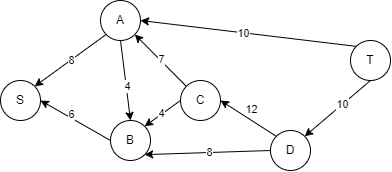
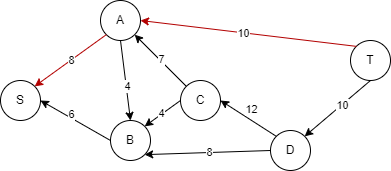
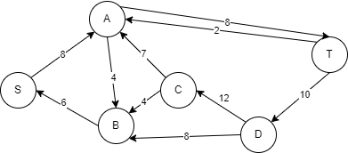
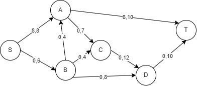
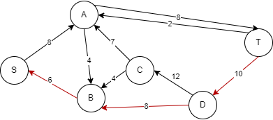
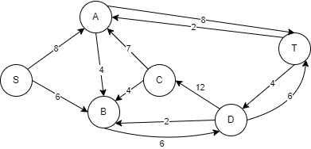
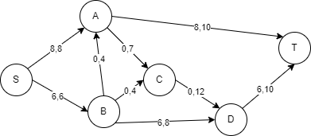
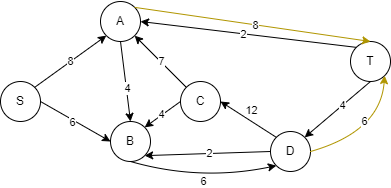

### Вариант 1:
#### Пропускная способность дуг сети:

|          Дуги          | sa | sb | bd | bc | cd | dt | ac | at | ba |
|:----------------------:|:--:|:--:|:--:|:--:|:--:|:--:|:--:|:--:|:--:|
| Пропускная способность | 8  | 6  | 8  | 4  | 12 | 10 | 7  | 10 |  4 |

### 1. Построим сеть с источником **s**, стоком **t** и указанными пропускными способностями дуг.

Построим остаточную сеть. Так как изначально поток в сети не задан, все дуги сети являются пустыми (локальный поток равен нулю). 

### 2. Проведем поиск увеличивающего пути в остаточной сети
В остаточной сети найден увеличивающий путь t -> a -> s. Минимальный вес дуг на этом пути равен 8.

Уменьшим вес дуг на найденном пути, дуги для которых вес стал нулевым удалим из остаточной сети.

Скорректируем соответствующим образом локальные потоки в исходной сети. Первым числом будем указывать локальный поток, вторым - пропускную способность дуги. 

### 3. Продолжим поиск увеличивающего пути в остаточной сети

В остаточной сети найден увеличивающий путь t -> d -> b -> s. Минимальный вес дуг на этом пути равен 6.

Уменьшим вес дуг на найденном пути, дуги для которых вес стал нулевым удалим из остаточной сети.

Скорректируем соответствующим образом локальные потоки в исходной сети.

### 4. Продолжим поиск увеличивающего пути в остаточной сети
В остаточной сети не найдено увеличивающих путей, следовательно, алгоритм завершил работу и найденный поток величиной 14 является максимальным для данной сети.

### 6. Проверим значение максимального потока перебором всех разрезов сети.
Для сети из 6 вершин нужно найти 26 - 2 = 24 = 16 разрезов. 

| № | V1                   | V2 | Пропускная способность разреза |
|---|:--------------------------------|:--------------|:------------------------------:|
| 1 | s                               | a, b, c, d, t    |           8 + 6 = 14           |
|   | **s + одна вершина из a, b, c, d** |               |                                |
| 2 | s, a                            | b, c, d, t       |         7 + 10 + 6 = 23         |
| 3 | s, b                            | a, c, d, t       |         8 + 4 + 8 = 20         |
| 4 | s, c                            | a, b, d, t       |         6 + 8 + 12 = 26         |
| 5 | s, d                            | a, b, c, t       |         6 + 8 + 10 = 24         |
|   | **s + пара вершин из a, b, c, d**  |               |                                |
| 6 | s, a, b                         | c, d, t          |         10 + 7 + 4 + 8 = 27         |
| 7 | s, a, c                         | b, d, t          |         6 + 12 + 10 = 28         |
| 8 | s, b, c                         | a, d, t          |         8 + 4 + 8 + 12 = 32         |
| 9 | s, a, d                         | b, c, t          |         6 + 7 + 10 + 10 = 33         |
| 10 | s, b, d                         | a, c, t          |         8 + 4 + 4 + 10 = 26         |
| 11 | s, c, d                         | a, b, t          |         6 + 8 + 10 = 24         |
|   | **s + три вершины из a, b, c, d**  |               |                                |
| 12 | s, a, b, c                      |d, t             |           8 + 12 + 10 = 30           |
| 13 | s, a, b, d                      |c, t             |           4 + 7 + 10 + 10 = 31           |
| 14 | s, a, c, d                      |b, t             |           6 + 10 + 10 = 26           |
| 15 | s, b, c, d                      |a, t             |           8 + 4 + 10 = 22           |
|   | **s + четыре вершины из a, b, c, d**  |               |                                |
| 16 | s, a, b, c, d                      |t             |           10 + 10 = 20           |

Минимальная пропускная способность разреза равна 14 ( {s} / {a, b, c, d, t} ), что совпадает с найденной величиной максимального потока в сети.

### Ответ:
Максимальный поток в сети равен 14, он реализуется следующим локальными потоками:

