## Задание
#### Пропускная способность дуг сети:

|          Дуги          | sb | sa | bt | sc | bc | ac | at | ct |
|:----------------------:|:--:|:--:|:--:|:--:|:--:|:--:|:--:|:--:|
| Пропускная способность | 11 | 8  | 5  | 5  | 3  | 3  | 6  | 13 |

## Решение
### 1. Построим сеть с источником **s**, стоком **t** и указанными пропускными способностями дуг.

Построим остаточную сеть. Так как изначально поток в сети не задан, все дуги сети являются пустыми (локальный поток равен нулю), соответственно в остаточную сеть необходимо вынести обратную дугу с весом равным пропускной способности.
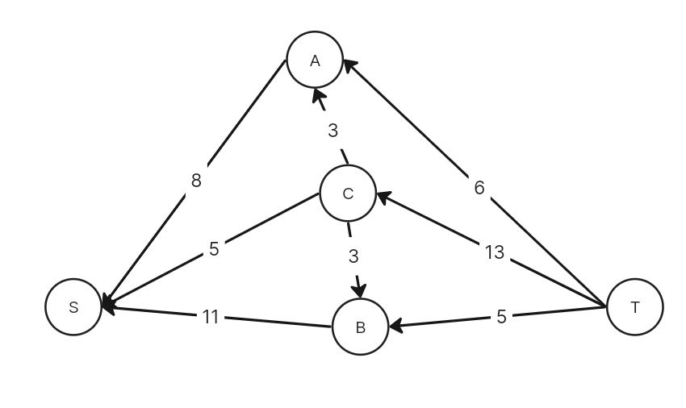

### 2. Проведем поиск увеличивающего пути в остаточной сети.
В остаточной сети найден два путя. Можно выбрать любой из путей. Оба являются корректными увеличивающими путями в остаточной сети. Алгоритм гарантированно сойдётся к максимальному потоку, независимо от выбора.
В остаточной сети найден увеличивающий путь t -> a -> s. Минимальный вес дуг на этом пути равен 6.
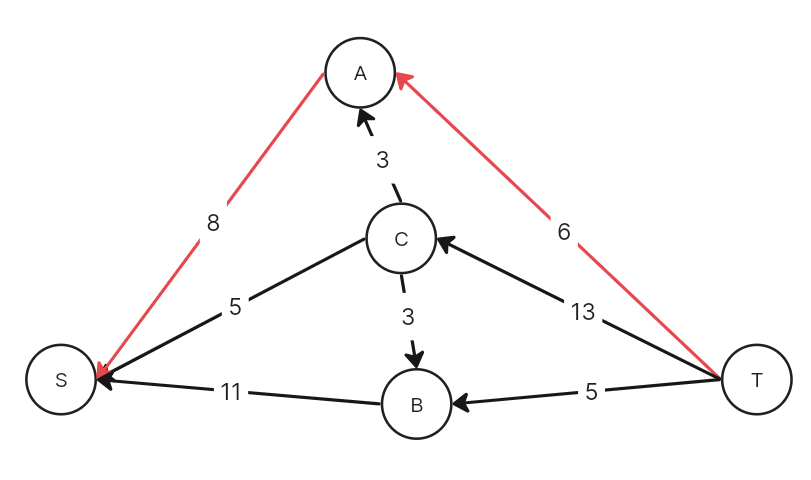

Уменьшим вес дуг на найденном пути, дуги для которых вес стал нулевым удалим из остаточной сети.
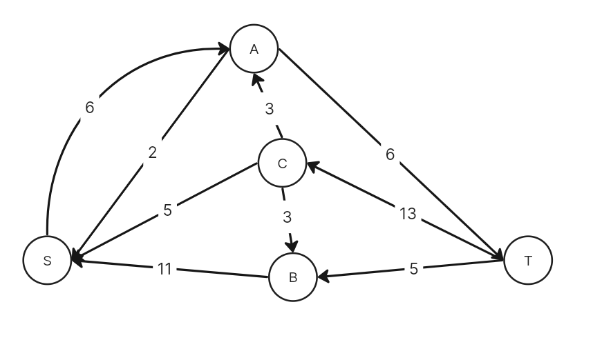

Скорректируем соответствующим образом локальные потоки в исходной сети. Первым числом будем указывать локальный поток, вторым пропускную способность дуги.
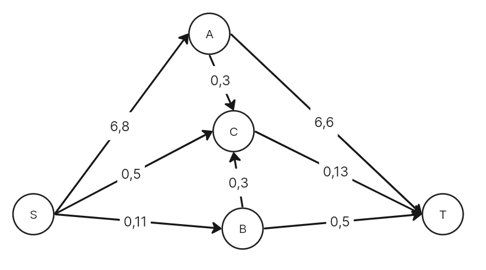

### 3. Продолжим поиск увеличивающего пути в остаточной сети.
В остаточной сети найден увеличивающий путь t -> b -> s. Минимальный вес дуг на этом пути равен 5.
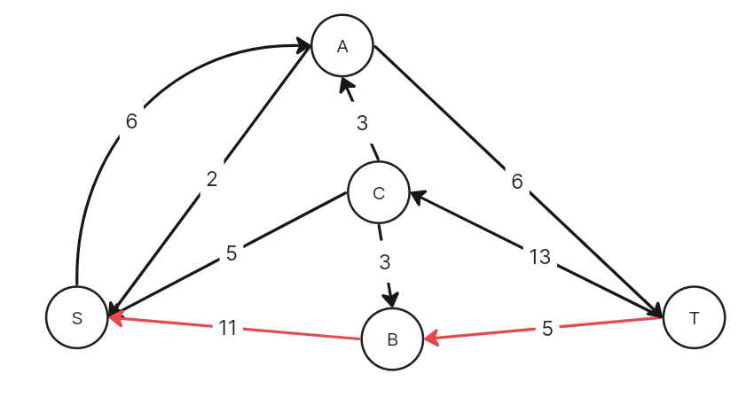

Уменьшим вес дуг на найденном пути, дуги для которых вес стал нулевым удалим из остаточной сети.
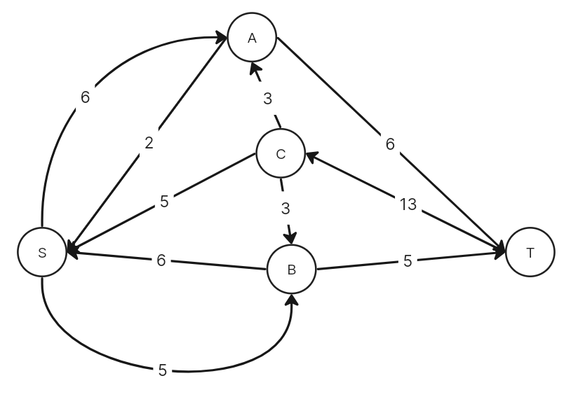

Скорректируем соответствующим образом локальные потоки в исходной сети.
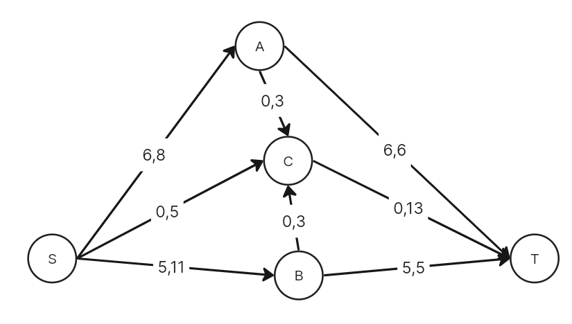

### 4. Продолжим поиск увеличивающего пути в остаточной сети.
В остаточной сети найден увеличивающий путь t -> c -> s. Минимальный вес дуг на этом пути равен 5.
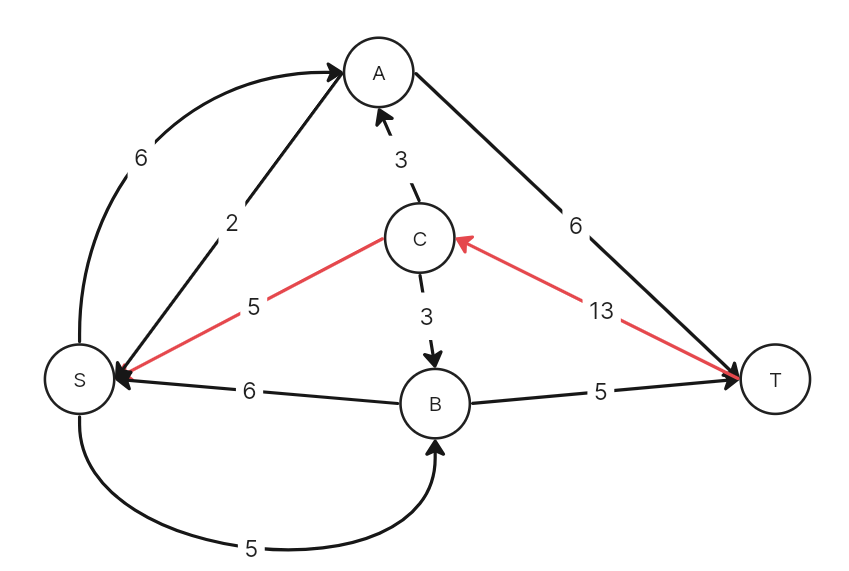

Уменьшим вес дуг на найденном пути, дуги для которых вес стал нулевым удалим из остаточной сети.
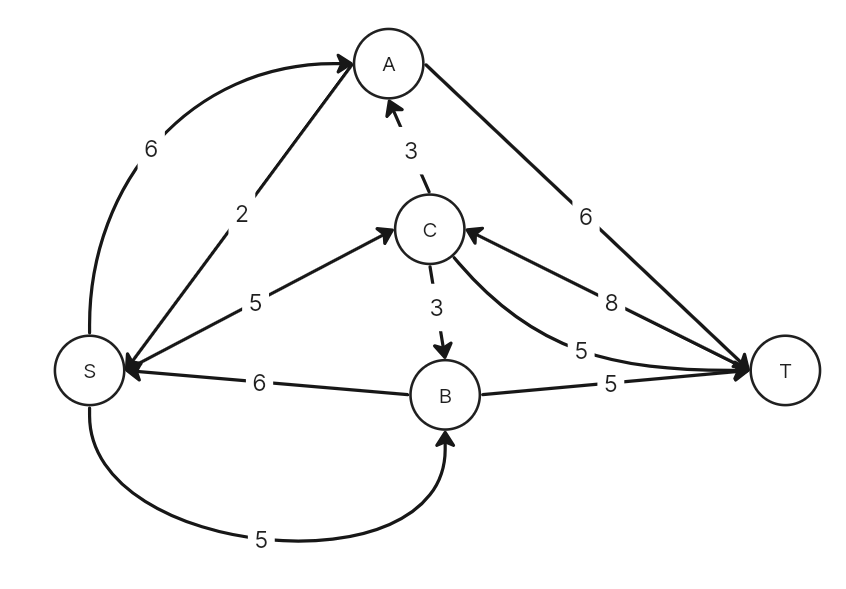

Скорректируем соответствующим образом локальные потоки в исходной сети.
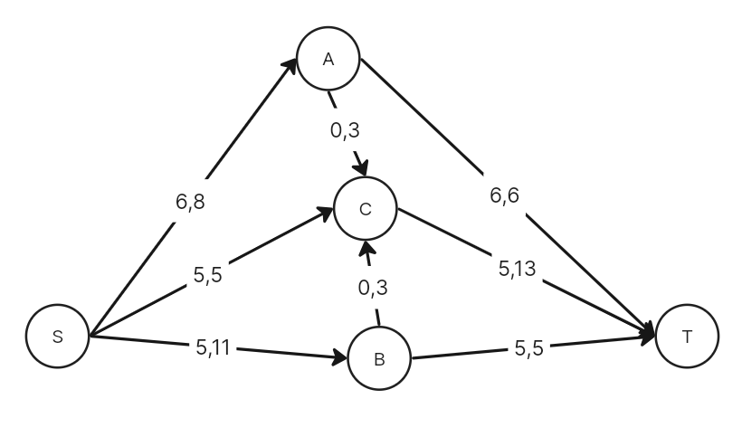

### 5. Продолжим поиск увеличивающего пути в остаточной сети.
В остаточной сети найден увеличивающий путь t -> c -> b -> s. Минимальный вес дуг на этом пути равен 3.
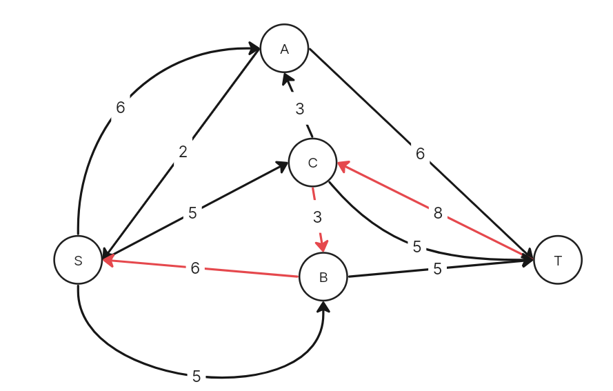

Уменьшим вес дуг на найденном пути, дуги для которых вес стал нулевым удалим из остаточной сети.
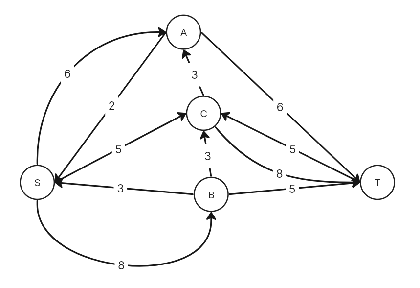

Скорректируем соответствующим образом локальные потоки в исходной сети.
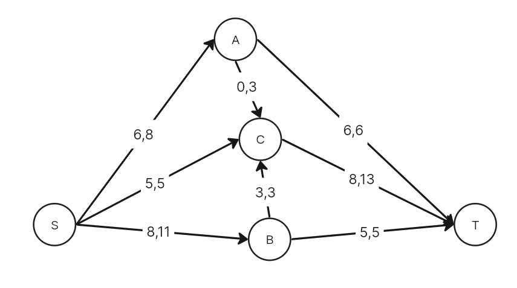

### 6. Продолжим поиск увеличивающего пути в остаточной сети.
В остаточной сети найден увеличивающий путь t -> c -> a -> s. Минимальный вес дуг на этом пути равен 2.
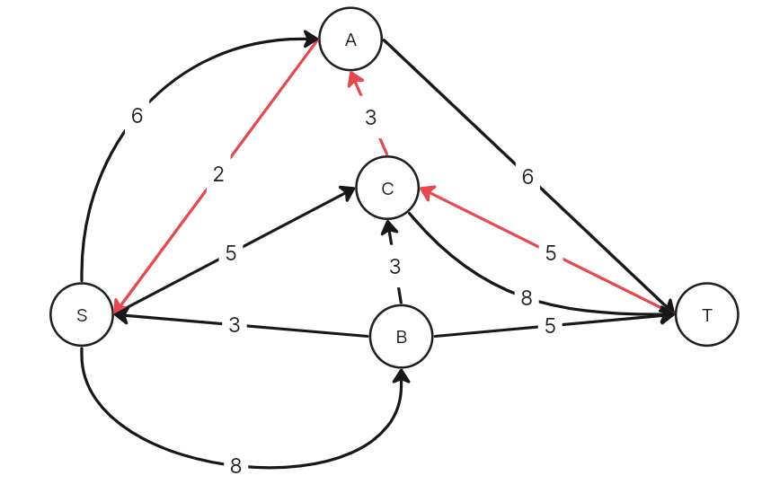

Уменьшим вес дуг на найденном пути, дуги для которых вес стал нулевым удалим из остаточной сети.
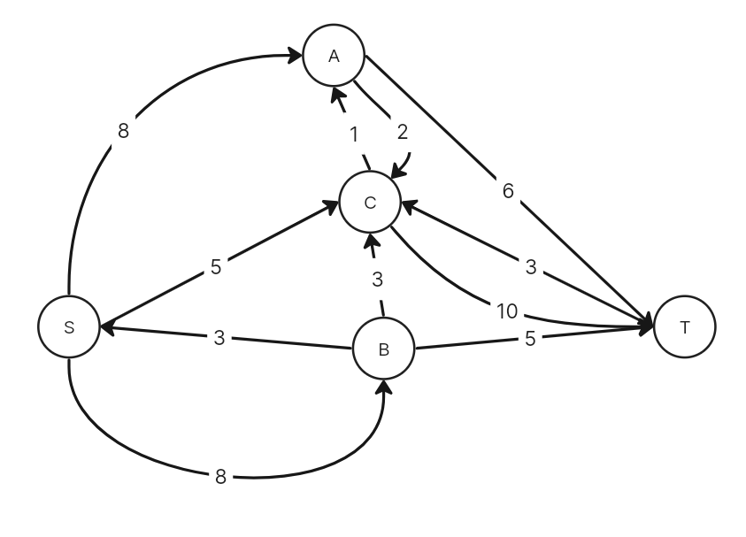

Скорректируем соответствующим образом локальные потоки в исходной сети.
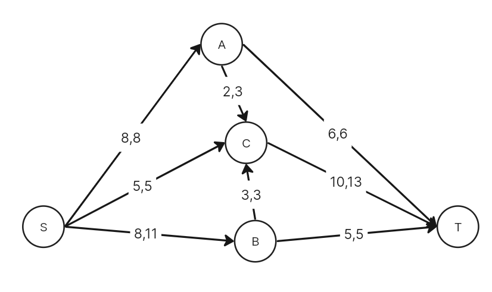

### 7. Продолжим поиск увеличивающего пути в остаточной сети.
В остаточной сети не найдено увеличивающих путей, следовательно, алгоритм завершил работу и найденный поток величиной 21 является максимальным для данной сети.
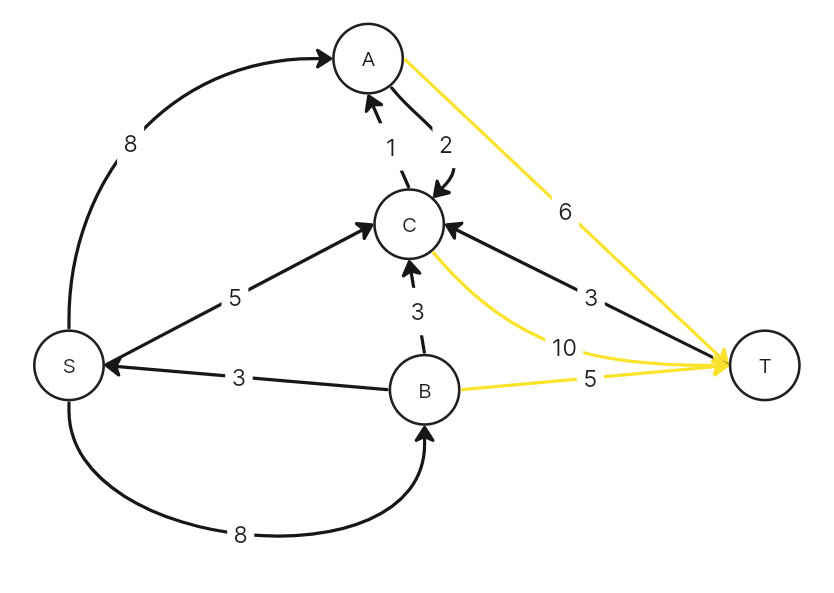

### 8. Проверим значение максимального потока перебором всех разрезов сети.
Разрез сети - разбиение множества вершин на два подмножества V1 и V2, где во множество V1 входит источник, а в V2 входит сток.

Пропускная способность разреза - сумма пропускной способности дуг, начинающихся в вершинах из множества V1 и оканчивающихся в вершинах из V2.

Для сети из _n_ вершин существует 2n - 2 различных разрезов, так как две вершины из множества (источник и сток) "зафиксированы" в V1 и V2, остальные вершины можно различными способами распределять между множествами V1 и V2.

Для сети из 5 вершин нужно найти 25 - 2 = 23 = 8 разрезов. 
| № | V1                   | V2 | Пропускная способность разреза |
|---|:--------------------------------|:--------------|:------------------------------:|
| 1 | s                               | a, b, c, t    |       8 + 5 + 11 = 24          |
|   | **s + одна вершина из a, b, c** |               |                                |
| 2 | s, a                            | b, c, t       |       11 + 5 + 3 + 6 = 25      |
| 3 | s, b                            | a, c, t       |     **8 + 5 + 5 + 3 = 21**     |
| 4 | s, c                            | a, b, t       |       8 + 11 + 13 = 32         |
|   | **s + пара вершин из a, b, c**  |               |                                |
| 5 | s, a, b                         | c, t          |       5 + 3 + 6 + 3 + 5 = 22   |
| 6 | s, a, c                         | b, t          |       11 + 6 + 13 = 30         |
| 7 | s, b, c                         | a, t          |       8 + 5 + 13 = 26          |
|   | **s + три вершины из a, b, c**  |               |                                |
| 8 | s, a, b, c                      | t             |       6 + 13 + 5 = 24          |

Минимальная пропускная способность разреза равна 21 ( {s, b} / {a, c, t} ), что совпадает с найденной величиной максимального потока в сети.

### Ответ
Максимальный поток в сети равен 21, он реализуется следующим локальными потоками:
