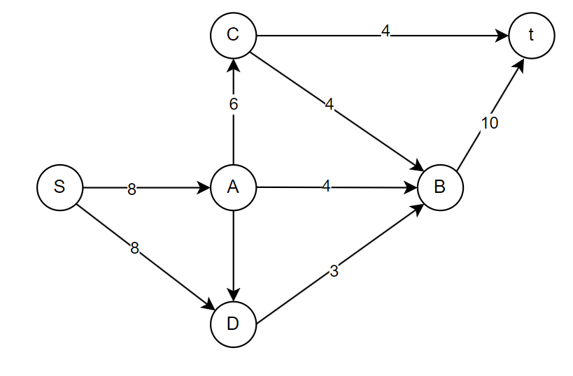

## Вариант 6

Пропускная способность дуг сети указана в таблице.

|          Дуги          | sa | sb | sc | ca | ab | cb | bd | dt | at |
|:----------------------:|:--:|:--:|:--:|:--:|:--:|:--:|:--:|:--:|:--:|
| Пропускная способность | 6  | 6  | 4  | 5  | 5  | 5  | 10 | 8  | 8  |

Вершины сети: источник **s**, сток **t**, промежуточные вершины: **a**, **b**, **c**, **d**.

---

### 1. Построим сеть с источником s, стоком t и указанными пропускными способностями дуг

Сеть содержит следующие дуги с пропускными способностями:

Эта схема — исходная сеть.

---

### 2. Построим начальную остаточную сеть

В начале поток в сети равен нулю, поэтому во всех дугах исходной сети локальный поток f_ij = 0.

В методичке остаточная сеть строится так: в остаточную сеть выносятся **обратные дуги** с весами, равными пропускной способности исходных дуг.

Тогда начальная остаточная сеть содержит дуги:

.png>)

Больше никаких дуг в остаточной сети на старте нет.

---

### 3. Поиск увеличивающих путей в остаточной сети

Далее ищем **увеличивающие пути** в остаточной сети от стока t к источнику s, находим минимальный вес на пути, уменьшаем его по дугам пути и добавляем/обновляем обратные дуги, после чего корректируем потоки в исходной сети.

#### Шаг 1. Первый увеличивающий путь

В остаточной сети имеется путь:

t → a → s.

Веса дуг на этом пути:

- t → a: 8,
- a → s: 6.

Минимальный вес на пути:

Δ₁ = min(8, 6) = 6.

.png>)

Это значит, что в исходной сети можно увеличить поток на 6 единиц вдоль пути:

s → a → t.

**Обновление остаточной сети после шага 1**

- на дуге t → a уменьшаем остаточную пропускную способность:
  - 8 − 6 = 2;
- на дуге a → s:
  - 6 − 6 = 0, дуга удаляется из остаточной сети;
- добавляем обратные дуги к использованному пути (или увеличиваем их вес):
  - s → a — появляется с остаточной пропускной способностью 6;
  - a → t — появляется с остаточной пропускной способностью 6 (обратная к путевому использованию дуги at).

Все остальные дуги остаточной сети остаются как были.

.png>)

**Обновление потоков в исходной сети после шага 1**

В исходной сети по дугам пути s → a → t идёт поток 6:

- f_sa = 6, c_sa = 6;
- f_at = 6, c_at = 8;

остальные дуги пока имеют поток 0.
Суммарный поток |f| = 6.
.png>)
---

#### Шаг 2. Второй увеличивающий путь

Смотрим остаточную сеть после шага 1. В ней есть путь:

t → d → b → s.

.png>)

Минимальный вес на пути:

Δ₂ = min(8, 10, 6) = 6.

В исходной сети этому соответствует путь:

s → b → d → t

с приращением потока 6.

**Обновление остаточной сети после шага 2**

По пути t → d → b → s:

- t → d: 8 − 6 = 2,
- d → b: 10 − 6 = 4,
- b → s: 6 − 6 = 0, дуга удаляется.

Добавляем обратные дуги:

- d → t — появляется или увеличивается до 6;
- b → d — появляется или увеличивается до 6;
- s → b — появляется с весом 6.
.png>)
Прочие дуги остаточной сети сохраняются с прежними значениями:

- s → a (6),
- t → a (2),
- a → t (6),
- a → c (5),
- b → a (5),
- b → c (5),
- c → s (4),
- d → b (4).

**Обновление потоков в исходной сети после шага 2**

Теперь в исходной сети по второму пути s → b → d → t идёт поток 6:

- f_sb = 6, c_sb = 6;
- f_bd = 6, c_bd = 10;
- f_dt = 6, c_dt = 8.

С учётом первого пути:

- f_sa = 6,
- f_sb = 6,
- f_at = 6,
- f_bd = 6,
- f_dt = 6,

остальные дуги — поток 0.

Суммарный поток:

|f| = 6 (по s→a→t) + 6 (по s→b→d→t) = 12.
.png>)
---

#### Шаг 3. Третий увеличивающий путь

Рассматриваем текущую остаточную сеть. В ней существует путь:

t → a → c → s.

.png>)
Оценим веса дуг:

- t → a = 2 (после шага 1 осталось 2, шаг 2 её не менял),
- a → c = 5,
- c → s = 4.

Минимальный вес на пути:

Δ₃ = min(2, 5, 4) = 2.

Это соответствует увеличению потока в исходной сети по пути:

s → c → a → t

на 2 единицы.

**Обновление остаточной сети после шага 3**

По дугам пути t → a → c → s:

- t → a: 2 − 2 = 0, дуга удаляется;
- a → c: 5 − 2 = 3;
- c → s: 4 − 2 = 2.

Добавляем/обновляем обратные дуги:

- a → t: было 6, становится 6 + 2 = 8 (обратная к использованию at);
- c → a: появляется с весом 2;
- s → c: появляется с весом 2 (обратная к использованию sc).
.png>)
**Обновление потоков в исходной сети после шага 3**

По пути s → c → a → t:

- f_sc = 2 (из 0 до 2),
- f_ca = 2 (из 0 до 2),
- f_at = 6 + 2 = 8.

Обновлённые потоки:

- f_sa = 6,
- f_sb = 6,
- f_sc = 2,
- f_ca = 2,
- f_bd = 6,
- f_dt = 6,
- f_at = 8,

остальные дуги по-прежнему имеют поток 0.

Суммарный поток:

- на выходе из s: 6 + 6 + 2 = 14;
- на входе в t: 8 + 6 = 14.

|f| = 14.
-1.png>)
---

#### Шаг 4. Четвёртый увеличивающий путь

Смотрим на текущую остаточную сеть. В ней присутствует путь:

t → d → b → c → s.

Остаточные пропускные способности этих дуг:

- t → d = 2 (после шага 2 осталось 2),
- d → b = 4,
- b → c = 5,
- c → s = 2 (после шага 3).

Минимальный вес на пути:

Δ₄ = min(2, 4, 5, 2) = 2.

Это означает, что в исходной сети можем увеличить поток на 2 по пути:

s → c → b → d → t.
.png>)
**Обновление остаточной сети после шага 4**

По дугам пути t → d → b → c → s:

- t → d: 2 − 2 = 0, дуга удаляется;
- d → b: 4 − 2 = 2;
- b → c: 5 − 2 = 3;
- c → s: 2 − 2 = 0, дуга удаляется.

Добавляем/обновляем обратные дуги:

- d → t: было 6, становится 8;
- b → d: было 6, становится 8;
- c → b: появляется с весом 2;
- s → c: было 2, становится 4.

После этого из вершины t в остаточной сети больше не выходит дуг с положительной остаточной пропускной способностью, т.е. увеличивающих путей от t к s больше нет — алгоритм завершает работу.
.png>)
**Обновление потоков в исходной сети после шага 4**

По пути s → c → b → d → t увеличиваем поток на 2:

- f_sc: было 2, становится 4;
- f_cb: было 0, становится 2;
- f_bd: было 6, становится 8;
- f_dt: было 6, становится 8.

Итоговые значения потоков по дугам:

- f_sa = 6,
- f_sb = 6,
- f_sc = 4,
- f_ca = 2,
- f_ab = 0,
- f_cb = 2,
- f_bd = 8,
- f_dt = 8,
- f_at = 8.

Проверка суммы потока:

- на выходе из s: f_sa + f_sb + f_sc = 6 + 6 + 4 = 16;
- на входе в t: f_at + f_dt = 8 + 8 = 16.

Следовательно, величина потока |f| = 16.
.png>)
---

### 4. Проверка сохранения потока в промежуточных вершинах

Проверим для каждой промежуточной вершины, что сумма входящих потоков равна сумме исходящих.

- Вершина a:  
  вход: f_sa = 6, f_ca = 2 → всего 8;  
  выход: f_ab = 0, f_at = 8 → всего 8.

- Вершина b:  
  вход: f_sb = 6, f_ab = 0, f_cb = 2 → всего 8;  
  выход: f_bd = 8 → 8.

- Вершина c:  
  вход: f_sc = 4;  
  выход: f_ca = 2, f_cb = 2 → 4.

- Вершина d:  
  вход: f_bd = 8;  
  выход: f_dt = 8.

Баланс в узлах выполнен, поток корректен.
.png>)
---

### 5. Проверка максимальности потока через минимальный разрез сети

Разрез сети — разбиение множества вершин на два подмножества V₁ и V₂, где:

- источник s ∈ V₁,
- сток t ∈ V₂.

Пропускная способность разреза C(V₁, V₂) — сумма пропускных способностей всех дуг, которые начинаются в вершинах из V₁ и оканчиваются в вершинах из V₂.

У нас 6 вершин: {s, a, b, c, d, t}.  
Вершины s и t зафиксированы: s всегда в V₁, t всегда в V₂.  
Остальные вершины {a, b, c, d} могут принадлежать либо V₁, либо V₂, всего вариантов:

2⁴ = 16 разрезов.

Перечислим все разрезы, задавая V₁ и V₂, и найдём их пропускные способности.
.png>)
#### Группа 1: V₁ = {s} + 0 дополнительных вершин

1. V₁ = {s}, V₂ = {a, b, c, d, t}

Дуги из V₁ в V₂:

- s → a (6),
- s → b (6),
- s → c (4).

C₁ = 6 + 6 + 4 = 16.

---

#### Группа 2: V₁ = {s} + одна вершина из {a, b, c, d}

2. V₁ = {s, a}, V₂ = {b, c, d, t}

Дуги из {s, a} в {b, c, d, t}:

- s → b (6),
- s → c (4),
- a → b (5),
- a → t (8).

C₂ = 6 + 4 + 5 + 8 = 23.

3. V₁ = {s, b}, V₂ = {a, c, d, t}

Дуги:

- s → a (6),
- s → c (4),
- b → d (10).

C₃ = 6 + 4 + 10 = 20.

4. V₁ = {s, c}, V₂ = {a, b, d, t}

Дуги:

- s → a (6),
- s → b (6),
- c → a (5),
- c → b (5).

C₄ = 6 + 6 + 5 + 5 = 22.

5. V₁ = {s, d}, V₂ = {a, b, c, t}

Дуги:

- s → a (6),
- s → b (6),
- s → c (4),
- d → t (8).

C₅ = 6 + 6 + 4 + 8 = 24.

---

#### Группа 3: V₁ = {s} + две вершины из {a, b, c, d}

6. V₁ = {s, a, b}, V₂ = {c, d, t}

Дуги из {s, a, b} в {c, d, t}:

- s → c (4),
- a → t (8),
- b → d (10).

C₆ = 4 + 8 + 10 = 22.

7. V₁ = {s, a, c}, V₂ = {b, d, t}

Дуги:

- s → b (6),
- a → b (5),
- a → t (8),
- c → b (5).

C₇ = 6 + 5 + 8 + 5 = 24.

8. V₁ = {s, a, d}, V₂ = {b, c, t}

Дуги:

- s → b (6),
- s → c (4),
- a → b (5),
- a → t (8),
- d → t (8).

C₈ = 6 + 4 + 5 + 8 + 8 = 31.

9. V₁ = {s, b, c}, V₂ = {a, d, t}

Дуги:

- s → a (6),
- c → a (5),
- b → d (10).

C₉ = 6 + 5 + 10 = 21.

10. V₁ = {s, b, d}, V₂ = {a, c, t}

Дуги:

- s → a (6),
- s → c (4),
- d → t (8).

C₁₀ = 6 + 4 + 8 = 18.

11. V₁ = {s, c, d}, V₂ = {a, b, t}

Дуги:

- s → a (6),
- s → b (6),
- c → a (5),
- c → b (5),
- d → t (8).

C₁₁ = 6 + 6 + 5 + 5 + 8 = 30.

---

#### Группа 4: V₁ = {s} + три вершины из {a, b, c, d}

12. V₁ = {s, a, b, c}, V₂ = {d, t}

Дуги:

- a → t (8),
- b → d (10).

C₁₂ = 8 + 10 = 18.

13. V₁ = {s, a, b, d}, V₂ = {c, t}

Дуги:

- s → c (4),
- a → t (8),
- d → t (8).

C₁₃ = 4 + 8 + 8 = 20.

14. V₁ = {s, a, c, d}, V₂ = {b, t}

Дуги:

- s → b (6),
- a → b (5),
- a → t (8),
- c → b (5),
- d → t (8).

C₁₄ = 6 + 5 + 8 + 5 + 8 = 32.

15. V₁ = {s, b, c, d}, V₂ = {a, t}

Дуги:

- s → a (6),
- c → a (5),
- d → t (8).

C₁₅ = 6 + 5 + 8 = 19.

---

#### Группа 5: V₁ = {s} + все вершины {a, b, c, d}

16. V₁ = {s, a, b, c, d}, V₂ = {t}

Дуги:

- a → t (8),
- d → t (8).

C₁₆ = 8 + 8 = 16.

---

#### Минимальный разрез

Среди всех 16 разрезов минимальная пропускная способность:

C_min = 16.

Например, её дают разрезы:

- V₁ = {s}, V₂ = {a, b, c, d, t};
- V₁ = {s, a, b, c, d}, V₂ = {t}.

По теореме о максимальном потоке и минимальном разрезе:

|f|_max = C_min = 16.

Это совпадает с найденной величиной потока |f| = 16, следовательно, найденный поток — максимальный.

---

### Ответ

Максимальный поток в сети для **варианта 6** равен:

|f| = 16.

Он реализуется следующими локальными потоками по дугам:

- f_sa = 6, f_sb = 6, f_sc = 4;
- f_ca = 2, f_ab = 0, f_cb = 2;
- f_bd = 8, f_dt = 8, f_at = 8.

Эквивалентно, поток можно представить как сумму потоков по путям:

1. s → a → t — поток 6;
2. s → b → d → t — поток 6;
3. s → c → a → t — поток 2;
4. s → c → b → d → t — поток 2.

Суммарный поток:

6 + 6 + 2 + 2 = 16.
