# Вариант 7:
#### Пропускная способность дуг сети:

|          Дуги          | sa | sd | ab | ad | db | cb | ct | bt | ac |
|:----------------------:|:--:|:--:|:--:|:--:|----|:--:|:--:|:--:|:--:|
| Пропускная способность | 8  | 8  | 4  | 6  | 3  | 4  | 4  | 10 | 6  |

## Решение

### 1. Построим сеть с источником s, стоком t и указанными пропускными способностями дуг.

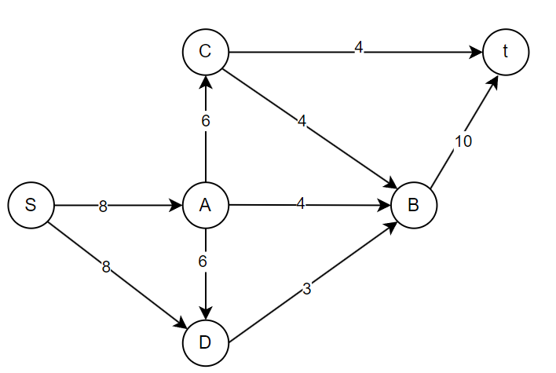

Построим остаточную сеть. Так как изначально поток в сети не задан, все дуги сети являются пустыми (локальный поток равен нулю), соответственно в остаточную сеть необходимо вынести обратную дугу с весом равным пропускной способности. 

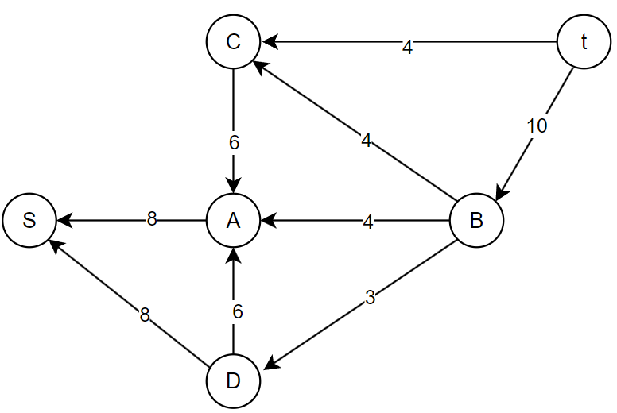

### 2. Проведем поиск увеличивающего пути в остаточной сети
В остаточной сети найден увеличивающий путь **t -> b -> a -> s**. Минимальный вес дуг на этом пути равен **4**.

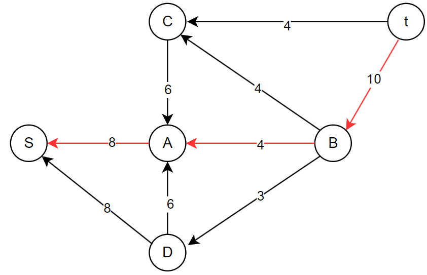

Уменьшим вес дуг на найденном пути, дуги для которых вес стал нулевым удалим из остаточной сети.

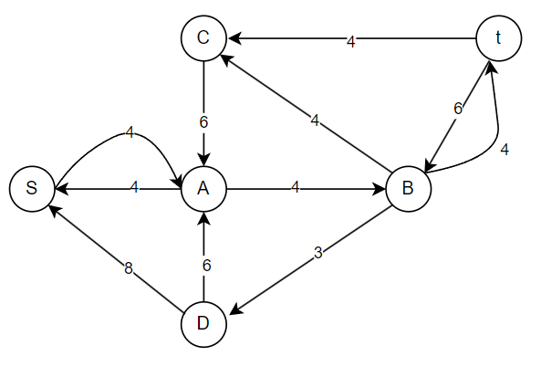

Скорректируем соответствующим образом локальные потоки в исходной сети. Первым числом будем указывать локальный поток, вторым пропускную способность дуги. 

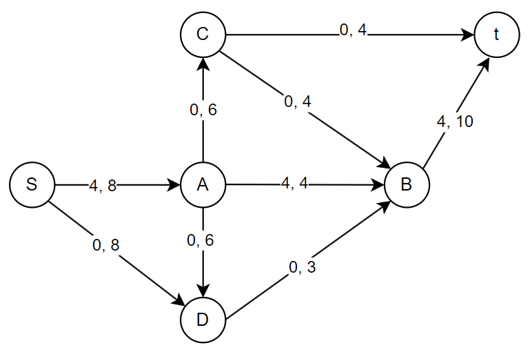

### 3. Продолжим поиск увеличивающего пути в остаточной сети
В остаточной сети найден увеличивающий путь **t -> b -> d -> s**. Минимальный вес дуг на этом пути равен **3**.

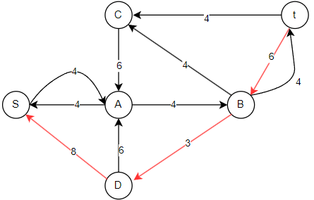

Уменьшим вес дуг на найденном пути, дуги для которых вес стал нулевым удалим из остаточной сети.

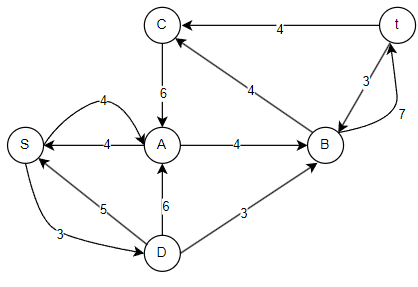

Скорректируем соответствующим образом локальные потоки в исходной сети.

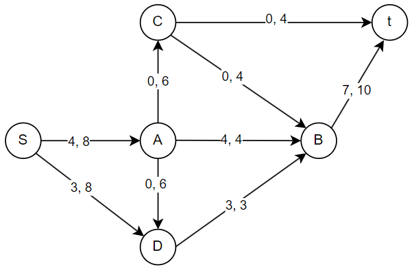

### 4. Продолжим поиск увеличивающего пути в остаточной сети
В остаточной сети найден увеличивающий путь **t -> c -> a -> s**. Минимальный вес дуг на этом пути равен **4**.

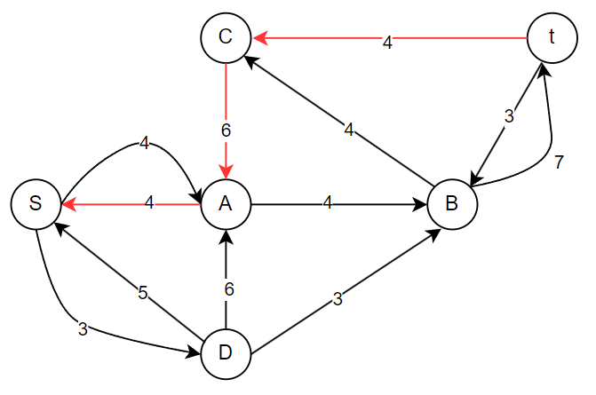

Уменьшим вес дуг на найденном пути, дуги для которых вес стал нулевым удалим из остаточной сети.

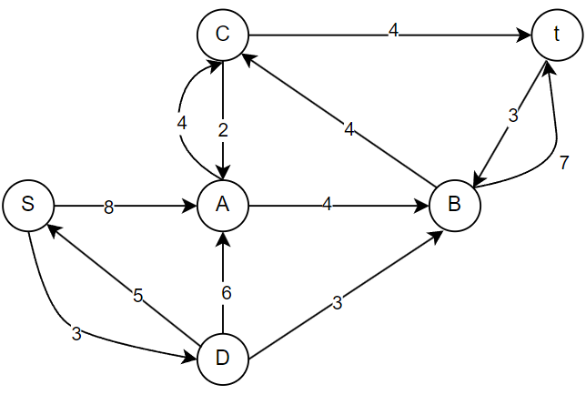

Скорректируем соответствующим образом локальные потоки в исходной сети.

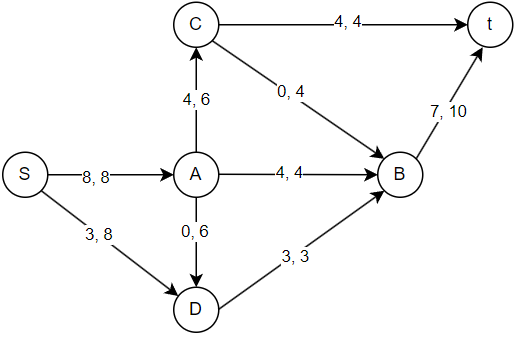

### 5. Продолжим поиск увеличивающего пути в остаточной сети
В остаточной сети не найдено увеличивающих путей, следовательно, алгоритм завершил работу и найденный поток величиной **11** является максимальным для данной сети.

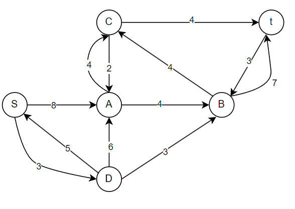

### 6. Проверим значение максимального потока перебором всех разрезов сети.
Для сети из 6 вершин нужно найти 26 - 2 = 24 = 16 разрезов. 

| № | V1                   | V2 | Пропускная способность разреза |
|---|:--------------------------------|:--------------|:------------------------------:|
| 1 | s                               | a, b, c, d, t    |           8 + 8 = 16           |                           |
| 2 | s, a                            | b, c, d, t       |         8 + 4 + 6 + 6 = 24         |
| 3 | s, b                            | a, c, d, t       |         8 + 8 + 10 = 26        |
| 4 | s, c                            | a, b, d, t       |         8 + 8 + 4 + 4 = 24         |                               |
| 5 | s, d                           | a, b, c, t       |         8 + 3 = **11**         |
| 6 | s, a, b                         | c, d, t          |         8 + 6 + 6 + 10 = 30         |
| 7 | s, a, c                         | b, d, t          |         8 + 4 + 6 + 4 + 4 = 26         |                               |
| 8 | s, a, d                      | t, b, c             |           4 + 6 + 3 = 13           |
| 9 | s, b, c                               | a, d, t    |           8 + 8 + 10 + 4 = 30           |                           |
| 10 | s, b, d                            | a, c, t       |         8 + 10 = 18         |
| 11 | s, c, d                            | a, b, t       |         8 + 4 + 4 + 3 = 19         |
| 12 | s, a, b, c                            | d, t       |         8 + 6 + 10 + 4 = 28         |                               |
| 13 | s, a, b, d                         | c, t          |         6 + 10 = 16         |
| 14 | s, a, c, d                         | b, t          |         4 + 4 + 4 + 3 = 15         |
| 15 | s, b, c, d                         | a, t          |         8 + 10 + 4 = 22        |                               |
| 16 | s, a, b, c, d                      | t             |           10 + 4 = 14           |

Минимальная пропускная способность разреза равна 11 ( {s, d} / {t, a, b, c} ), что совпадает с найденной величиной максимального потока в сети.

## Ответ:

Максимальный поток в сети равен 11, он реализуется следующим локальными потоками:

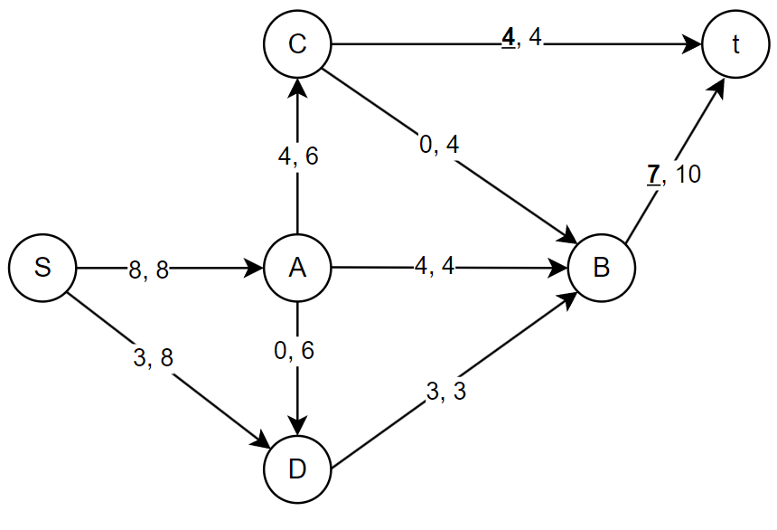