# Вариант 3

Пропускная способность дуг сети указана в таблице.

|          Дуги          | sa | at | sb | ab | ac | bc | bt | ct |
|:----------------------:|:--:|:--:|:--:|:--:|:--:|:--:|:--:|:--:|
| Пропускная способность | 8  | 7  | 5  | 3  | 6  | 5  | 2  | 5  |

### 1. Построим сеть с источником **s**, стоком **t** и указанными пропускными способностями дуг.

Исходная сеть с пропускными способностями
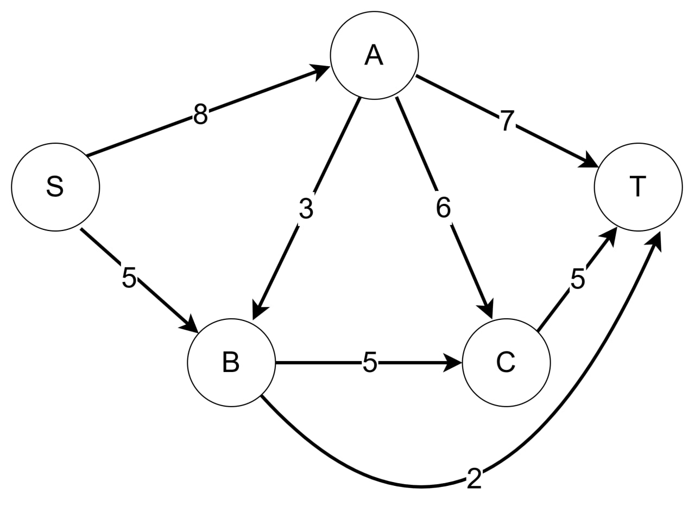
Построим остаточную сеть. Так как изначально поток в сети не задан, все дуги сети являются пустыми (локальный поток равен нулю), соответственно в остаточную сеть необходимо вынести обратную дугу с весом равным пропускной способности.

Начальная остаточная сеть

### 2. Проведем поиск увеличивающего пути в остаточной сети

В остаточной сети найден увеличивающий путь t -> a -> s. Минимальный вес дуг на этом пути равен 7.

Остаточная сеть с выделенным путём t -> a -> s
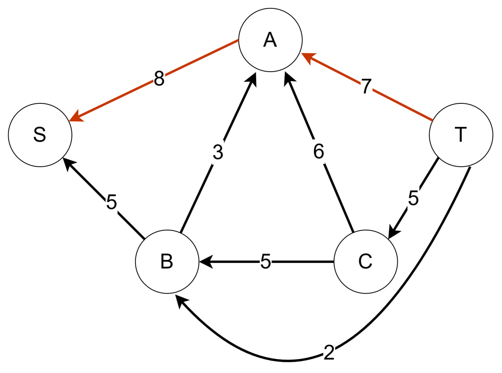

Уменьшим вес дуг на найденном пути, дуги для которых вес стал нулевым удалим из остаточной сети.

Обновлённая остаточная сеть после первого увеличивающего пути
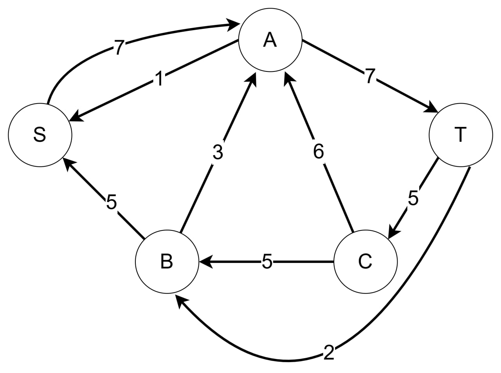

Скорректируем соответствующим образом локальные потоки в исходной сети. Первым числом будем указывать локальный поток, вторым пропускную способность дуги.

Исходная сеть с локальными потоками после первой итерации
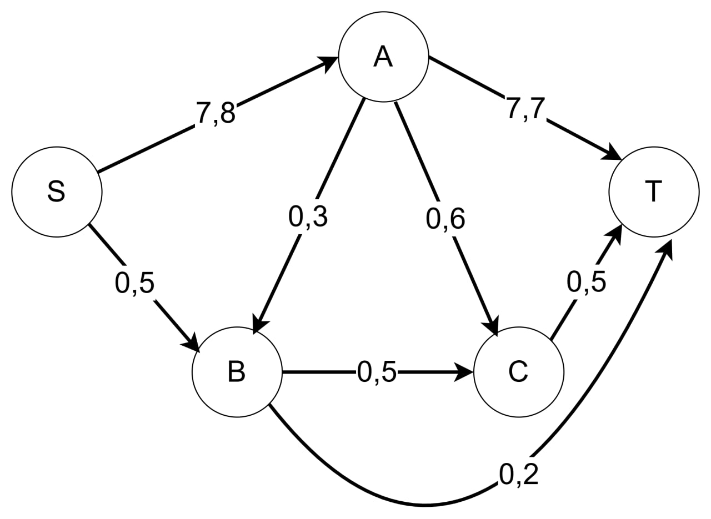

### 3. Продолжим поиск увеличивающего пути в остаточной сети

Остаточная сеть с выделенным путём
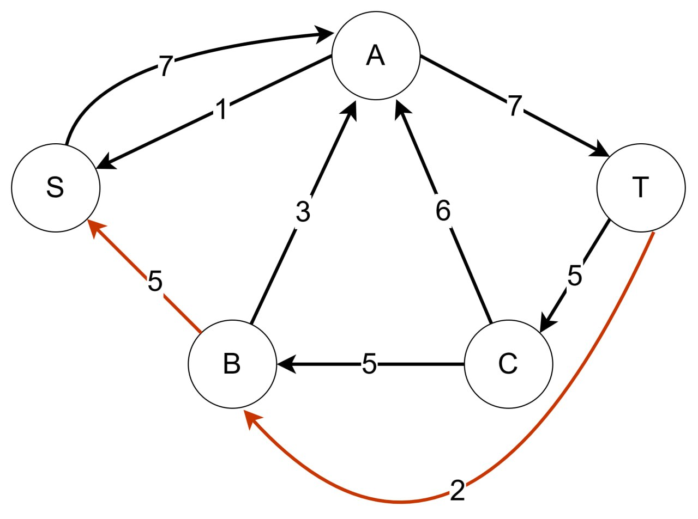

В остаточной сети найден увеличивающий путь t -> b -> s. Минимальный вес дуг на этом пути равен 2.

Уменьшим вес дуг на найденном пути, дуги для которых вес стал нулевым удалим из остаточной сети.

Обновлённая остаточная сеть
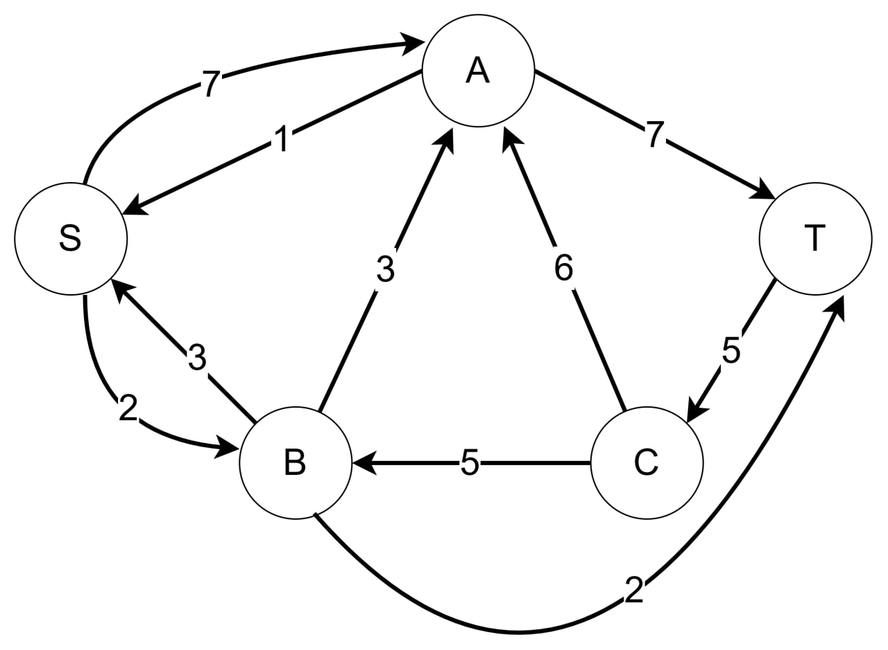

Скорректируем соответствующим образом локальные потоки в исходной сети.

Исходная сеть с локальными потоками после второй итерации
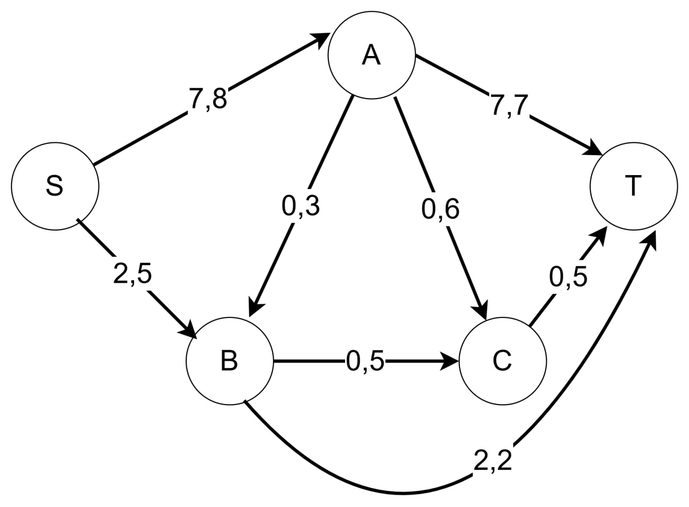

### 4. Продолжим поиск увеличивающего пути в остаточной сети

Остаточная сеть с выделенным путём
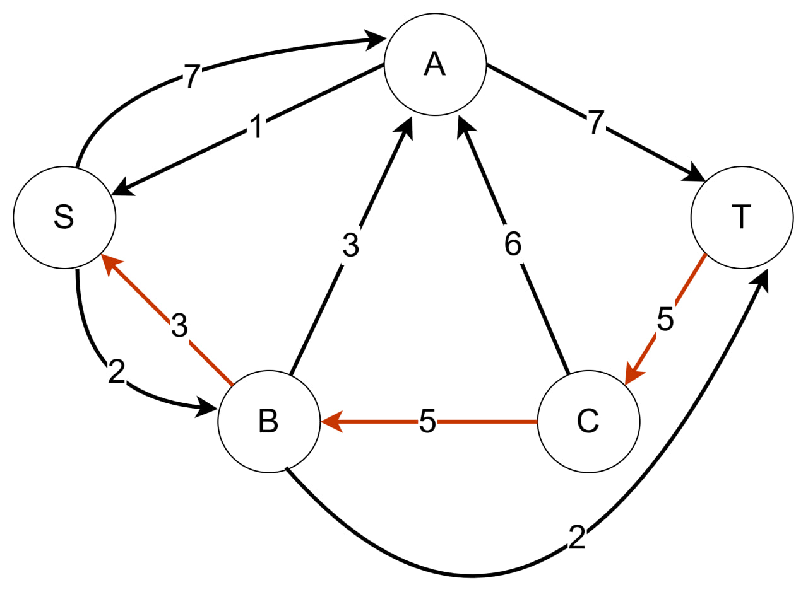

В остаточной сети найден увеличивающий путь t -> c -> b -> s. Минимальный вес дуг на этом пути равен 3.

Уменьшим вес дуг на найденном пути, дуги для которых вес стал нулевым удалим из остаточной сети.

Обновлённая остаточная сеть

Скорректируем соответствующим образом локальные потоки в исходной сети.

Исходная сеть с локальными потоками после третьей итерации
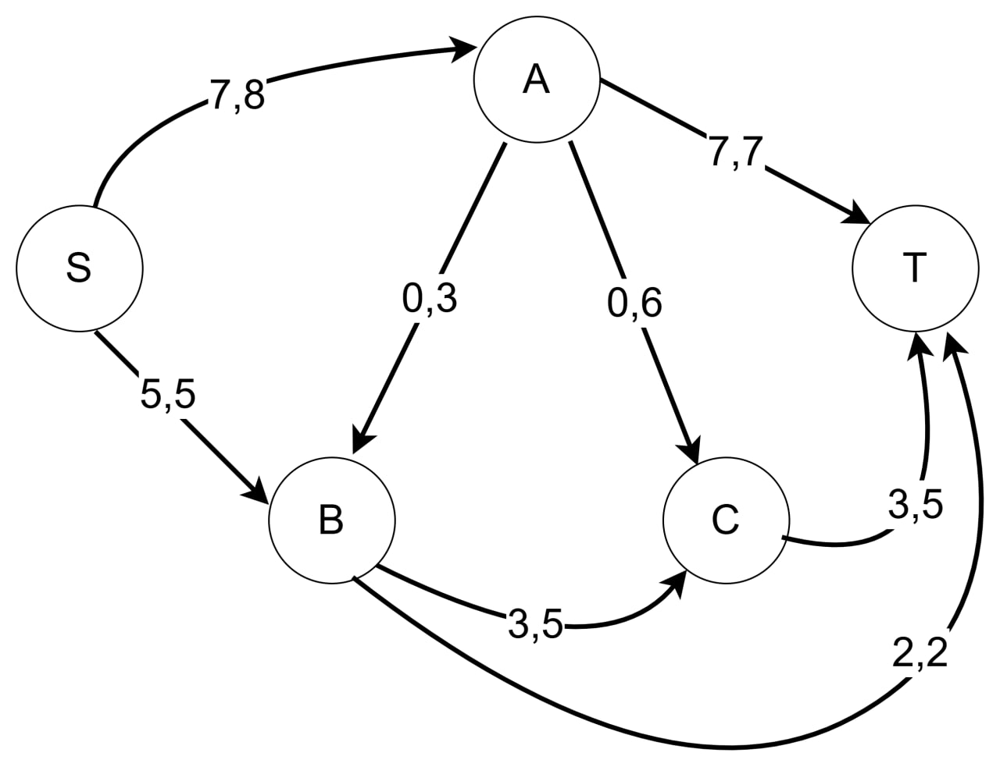

### 5. Продолжим поиск увеличивающего пути в остаточной сети

Остаточная сеть с выделенным путём
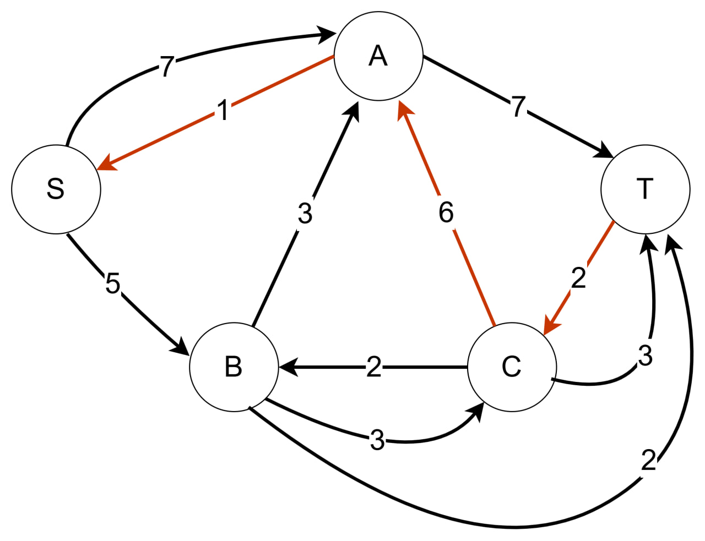

В остаточной сети найден увеличивающий путь t -> c -> a -> s. Минимальный вес дуг на этом пути равен 1.

Уменьшим вес дуг на найденном пути, дуги для которых вес стал нулевым удалим из остаточной сети.

Обновлённая остаточная сеть
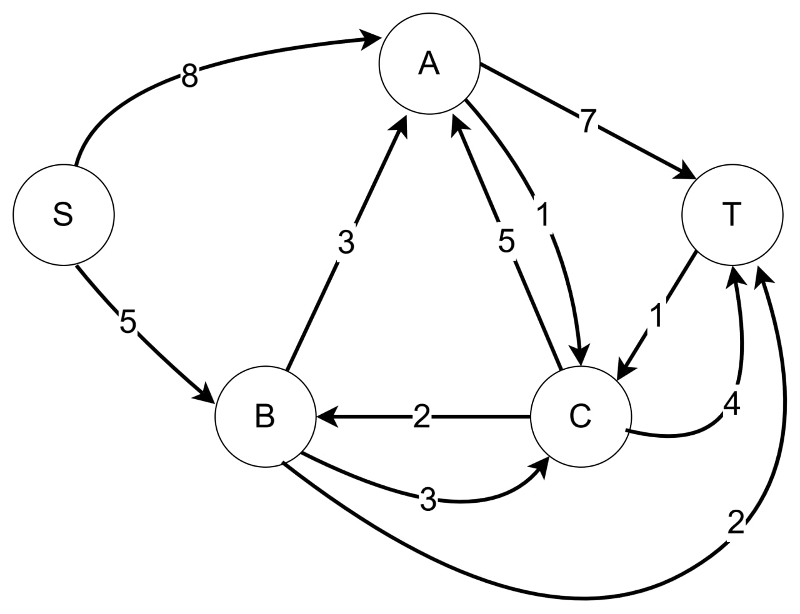

Скорректируем соответствующим образом локальные потоки в исходной сети.

Исходная сеть с локальными потоками после четвёртой итерации
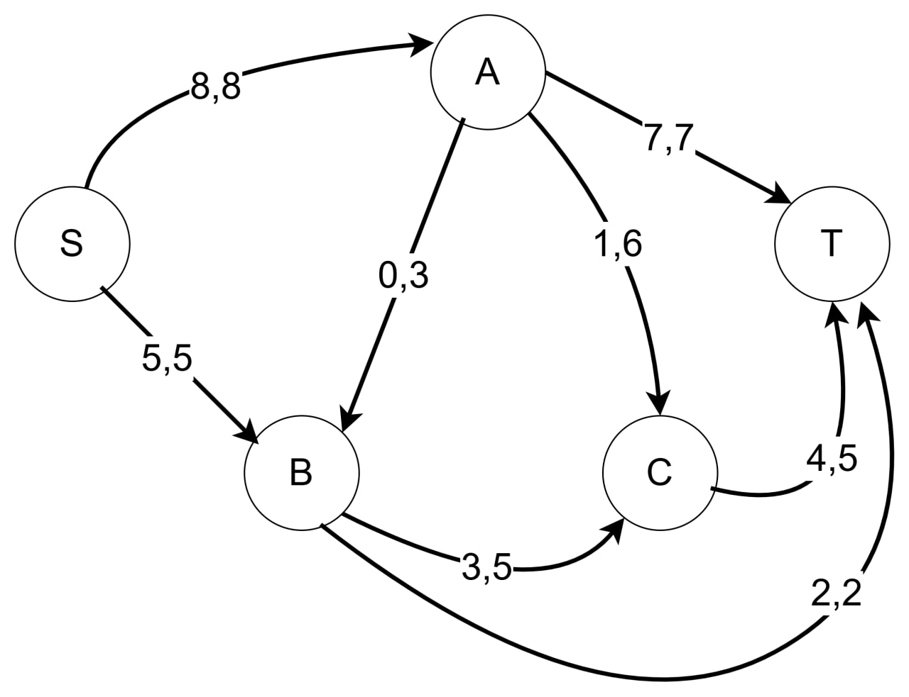

### 6. Продолжим поиск увеличивающего пути в остаточной сети

В остаточной сети не найдено увеличивающих путей, следовательно, алгоритм завершил работу и найденный поток величиной 13 является максимальным для данной сети.

Финальная остаточная сеть без увеличивающих путей
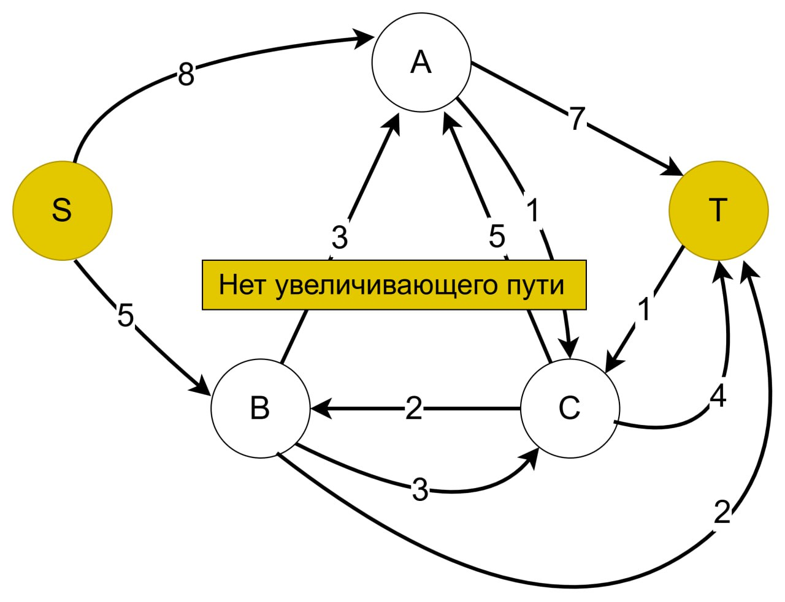

### 7. Проверим значение максимального потока перебором всех разрезов сети.

Разрез сети - разбиение множества вершин на два подмножества V1 и V2, где во множество V1 входит источник, а в V2 входит сток.

Пропускная способность разреза - сумма пропускной способности дуг, начинающихся в вершинах из множества V1 и оканчивающихся в вершинах из V2.

Для сети из _n_ вершин существует 2n - 2 различных разрезов, так как две вершины из множества (источник и сток) "зафиксированы" в V1 и V2, остальные вершины можно различными способами распределять между множествами V1 и V2.

Для сети из 5 вершин нужно найти 25 - 2 = 23 = 8 разрезов.

| № | V1                   | V2 | Пропускная способность разреза |
|---|:--------------------------------|:--------------|:------------------------------:|
| 1 | s                               | a, b, c, t    |           8 + 5 = 13           |
|   | **s + одна вершина из a, b, c** |               |                                |
| 2 | s, a                            | b, c, t       |       5 + 7 + 3 + 6 = 21           |
| 3 | s, b                            | a, c, t       |       8 + 2 + 5 = 15           |
| 4 | s, c                            | a, b, t       |         8 + 5 + 5 = 18         |
|   | **s + пара вершин из a, b, c**  |               |                                |
| 5 | s, a, b                         | c, t          |        7 +  6 + 5 + 2 = 20         |
| 6 | s, a, c                         | b, t          |        5 + 7 + 3 + 5 = 20         |
| 7 | s, b, c                         | a, t          |         8 + 5 + 2 = 15         |
|   | **s + три вершины из a, b, c**  |               |                                |
| 8 | s, a, b, c                      | t             |         7 + 2 + 5 = 14         |

Минимальная пропускная способность разреза равна 13  ({s} / {a, b, c, t}), что совпадает с найденной величиной максимального потока в сети.

### Ответ:

Максимальный поток в сети равен 13, он реализуется следующим локальными потоками:

Финальная сеть с распределением максимального потока
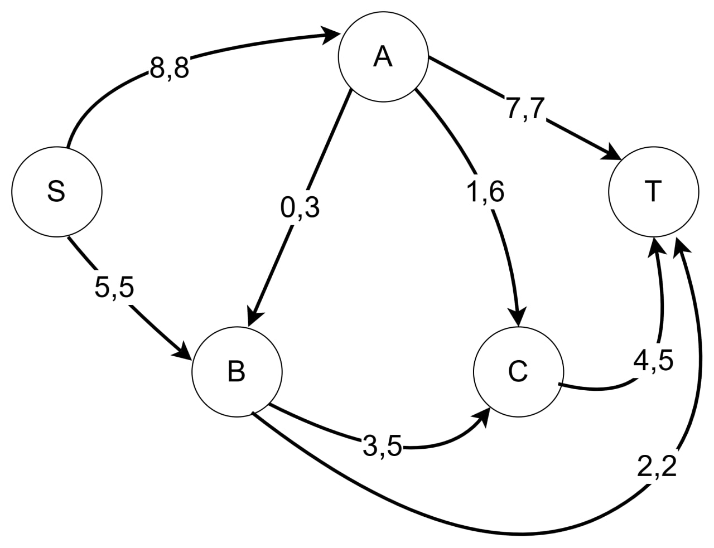
