# Вариант 1
## Пример решения задачи на поиск максимального потока в сети

Пропускная способность дуг сети и стоимость транспортировки указана в таблице.

| Дуги                      | sd | sb | sc | ca | bd | bc | dc | da | at |
|:--------------------------|:--:|:--:|:--:|:--:|:--:|:--:|:--:|:--:|:--:|
| Пропускная способность    | 6  | 6  | 6  | 10 | 6  | 5  | 5  | 8  | 15 |
| Стоимость транспортировки | 2  | 2  | 4  | 1  | 1  | 1  | 3  | 4  | 3  |

### 1. Построим сеть с источником **s**, стоком **t** и указанными пропускными способностями дуг для поиска максимального потока.

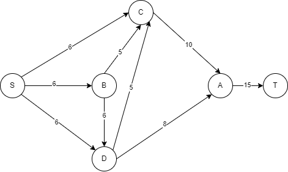

Укажем начальный поток величиной 6 **s -> d -> a -> t**. 

Построим соответствующую остаточную сеть.

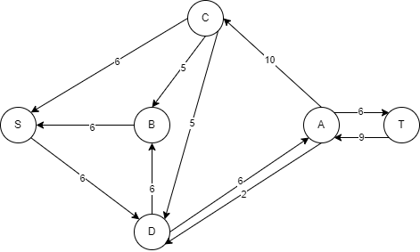

### 2. Проведем поиск увеличивающего пути в остаточной сети
В остаточной сети найден увеличивающий путь t -> a -> c -> s. Минимальный вес дуг на этом пути равен 6.

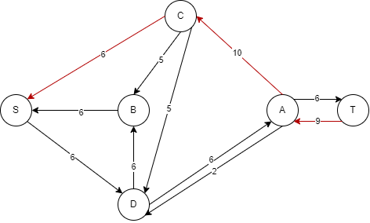

Уменьшим вес дуг на найденном пути, дуги для которых вес стал нулевым удалим из остаточной сети.

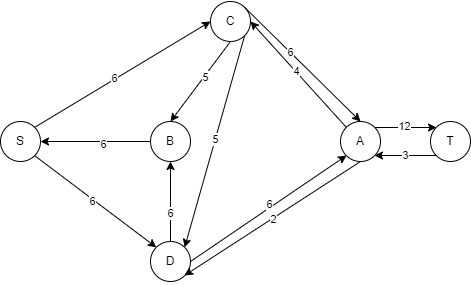

### 3. Продолжим поиск увеличивающего пути в остаточной сети
В остаточной сети найден увеличивающий путь t -> a -> c -> b -> s. Минимальный вес дуг на этом пути равен 3.

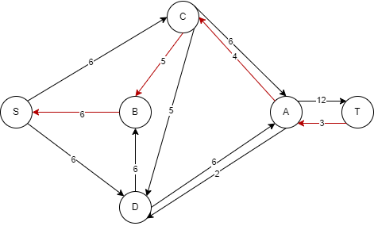

Уменьшим вес дуг на найденном пути, дуги для которых вес стал нулевым удалим из остаточной сети.

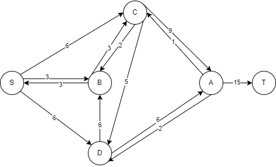

### 4. Продолжим поиск увеличивающего пути в остаточной сети

В остаточной сети не найдено увеличивающих путей, следовательно, алгоритм завершил работу и найденный поток величиной 10 является максимальным для данной сети.

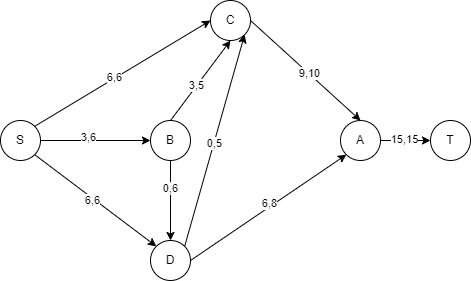

### 5. Рассчитаем стоимость полученного максимального потока.

| Дуги                                          | sd | sb | sc | ca | bd | bc | dc | da | at | Итого  |
|:----------------------------------------------|:--:|:--:|:--:|:--:|:--:|:--:|:--:|:--:|:--:|:------:|
| Пропускная способность p(e)                   | 6  | 6  | 6  | 10 | 6  | 5  | 5  | 8  | 15 |        |
| Локальный поток f(e)                          | 6  | 3  | 6  | 9  | 0  | 3  | 0 | 6 | 15 |        |
| Стоимость транспортировки единицы потока c(e) | 2  | 2  | 4  | 1  | 1  | 1  | 3  | 4  | 3  |
| Суммарная стоимость f(e)*c(e)                 | 12 | 6 | 24  | 9  | 0 | 3  | 0 | 24 | 25 | **123** |

Стоимость полученного потока составляет 123. 

### 6. Попробуем уменьшить стоимость потока для чего построим остаточную сеть.
Для каждого ребра остаточной сети укажем стоимость транспортировки единицы потока.

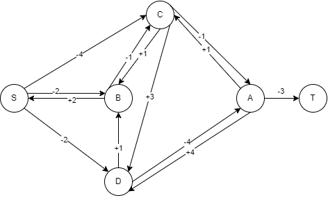

В остаточной сети найден ориентированный цикл отрицательной стоимости s -> d -> a -> c -> b -> s (- 2 - 4 + 1 + 1 + 2 = -2). 

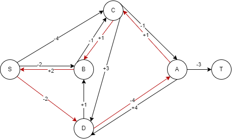

Найдем минимальный вес ребра в указанном цикле, изображенном **в остаточной сети с указанием величины потока**.  

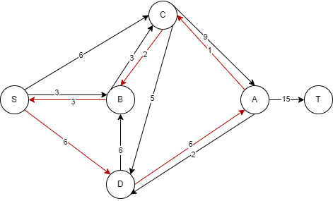

Минимальный вес ребра в цикле 1.

Удалим найденный цикл - уменьшим на 1 вес всех ребер, входящих в цикл, и увеличим на 1 обратные ребра.

Скорректируем остаточную сеть с указанием стоимости транспортировки единицы потока.

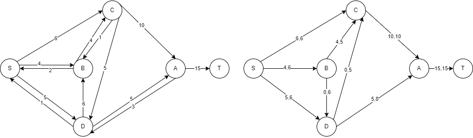

### 6. Проведем повторный поиск цикла отрицательной стоимости в остаточной сети.

В остаточной сети найден ориентированный цикл отрицательной стоимости s -> b -> c -> s (- 4 + 1 + 2 = -1). 

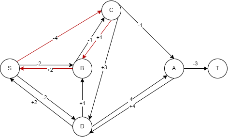

Найдем минимальный вес ребра в указанном цикле, изображенном **в остаточной сети с указанием величины потока**.  

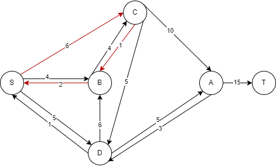

Минимальный вес ребра в цикле 1.

Удалим найденный цикл - уменьшим на 1 вес всех ребер, входящих в цикл, и увеличим на 1 обратные ребра.
Скорректируем остаточную сеть с указанием стоимости транспортировки единицы потока.

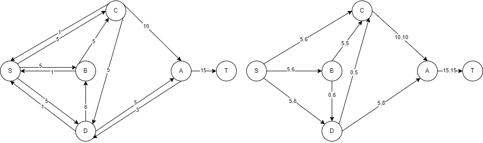

### 7. Проведем повторный поиск цикла отрицательной стоимости в остаточной сети.

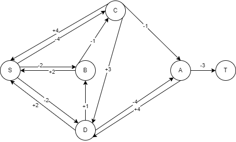

В остаточной сети отсутствуют циклы отрицательной стоимости, следовательно, стоимость потока минимальна.

### 8. Рассчитаем стоимость полученного максимального потока.

| Дуги                                          | sd | sb | sc | ca | bd | bc | dc | da | at | Итого  |
|:----------------------------------------------|:--:|:--:|:--:|:--:|:--:|:--:|:--:|:--:|:--:|:------:|
| Пропускная способность p(e)                   | 6  | 6  | 6  | 10 | 6  | 5  | 5  | 8  | 15 |        |
| Локальный поток f(e)                          | 5  | 5  | 5  | 10  | 0  | 5  | 0 | 5 | 15 |        |
| Стоимость транспортировки единицы потока c(e) | 2  | 2  | 4  | 1  | 1  | 1  | 3  | 4  | 3  |
| Суммарная стоимость f(e)*c(e)                 | 10 | 10 | 20  | 10  | 0 | 5  | 0 | 20 | 45 | **120** |

Стоимость полученного потока составляет 120. 

### Ответ:
Максимальный поток в сети равен 15, минимальная стоимость потока 120, она реализуется следующим локальными потоками:

