# Решение задачи №11, вариант 4
## Команда petr

### Условие
Дана сеть  с источником \(s\) и стоком \(t\). Для каждой дуги известны пропускная способность \(p(e)\) и стоимость транспортировки единицы потока \(c(e)\).

| Дуги | sa | sb | sc | ba | bc | cd | ac | ad | dt |
|------|-------|-------|-------|-------|-------|-------|-------|-------|-------|
| \(p(e)\) | 6 | 7 | 6 | 6 | 4 | 10 | 6 | 8 | 13 |
| \(c(e)\) | 1 | 1 | 3 | 1 | 1 | 1 | 5 | 4 | 2 |

### 1. Построим сеть с источником s, стоком t и указанными пропускными способностями дуг для поиска максимального потока, а также укажем начальный поток величиной 6 s -> a -> с -> d -> t. 
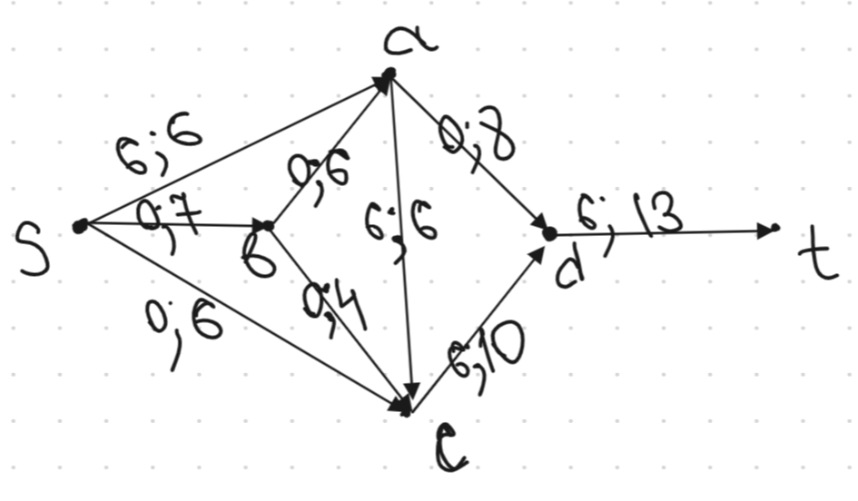
### 2. Построим соответствующую остаточную сеть, а также проведем поиск увеличивающего пути в остаточной сети
В остаточной сети найден увеличивающий путь t -> d -> c -> s. Минимальный вес дуг на этом пути равен 4.

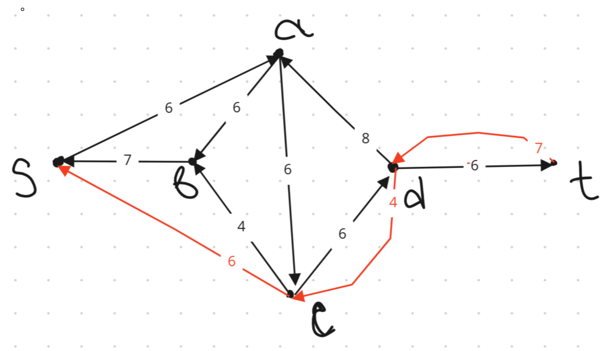

Уменьшим вес дуг на найденном пути, дуги для которых вес стал нулевым удалим из остаточной сети.

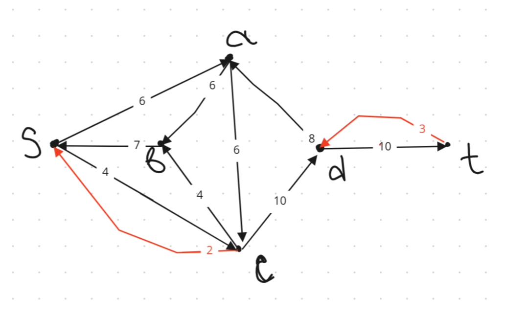

### 3. Продолжим поиск увеличивающего пути в остаточной сети
В остаточной сети найден увеличивающий путь t -> d -> а -> b -> s. Минимальный вес дуг на этом пути равен 3.

Уменьшим вес дуг на найденном пути, дуги для которых вес стал нулевым удалим из остаточной сети.

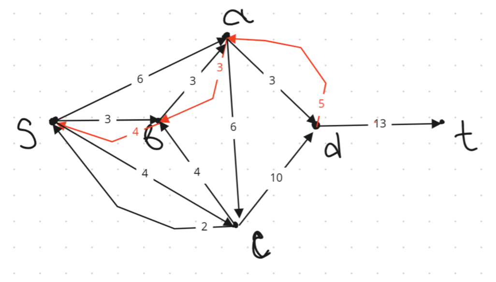

### 4. Продолжим поиск увеличивающего пути в остаточной сети
В остаточной сети не найдено увеличивающих путей, следовательно, алгоритм завершил работу и найденный поток величиной 13 является максимальным для данной сети.

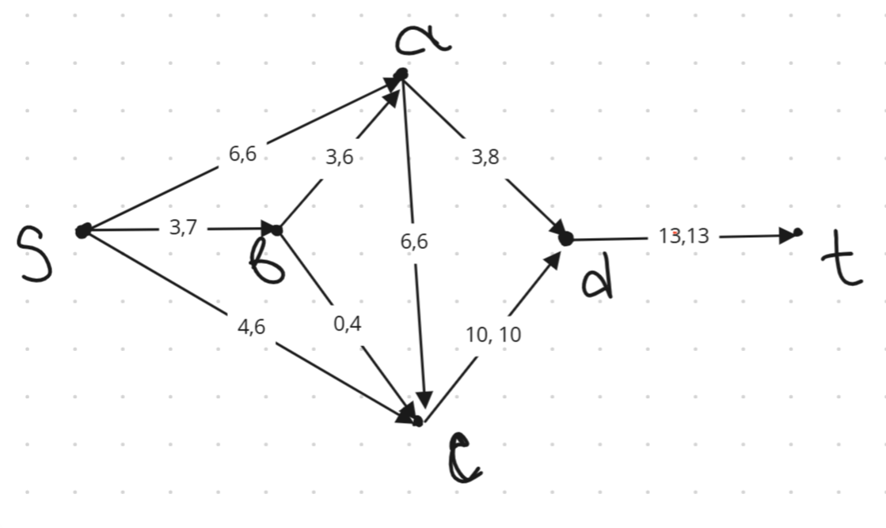

### 5. Рассчитаем стоимость полученного максимального потока.

| Дуги | sa | sb | sc | ba | bc | cd | ac | ad | dt |
|------|-------|-------|-------|-------|-------|-------|-------|-------|-------|
| Пропускная способность \(p(e)\) | 6 | 7 | 6 | 6 | 4 | 10 | 6 | 8 | 13 |
| Локальный поток \(f(e)\) | 6 | 3 | 4 | 3 | 0 | 10 | 6 | 3 | 13 |
| Стоимость транспортировки единицы потока \(c(e)\) | 1 | 1 | 3 | 1 | 1 | 1 | 5 | 4 | 2 |
| Суммарная стоимость \(f(e)\)*\(c(e)\) | 6 | 3 | 12 | 3 | 0 | 10 | 30 | 12 | 26 |

Стоимость полученного потока (сумма последней строки) составляет: 102

### 6. Попробуем уменьшить стоимость потока для чего построим остаточную сеть.
Для каждого ребра остаточной сети укажем стоимость транспортировки единицы потока.
В остаточной сети найден ориентированный цикл отрицательной стоимости s -> a -> c -> s (- 1 - 5 + 3  = -3).

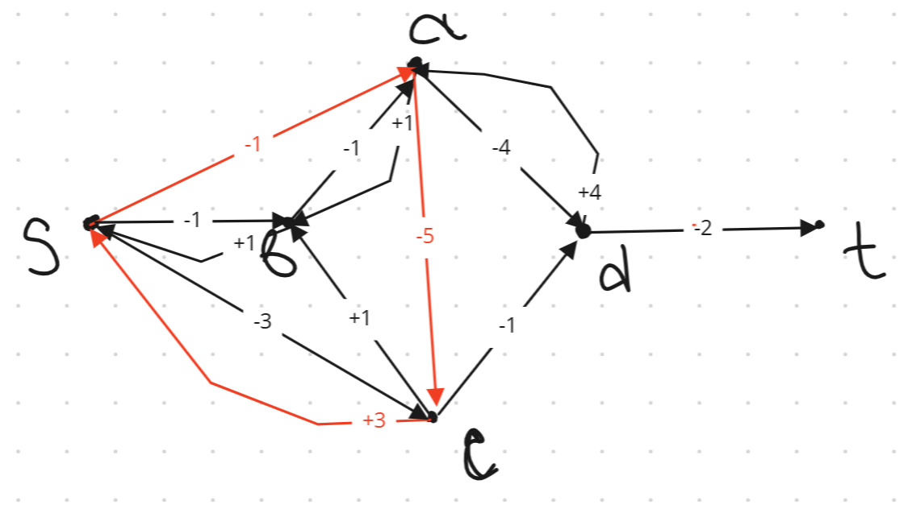

Найдем минимальный вес ребра в указанном цикле, изображенном в остаточной сети с указанием величины потока.

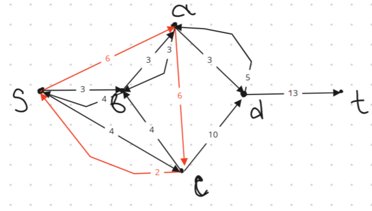

Минимальный вес ребра в цикле 2 - это неиспользованный резерв ребра c -> s.

Удалим найденный цикл - уменьшим на 2 вес всех ребер, входящих в цикл.

Скорректируем остаточную сеть с указанием стоимости транспортировки единицы потока.

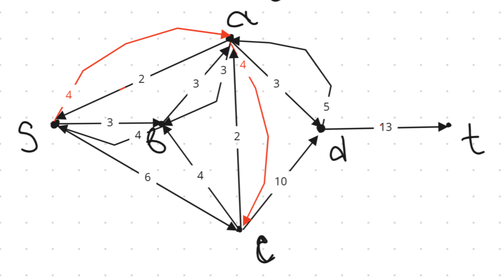

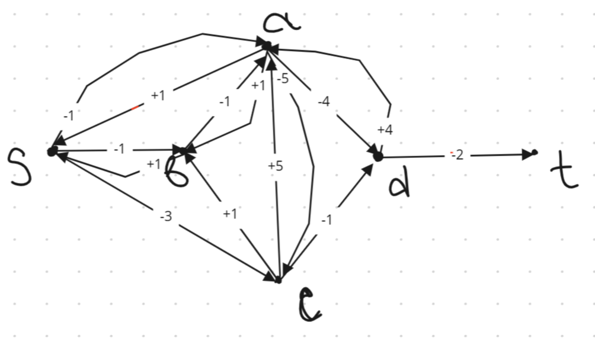

### 7. Проведем повторный поиск цикла отрицательной стоимости в остаточной сети.
В остаточной сети найден ориентированный цикл отрицательной стоимости a -> c -> d -> a  (- 5 - 1 + 4 = -2).

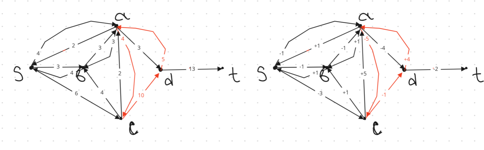

Найдем минимальный вес ребра в указанном цикле, изображенном в остаточной сети с указанием величины потока.

Минимальный вес ребра в цикле 4 - это неиспользованный резерв ребер a -> c.

Удалим найденный цикл - уменьшим на 4 вес всех ребер, входящих в цикл.

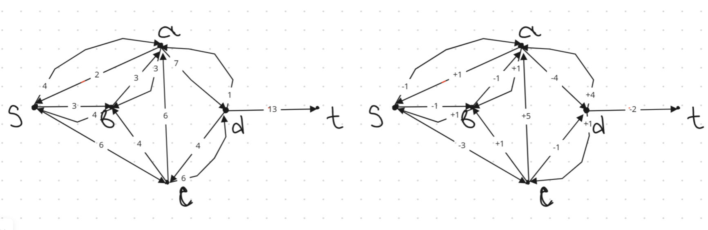

Скорректируем остаточную сеть с указанием стоимости транспортировки единицы потока.

### 8. Проведем повторный поиск цикла отрицательной стоимости в остаточной сети.
В остаточной сети найден ориентированный цикл отрицательной стоимости a -> d -> c -> b -> a  (-1 - 4 + 1 + 1 = -3).

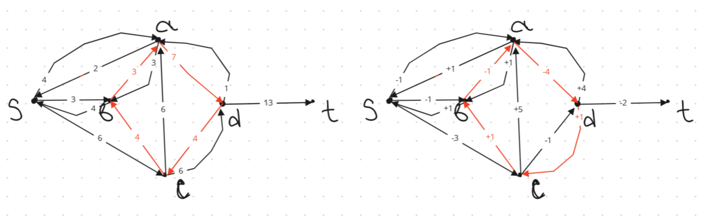

Найдем минимальный вес ребра в указанном цикле, изображенном в остаточной сети с указанием величины потока.

Минимальный вес ребра в цикле 3 - это неиспользованный резерв ребер b -> a.

Удалим найденный цикл - уменьшим на 3 вес всех ребер, входящих в цикл.

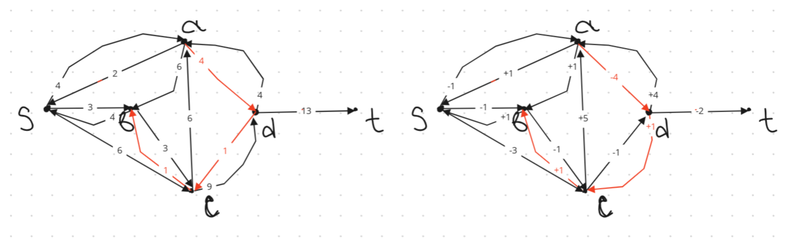

Скорректируем остаточную сеть с указанием стоимости транспортировки единицы потока.

### 9. Проведем повторный поиск цикла отрицательной стоимости в остаточной сети.

В остаточной сети найден ориентированный цикл отрицательной стоимости с -> b -> s -> c   (+1 + 1 - 3 = -1).

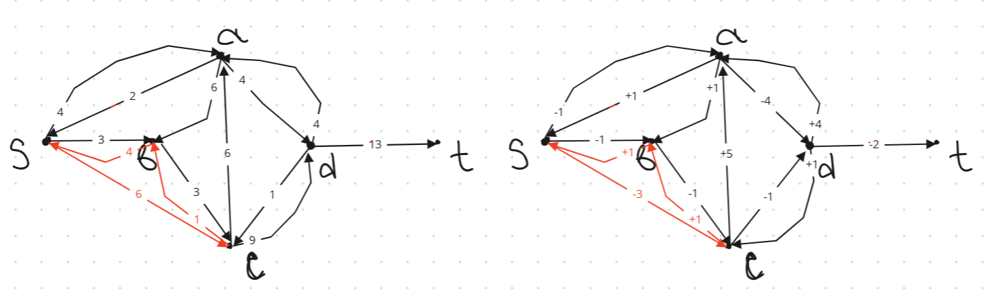

Найдем минимальный вес ребра в указанном цикле, изображенном в остаточной сети с указанием величины потока.

Минимальный вес ребра в цикле 1 - это неиспользованный резерв ребер с -> b.

Удалим найденный цикл - уменьшим на 1 вес всех ребер, входящих в цикл.

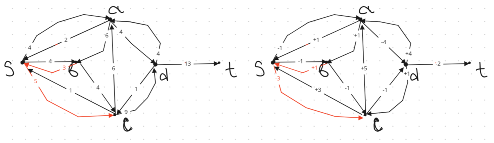

Скорректируем остаточную сеть с указанием стоимости транспортировки единицы потока.

### 10. Проведем повторный поиск цикла отрицательной стоимости в остаточной сети.
В остаточной сети найден ориентированный цикл отрицательной стоимости s -> a -> d -> c -> s   (-1 - 4 + 1 + 3 = -1).

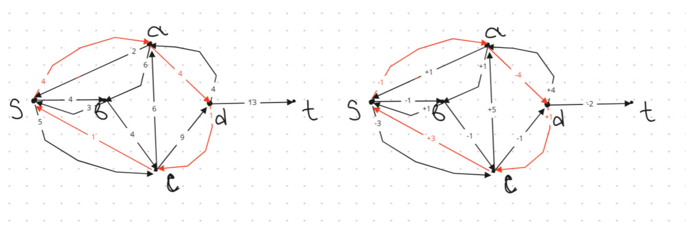

Найдем минимальный вес ребра в указанном цикле, изображенном в остаточной сети с указанием величины потока.

Минимальный вес ребра в цикле 1 - это неиспользованный резерв ребер d -> c.

Удалим найденный цикл - уменьшим на 1 вес всех ребер, входящих в цикл.

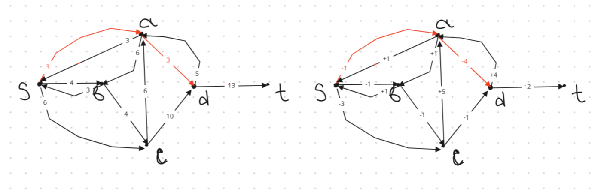

Скорректируем остаточную сеть с указанием стоимости транспортировки единицы потока.

### 11. Проведем повторный поиск цикла отрицательной стоимости в остаточной сети.

В остаточной сети отсутствуют циклы отрицательной стоимости, следовательно, стоимость потока минимальна.

### 12. Рассчитаем стоимость полученного максимального потока.
| Дуги | sa | sb | sc | ba | bc | cd | ac | ad | dt |
|------|-------|-------|-------|-------|-------|-------|-------|-------|-------|
| Пропускная способность \(p(e)\) | 6 | 7 | 6 | 6 | 4 | 10 | 6 | 8 | 13 |
| Локальный поток \(f(e)\) | 3 | 4 | 6 | 0 | 4 | 10 | 0 | 3 | 13 |
| Стоимость транспортировки единицы потока \(c(e)\) | 1 | 1 | 3 | 1 | 1 | 1 | 5 | 4 | 2 |
| Суммарная стоимость \(f(e)\)*\(c(e)\) | 3 | 4 | 18 | 0 | 4 | 10 | 0 | 12 | 26 |

Стоимость полученного потока составляет: 3+4+18+0+4+10+0+12+26 =  77.

### Ответ:
Максимальный поток в сети равен 13, минимальная стоимость потока 77, она реализуется следующим локальными потоками:

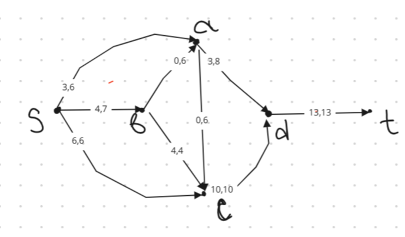

