# Вариант 3

## Задача о максимальном потоке минимальной стоимости

Пропускная способность и стоимость транспортировки дуг сети указаны в таблице.

|          Дуги          | sa | sb | sd | ba | bc | cd | ac | at | dt |
|:----------------------:|:--:|:--:|:--:|:--:|:--:|:--:|:--:|:--:|:--:|
| Пропускная способность | 6  | 7  | 6  | 6  | 4  | 10 | 5  | 8  | 12 |
| Стоимость транспортировки | 1  | 1  | 3  | 1  | 1  | 1  | 3  | 4  | 3  |

### 1. Построим сеть с источником **s**, стоком **t** и указанными пропускными способностями и стоимостями дуг.

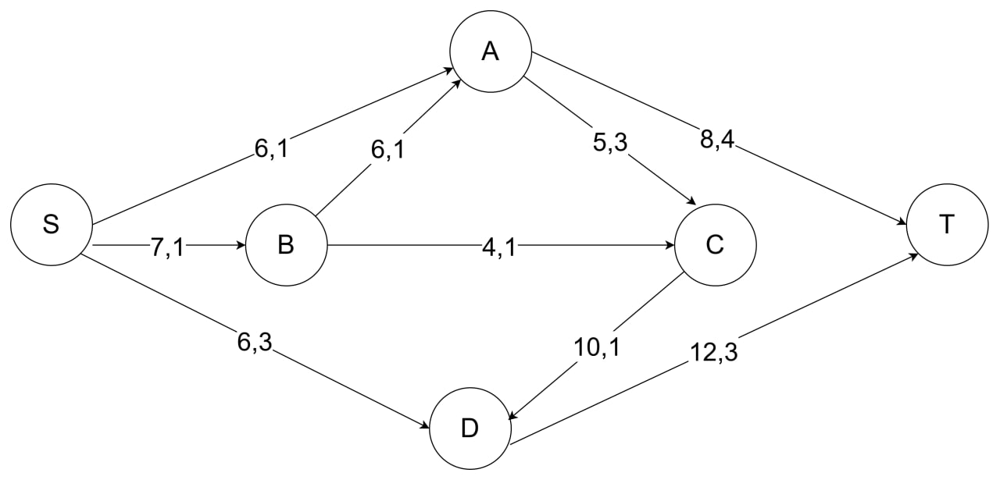
> **[Граф 1]** - Исходная сеть с пропускными способностями и стоимостями

Построим остаточную сеть. Так как изначально поток в сети не задан, все дуги сети являются пустыми (локальный поток равен нулю), соответственно в остаточную сеть необходимо вынести обратную дугу с весом равным пропускной способности и отрицательной стоимостью.

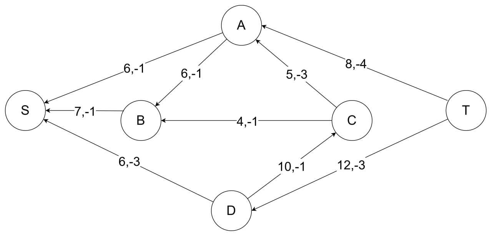
> **[Граф 2]** - Начальная остаточная сеть

### 2. Проведем поиск увеличивающего пути в остаточной сети (Итерация 1)

В остаточной сети найден увеличивающий путь **s → b → a → t**. Минимальная пропускная способность дуг на этом пути равна $\min(7, 6, 8) = 6$.

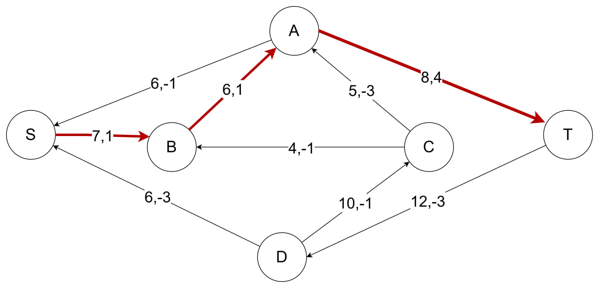
> **[Граф 3]** - Остаточная сеть с выделенным путём s → b → a → t

Увеличим поток на 6 единиц по найденному пути. Обновим остаточную сеть.

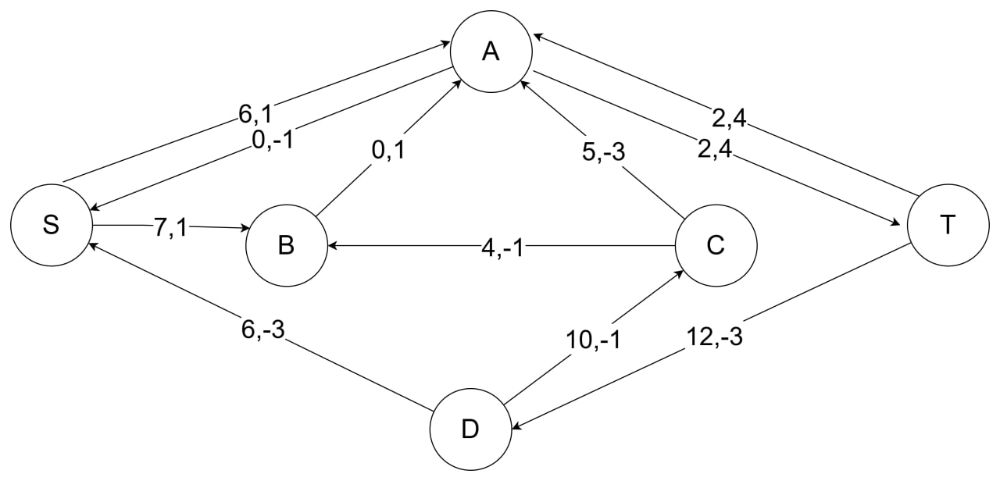
> **[Граф 4]** - Обновлённая остаточная сеть после первой итерации

Скорректируем соответствующим образом локальные потоки в исходной сети. Первым числом будем указывать локальный поток, вторым пропускную способность дуги, в скобках - стоимость.

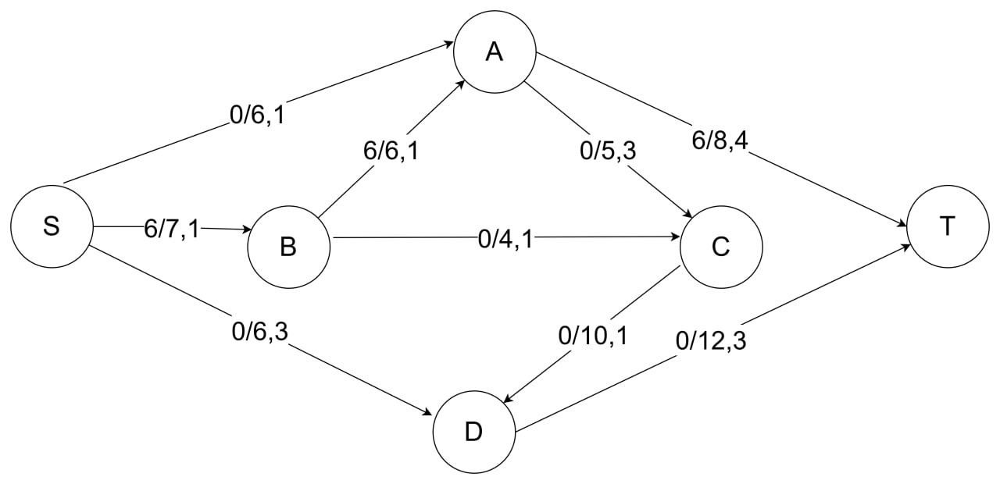
> **[Граф 5]** - Исходная сеть с локальными потоками после первой итерации

**Текущий поток:** 6  
**Текущая стоимость:** $6 \times 1 + 6 \times 1 + 6 \times 4 = 6 + 6 + 24 = 36$

### 3. Продолжим поиск увеличивающего пути в остаточной сети (Итерация 2)

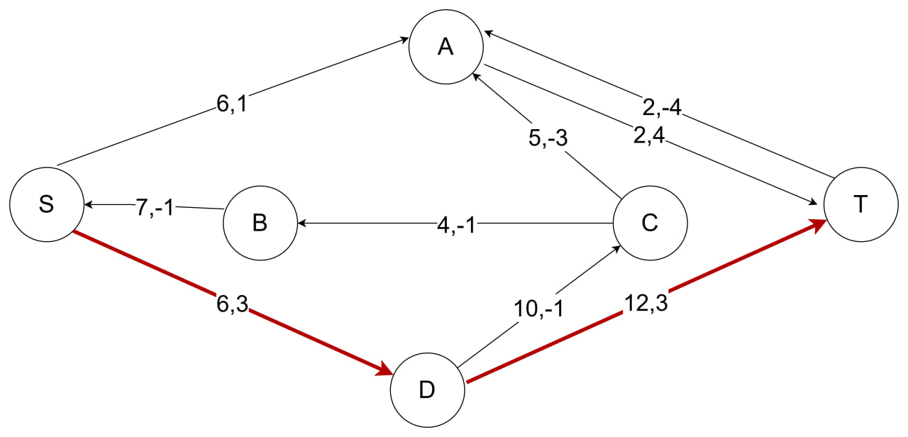
> **[Граф 6]** - Остаточная сеть с выделенным путём

В остаточной сети найден увеличивающий путь **s → d → t**. Минимальная пропускная способность дуг на этом пути равна $\min(6, 12) = 6$.

Увеличим поток на 6 единиц по найденному пути.

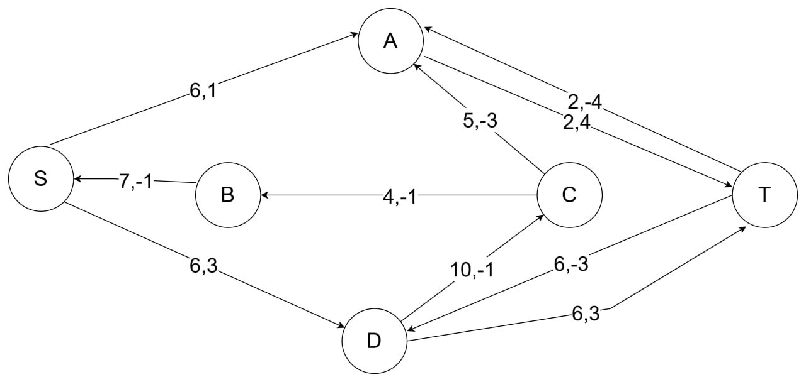
> **[Граф 7]** - Обновлённая остаточная сеть после второй итерации

Скорректируем соответствующим образом локальные потоки в исходной сети.

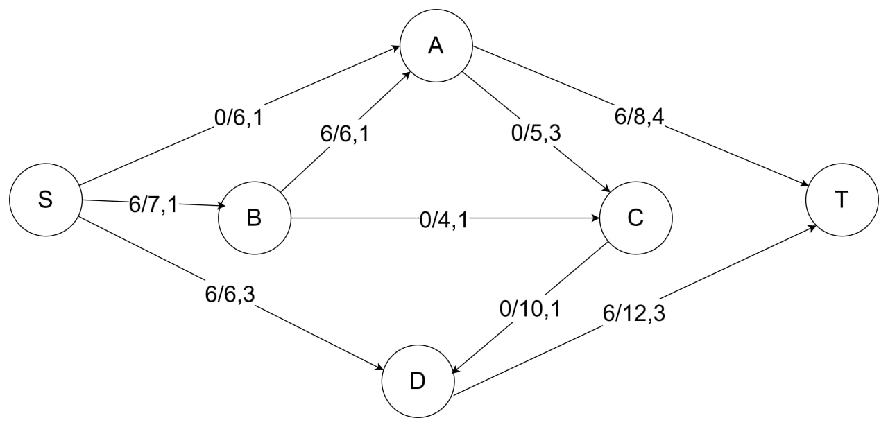
> **[Граф 8]** - Исходная сеть с локальными потоками после второй итерации

**Текущий поток:** 6 + 6 = 12  
**Текущая стоимость:** $36 + 6 \times 3 + 6 \times 3 = 36 + 18 + 18 = 72$

### 4. Продолжим поиск увеличивающего пути в остаточной сети (Итерация 3)

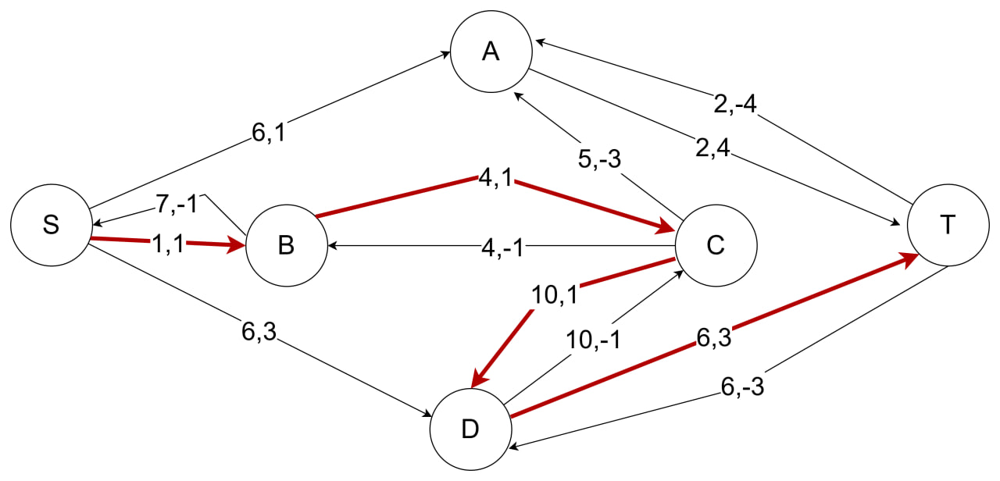
> **[Граф 9]** - Остаточная сеть с выделенным путём

В остаточной сети найден увеличивающий путь **s → b → c → d → t**. Минимальная пропускная способность дуг на этом пути равна $\min(7-6=1, 4, 10, 12-6=6) = 1$.

Увеличим поток на 1 единицу по найденному пути.

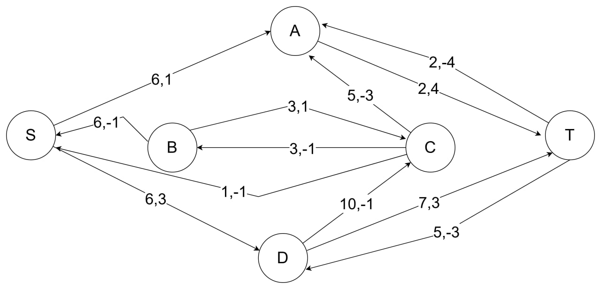
> **[Граф 10]** - Обновлённая остаточная сеть после третьей итерации

Скорректируем соответствующим образом локальные потоки в исходной сети.

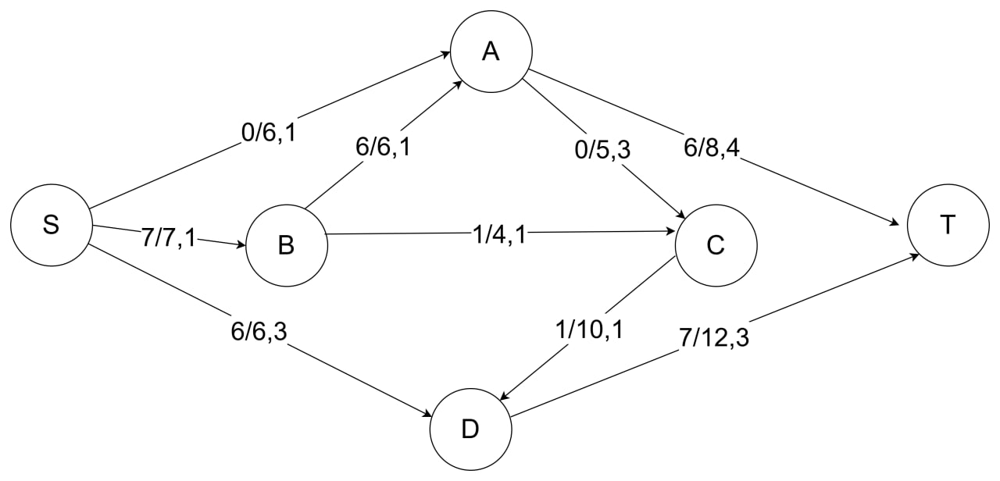
> **[Граф 11]** - Исходная сеть с локальными потоками после третьей итерации

**Текущий поток:** 12 + 1 = 13  
**Текущая стоимость:** $72 + 1 \times 1 + 1 \times 1 + 1 \times 1 + 1 \times 3 = 72 + 6 = 78$

### 5. Продолжим поиск увеличивающего пути в остаточной сети (Итерация 4)

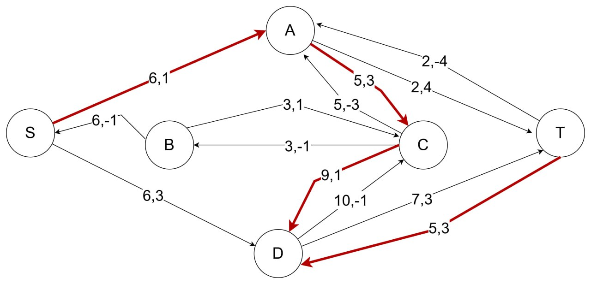
> **[Граф 12]** - Остаточная сеть с выделенным путём

В остаточной сети найден увеличивающий путь **s → a → c → d → t**. Минимальная пропускная способность дуг на этом пути равна $\min(6, 5, 10-1=9, 12-7=5) = 5$.

Увеличим поток на 5 единиц по найденному пути.

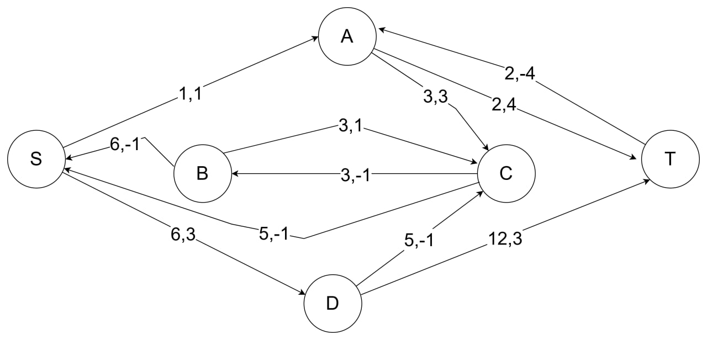
> **[Граф 13]** - Обновлённая остаточная сеть после четвёртой итерации

Скорректируем соответствующим образом локальные потоки в исходной сети.

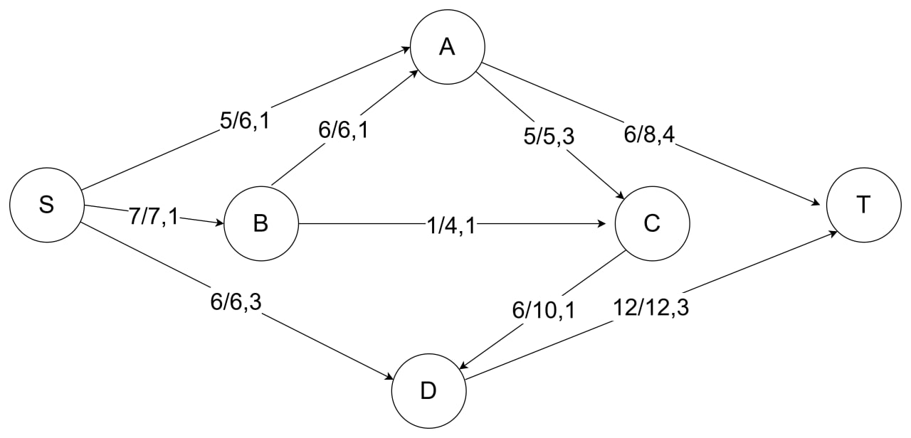
> **[Граф 14]** - Исходная сеть с локальными потоками после четвёртой итерации

**Текущий поток:** 13 + 5 = 18  
**Текущая стоимость:** $78 + 5 \times 1 + 5 \times 3 + 5 \times 1 + 5 \times 3 = 78 + 40 = 118$

### 6. Продолжим поиск увеличивающего пути в остаточной сети (Итерация 5)

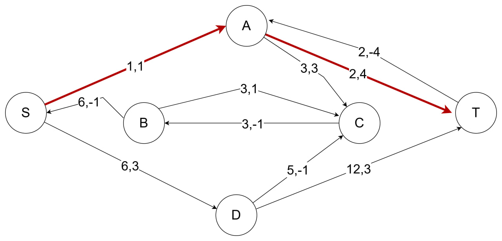
> **[Граф 15]** - Остаточная сеть с выделенным путём

В остаточной сети найден увеличивающий путь **s → a → t**. Минимальная пропускная способность дуг на этом пути равна $\min(6-5=1, 8-6=2) = 1$.

Увеличим поток на 1 единицу по найденному пути.

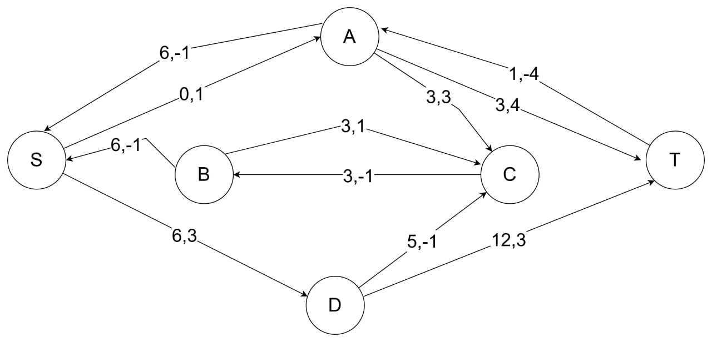
> **[Граф 16]** - Обновлённая остаточная сеть после пятой итерации

Скорректируем соответствующим образом локальные потоки в исходной сети.

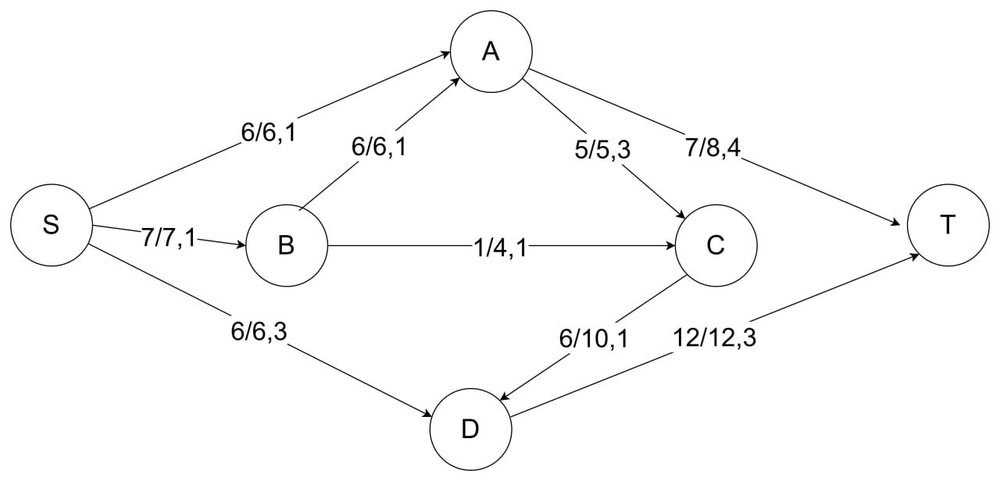
> **[Граф 17]** - Исходная сеть с локальными потоками после пятой итерации

**Текущий поток:** 18 + 1 = 19  
**Текущая стоимость:** $118 + 1 \times 1 + 1 \times 4 = 118 + 5 = 123$

### 7. Проверка на максимальный поток

Из источника **s** выходят дуги с суммарной пропускной способностью $6 + 7 + 6 = 19$. Все они насыщены. Следовательно, **максимальный поток = 19**.

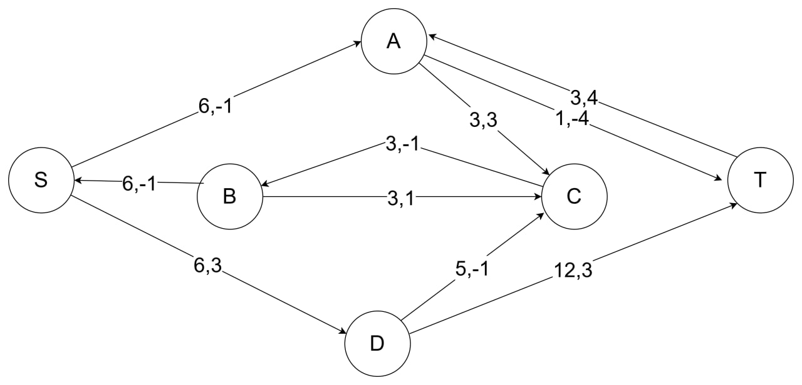
> **[Граф 18]** - Финальная остаточная сеть после достижения максимального потока

### 8. Поиск циклов отрицательной стоимости для минимизации

Теперь необходимо минимизировать стоимость максимального потока посредством поиска циклов отрицательной стоимости в остаточной сети.

**Анализ остаточной сети для поиска отрицательных циклов:**

Рассмотрим цикл, проходящий через вершины **b → c → a → b**:

| Дуга в цикле | Тип дуги | Пропускная способность в остаточной сети | Стоимость |
|:------------:|:--------:|:----------------------------------------:|:---------:|
| b → c | Прямая | 4 - 1 = 3 | 1 |
| c → a | Обратная (к a → c) | 5 | -3 |
| a → b | Обратная (к b → a) | 6 | -1 |

**Стоимость цикла:** $1 + (-3) + (-1) = \mathbf{-3}$

Так как стоимость цикла отрицательна, мы можем уменьшить общую стоимость сети, пустив поток по этому циклу.

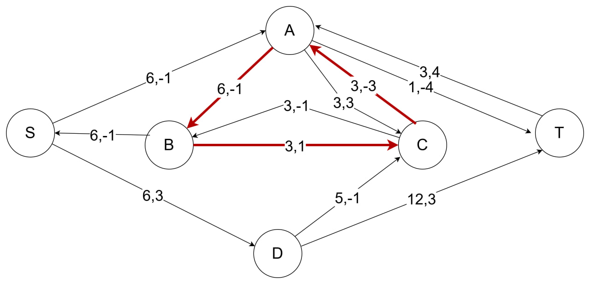
> **[Граф 19]** - Остаточная сеть с выделенным отрицательным циклом b → c → a → b

### 9. Устранение отрицательного цикла

Определим, сколько потока можно пропустить по найденному отрицательному циклу:

$\Delta = \min(3, 5, 6) = \mathbf{3}$

**Корректировка потоков в исходной сети:**
1. Увеличиваем поток по дуге **b → c** на 3: $1 + 3 = 4$
2. Уменьшаем поток по дуге **a → c** на 3: $5 - 3 = 2$
3. Уменьшаем поток по дуге **b → a** на 3: $6 - 3 = 3$

**Изменение стоимости:**
$\Delta Cost = 3 \times (-3) = -9$

**Новая общая стоимость:** $123 - 9 = \mathbf{114}$

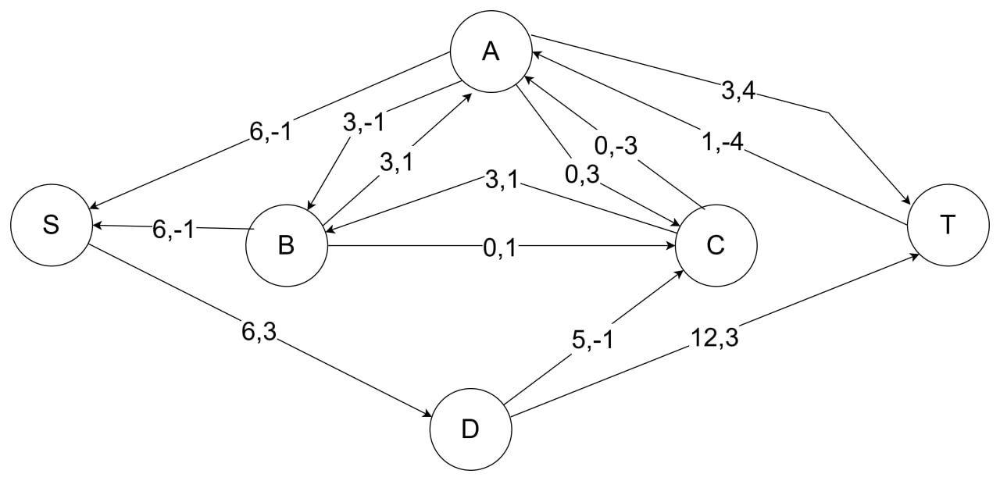
> **[Граф 20]** - Обновлённая остаточная сеть после устранения отрицательного цикла

> **[Граф 21]** - Исходная сеть с локальными потоками после оптимизации

### 10. Проверка на наличие других отрицательных циклов

После корректировки проверим остаточную сеть снова:

| Возможный цикл | Дуги | Стоимость |
|:--------------:|:-----:|:---------:|
| b → a → c → b | b→a (1), a→c (3), c→b (-1) | 1 + 3 - 1 = 3 |
| a → b → c → a | a→b (-1), b→c (насыщена), c→a (-3) | Цикл разорван |

Отрицательных циклов больше не обнаружено. Поток минимальной стоимости найден.

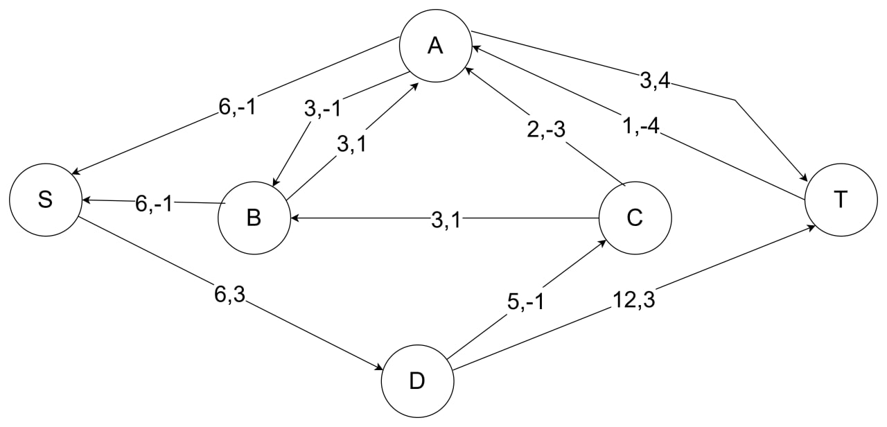
> **[Граф 22]** - Финальная остаточная сеть без отрицательных циклов

### 11. Проверка через разрезы сети

Для подтверждения максимального потока проверим минимальный разрез:

| № | V1 | V2 | Пропускная способность разреза |
|---|:--------------|:--------------|:------------------------------:|
| 1 | s | a, b, c, d, t | 6 + 7 + 6 = 19 |
| 2 | s, a | b, c, d, t | 7 + 6 + 5 + 8 = 26 |
| 3 | s, b | a, c, d, t | 6 + 6 + 4 + 2 = 18 |
| 4 | s, d | a, b, c, t | 6 + 7 + 12 = 25 |
| 5 | s, a, b | c, d, t | 6 + 4 + 5 + 8 = 23 |
| 6 | s, a, d | b, c, t | 7 + 5 + 8 + 12 = 32 |
| 7 | s, b, d | a, c, t | 6 + 4 + 2 + 12 = 24 |
| 8 | s, a, b, d | c, t | 4 + 5 + 8 + 12 = 29 |
| 9 | s, a, b, c | d, t | 6 + 10 + 8 = 24 |
| 10 | s, a, b, c, d | t | 8 + 12 = 20 |

Минимальная пропускная способность разреза равна **19** ({s} / {a, b, c, d, t}), что совпадает с найденной величиной максимального потока.

### 12. Финальный расчёт стоимости

| Дуга | Поток | Пропускная способность | Стоимость ед. | Общая стоимость |
|:----:|:-----:|:----------------------:|:-------------:|:---------------:|
| sa   | 6     | 6                      | 1             | 6               |
| sb   | 7     | 7                      | 1             | 7               |
| sd   | 6     | 6                      | 3             | 18              |
| ba   | 3     | 6                      | 1             | 3               |
| bc   | 4     | 4                      | 1             | 4               |
| cd   | 6     | 10                     | 1             | 6               |
| ac   | 2     | 5                      | 3             | 6               |
| at   | 7     | 8                      | 4             | 28              |
| dt   | 12    | 12                     | 3             | 36              |
| **Итого** | **19** | | | **114** |

### Ответ:

**Максимальный поток в сети равен 19**

**Минимальная стоимость транспортировки равна 114**

Поток реализуется следующими локальными потоками:

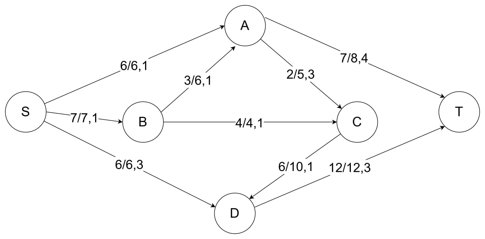
> **[Граф 23]** - Финальная сеть с распределением максимального потока минимальной стоимости