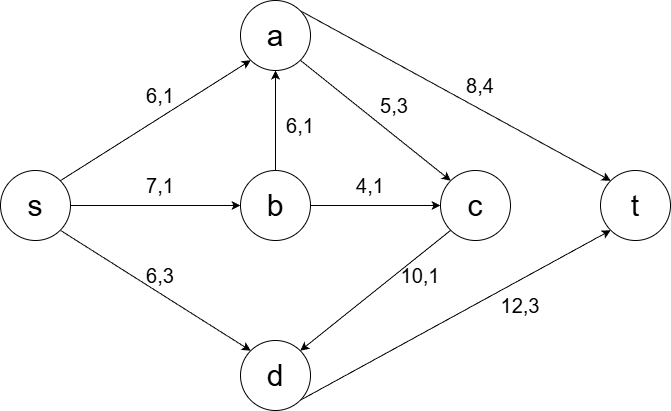
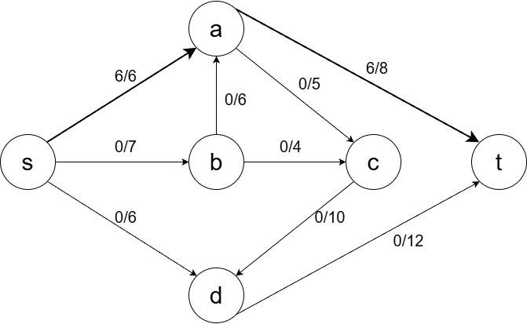
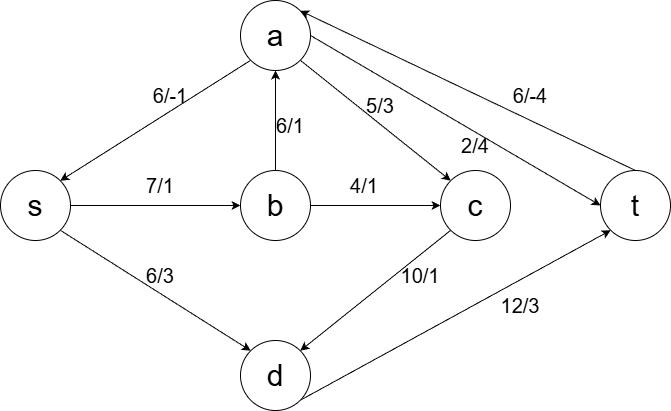
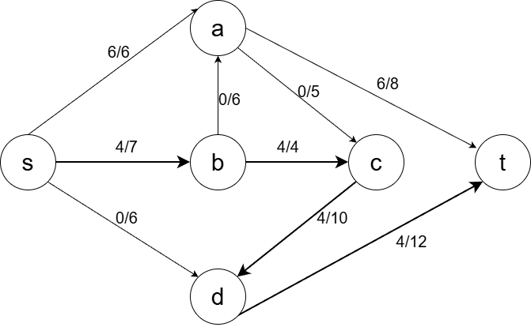
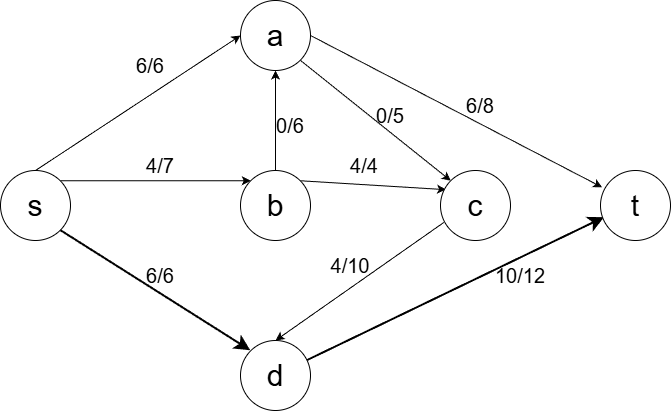
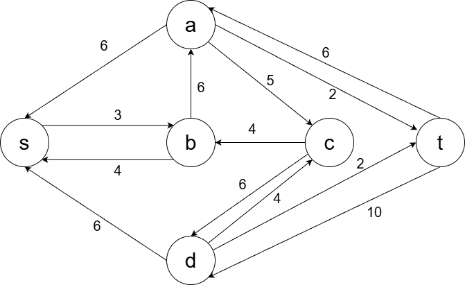
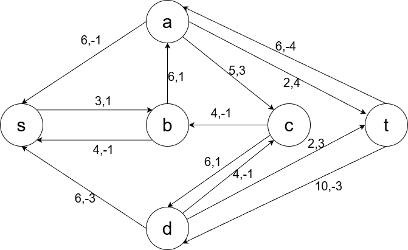

# Вариант 3
# Задача о максимальном потоке минимальной стоимости
# Полностью корректное решение

Исходные данные:

| Дуги                      | sa | sb | sd | ba | bc | cd | ac | at | dt |
|:--------------------------|:--:|:--:|:--:|:--:|:--:|:--:|:--:|:--:|:--:|
| Пропускная способность    | 6  | 7  | 6  | 6  | 4  | 10 | 5  | 8  | 12 |
| Стоимость транспортировки | 1  | 1  | 3  | 1  | 1  | 1  | 3  | 4  | 3  |

Источник - s  
Сток - t  

---------------------------------------------------------------------

## 1. Построение исходной сети

---------------------------------------------------------------------

## 2. Первый увеличивающий путь

Выбираем путь:

s -> a -> t

Минимальная пропускная способность:
min(6, 8) = 6

Добавляем поток 6.

---------------------------------------------------------------------

## 3. Остаточная сеть

---------------------------------------------------------------------

## 4. Второй увеличивающий путь

Путь:

s -> b -> c -> d -> t

Минимальная пропускная способность:
min(7, 4, 10, 12) = 4

Добавляем поток 4.

---------------------------------------------------------------------

## 5. Остаточная сеть

---------------------------------------------------------------------

## 6. Третий увеличивающий путь

Путь:

s -> d -> t

Минимальная пропускная способность:
min(6, 12 - 4) = 6

Добавляем поток 6.

Общий поток:

6 + 4 + 6 = 16

---------------------------------------------------------------------

## 7. Остаточная сеть после нахождения максимального потока

Увеличивающих путей больше нет.  
Максимальный поток равен 16.

---------------------------------------------------------------------

## 8. Стоимость полученного максимального потока

| Дуги | sa | sb | sd | ba | bc | cd | ac | at | dt | Итого |
|:-----|:--:|:--:|:--:|:--:|:--:|:--:|:--:|:--:|:--:|:----:|
| Локальный поток f(e) | 6 | 4 | 6 | 0 | 4 | 4 | 0 | 6 | 10 |      |
| Стоимость c(e)       | 1 | 1 | 3 | 1 | 1 | 1 | 3 | 4 | 3 |      |
| f(e)*c(e)            | 6 | 4 | 18 | 0 | 4 | 4 | 0 | 24 | 30 | 90 |

Стоимость равна 90.

---------------------------------------------------------------------

## 9. Минимизация стоимости

Строим остаточную сеть со стоимостями.

Остаточные дуги со стоимостями:

a -> s 6, стоимость -1  
b -> s 4, стоимость -1  
d -> s 6, стоимость -3  
s -> b 3, стоимость 1  
b -> a 6, стоимость 1  
c -> b 4, стоимость -1  
c -> d 6, стоимость 1  
d -> c 4, стоимость -1  
a -> c 5, стоимость 3  
a -> t 2, стоимость 4  
t -> a 6, стоимость -4  
d -> t 2, стоимость 3  
t -> d 10, стоимость -3  

Проверяем возможные циклы.

Рассмотрим цикл:

a -> c -> d -> s -> a

Стоимость:

a -> c = 3  
c -> d = 1  
d -> s = -3  
s отсутствует дуга к a напрямую, есть только a -> s  

Значит такого цикла нет.

Проверяем:

c -> d -> s -> b -> c

Стоимость:

c -> d = 1  
d -> s = -3  
s -> b = 1  
b отсутствует дуга к c  

Цикла нет.

Проверяем все возможные комбинации.

Отрицательных циклов в остаточной сети нет.

---------------------------------------------------------------------

## 10. Итог

Минимизация невозможна, так как отсутствуют циклы отрицательной стоимости.

Следовательно:

Максимальный поток = 16  
Минимальная стоимость = 90  

Ответ:

Максимальный поток равен 16.  
Минимальная стоимость равна 90.
