# Вариант 1
# Транспортная задача. Решение с использованием алгоритма поиска максимального потока минимальной стоимости.

Два завода имеют производительность 6 и 9, а два складских помещения имеют вместимость 7 и 10. Матрица затрат на перевозку одной единицы товара (строки – это заводы, столбцы – это склады) имеет вид:

$$
 \begin{pmatrix}    
  6 & 10 \\ 
  2 & 8 \\ 
 \end{pmatrix}    
$$

Требуется:
1. Найти стоимость перевозки с первого завода на первый склад 6 единиц товара, а со второго завода на второй склад 9 единиц товара;
2. Используя алгоритм поиска максимального потока минимальной стоимости, скорректировать указанный выше вариант перевозки товаров, так чтобы объём перевозимых товаров не изменился, а стоимость их перевозки стала минимальной.

Составляем граф с ценами перевозок, добавили исток и сток чтобы показать в будущем сколько по ним будет идти товаров, а ак же чтобы свести задачу к задачу о максимальном потоке минмальной стоимостию.

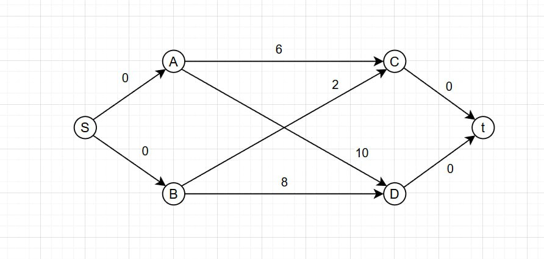

Далее находим цену под первое условие нашей задачи, которую потом мы будем снижать(минимализиловать). Ниже график пути, по которому нас просят отправить изначально.

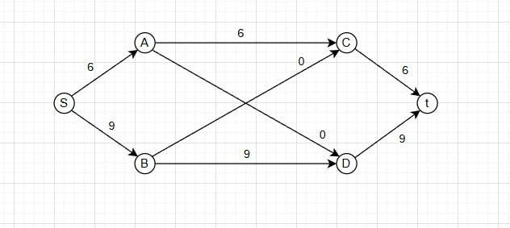

Стоимость этого пути составляет 6 * 6 + 9 * 8 = 36 + 72 = 108

Далее отобразим граф на котором подпишем максмальную пропускную способность всех дуг исзодя из того сколько на заводе всего товаров, а то есть из завода A никак не может уйти больше 6 товаров, а из завода B Не больше 9

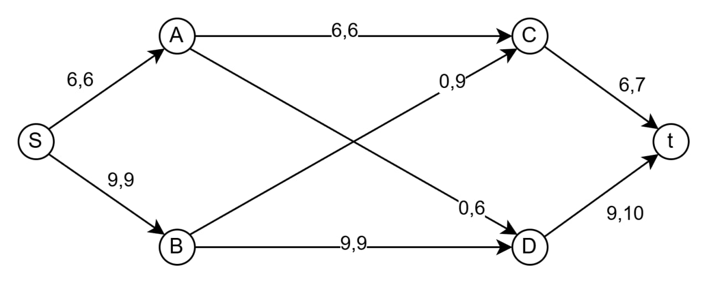

Далее построим остаточную сеть.

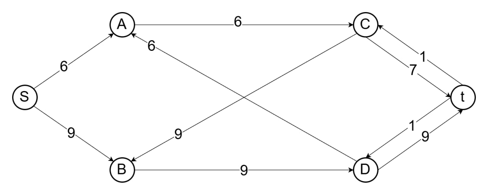

Далее отображаем остаточную сеть с ценами.

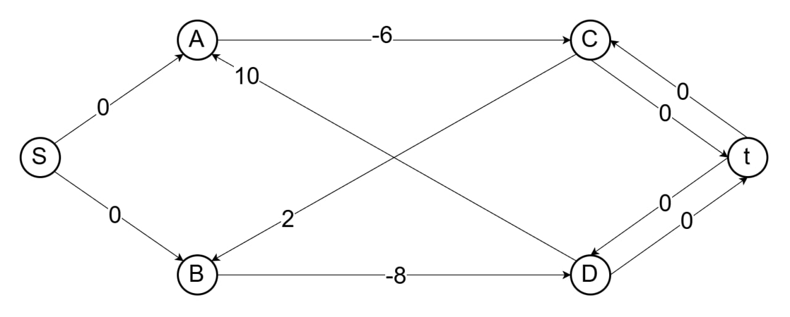

Ищем путь с отрицательной стоимостью, например BDtCB его сумма равна -6, далее идем к остаточной сети и ищем минимальное значение. 

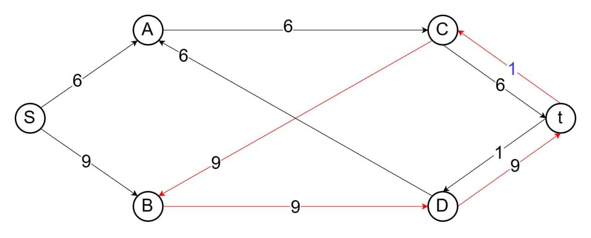

Его минимальное значени 1, вычитаем из всех дуг 1 и обязательно прибавляем 1 ко всем обратным.

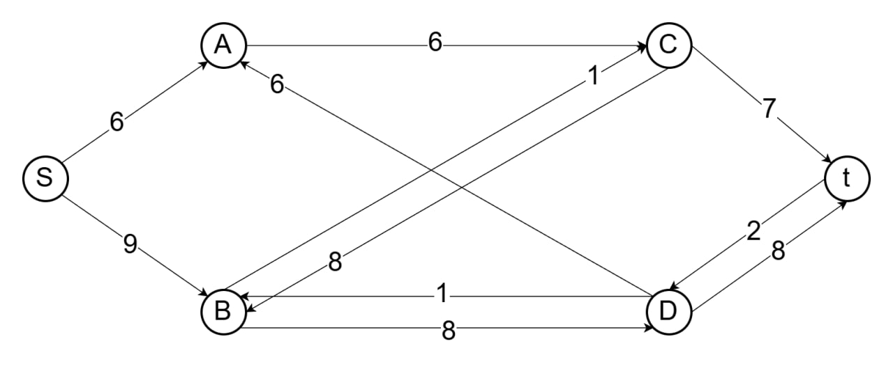

Строим снова остаточную сеть с ценами и ищем в ней путь с орицательной стоимостью.

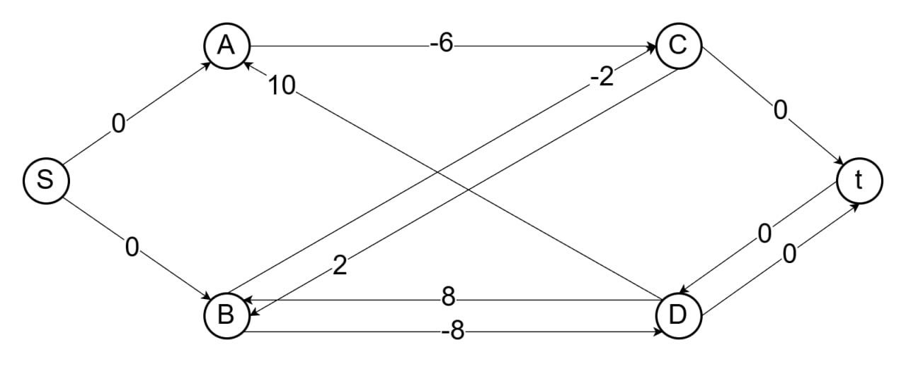

Находим путь с отрицательной стоимостью ACDBA: -2.

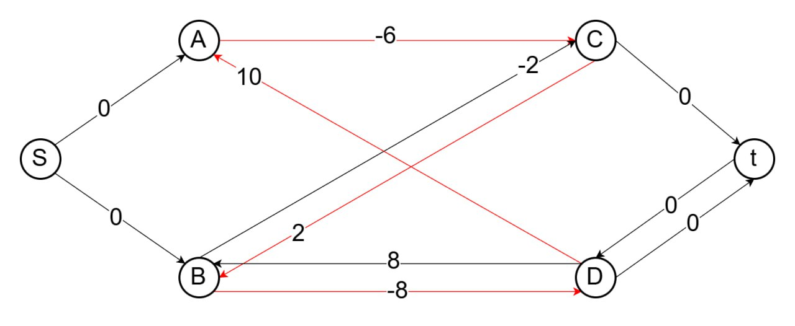

Переходим к остоточной сети и выделяем его там и смотрим на минимальное число, оно равно 6.

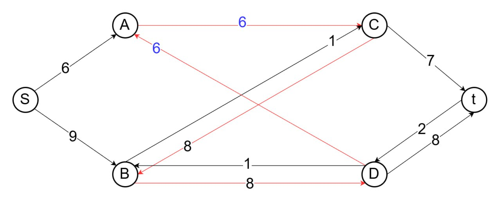

Вычитаем из всех дуг 6 и обязательно прибавляем 6 ко всем обратным.

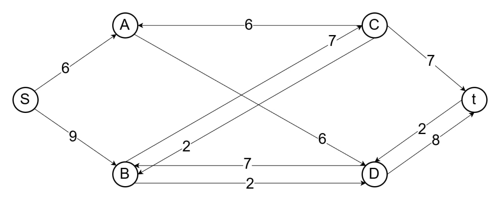

Полученная сеть.

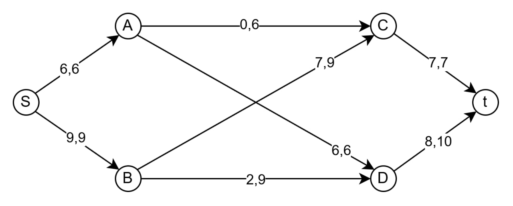

Далее мы дальше ищем отрицательную сумму в остаточной сети с ценами.

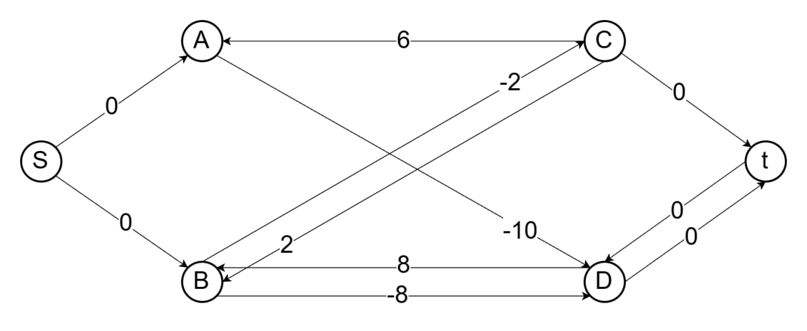

Больше нет, следовательно, мы нашли самый выгодный путь.

Считаем стоимость:10 * 6 + 2 * 7 + 8 * 2 = 90

Ответ: Из завода A на склад С(1) поставляем 0 товаров, из завода B на склад С(1) поставляем 7 товаров, из завода A на склад D(2) поставляем 6 товаров, из завода B на склад D(2) поставляем 2 товара и финальная стоимость равна 90, что на 18 меньше изначальной, урааа.