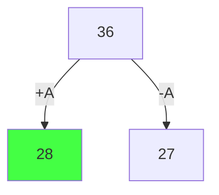
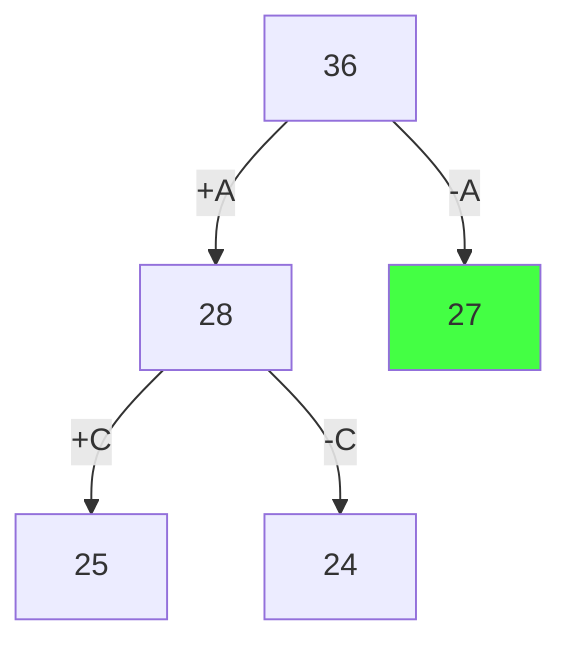
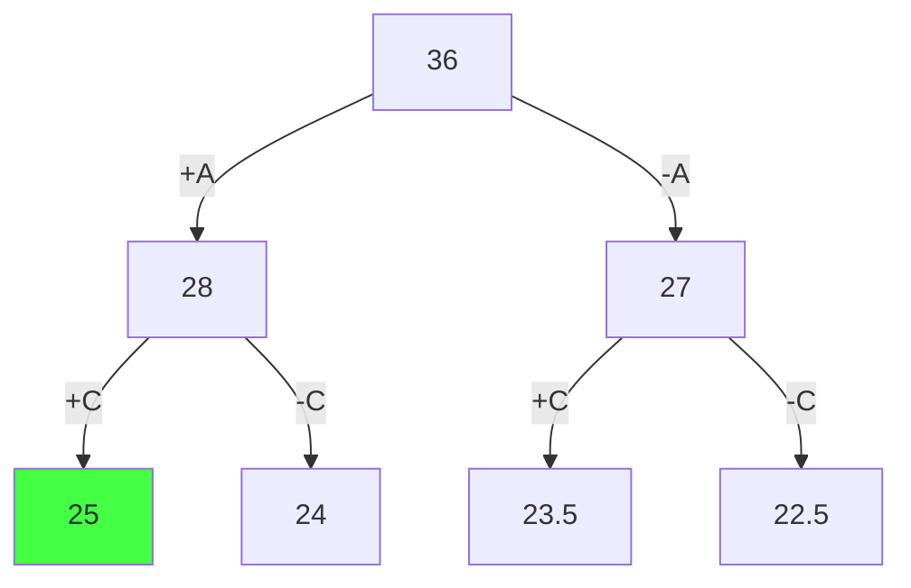
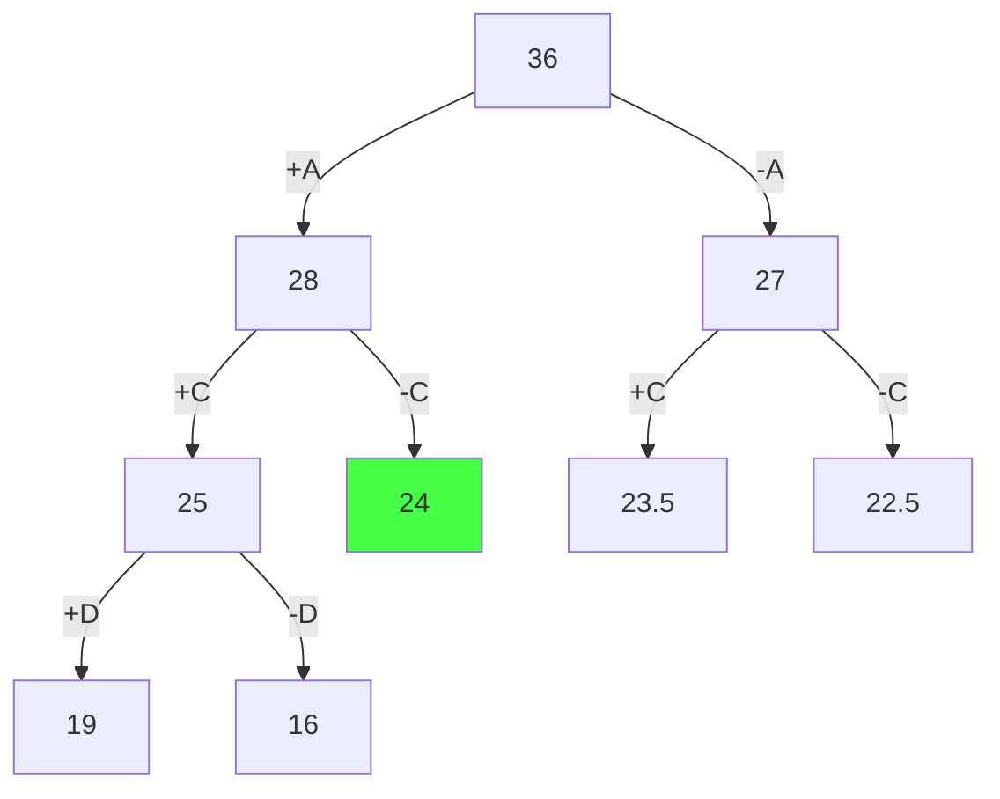
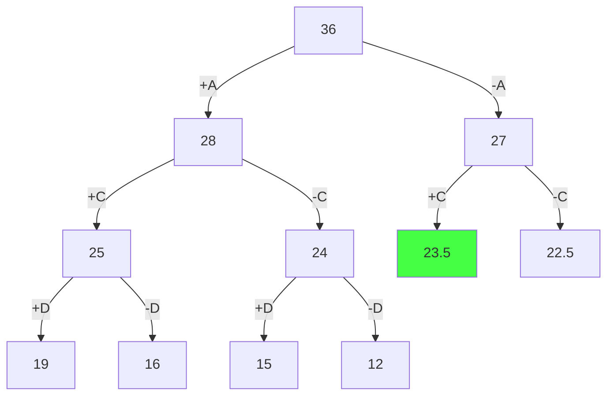
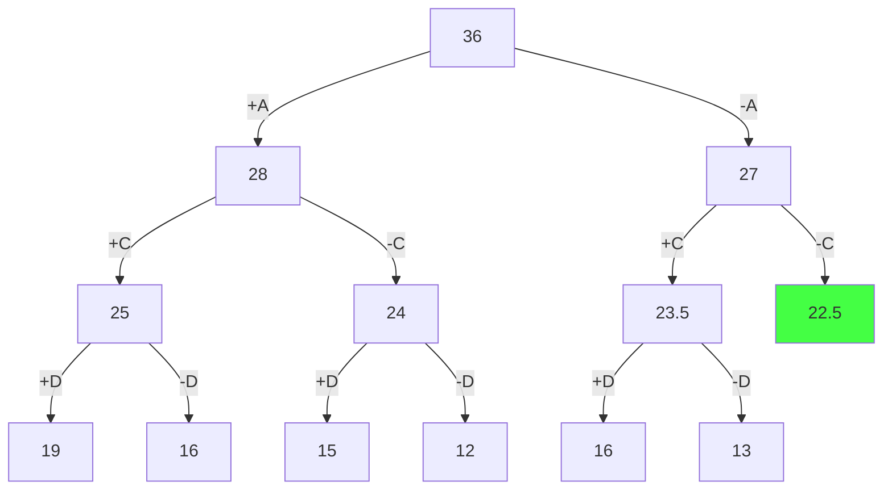
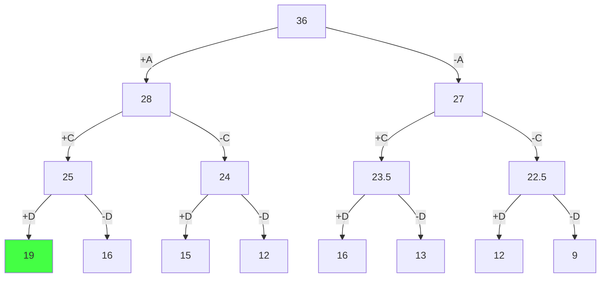
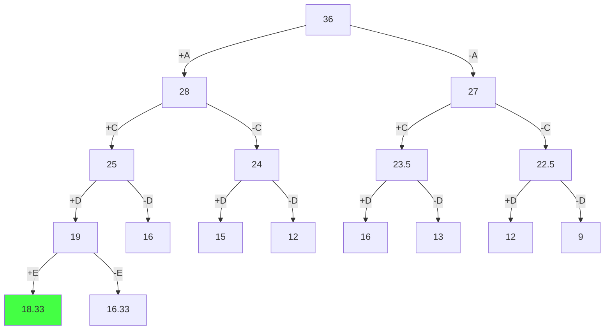
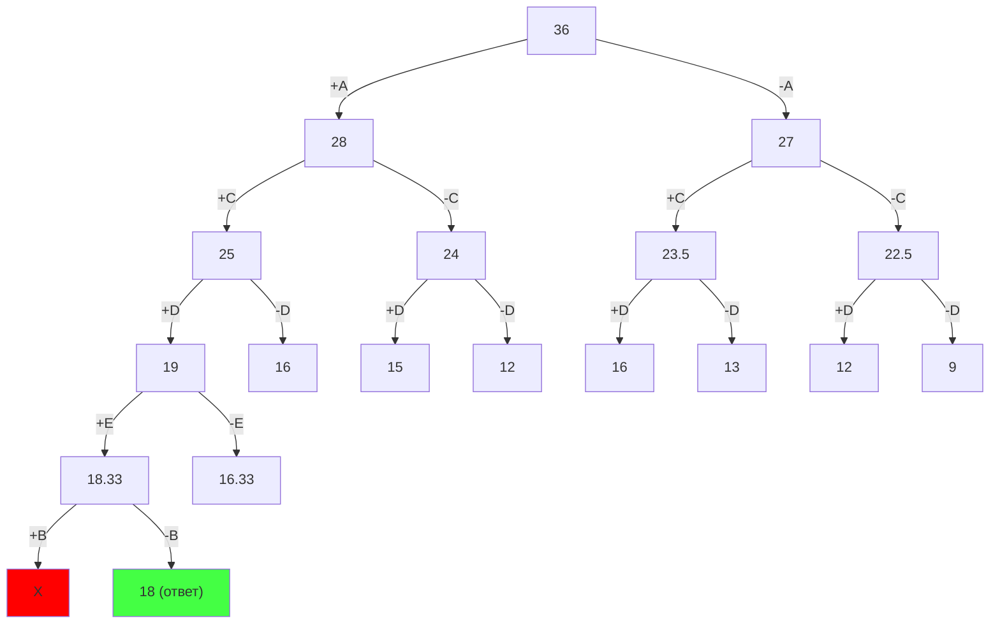
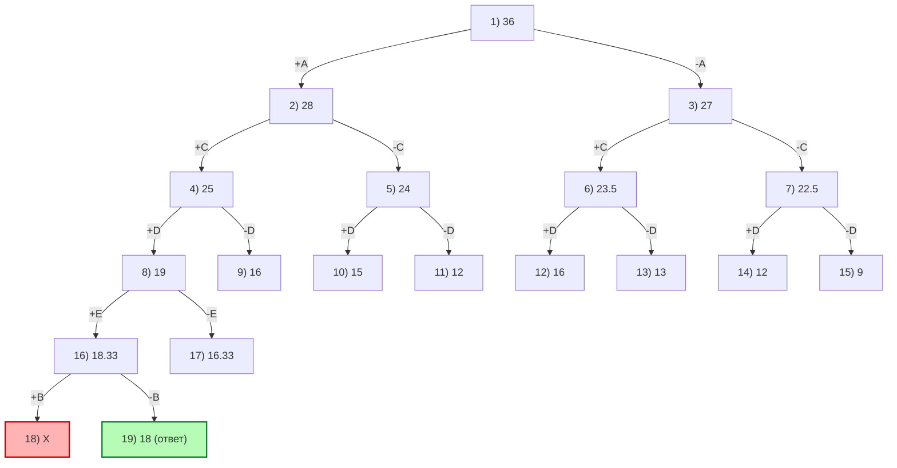

# Задача о рюкзаке (метод ветвей и границ)
## Вариант 5

## Условия задачи

| Предметы  | A | B | C | D | E |
|:----------|:-:|:-:|:-:|:-:|:-:|
| Стоимость | 4 | 1 | 6 | 5 | 3 |
| Вес       | 1 | 3 | 2 | 2 | 3 |

Ограничение вместимости: **9**

---

## Шаг 1. Сортировка предметов по удельной ценности (Стоимость / Вес)

Рассчитаем удельную ценность каждого предмета:

- A: 4 / 1 = 4
- C: 6 / 2 = 3
- D: 5 / 2 = 2.5
- E: 3 / 3 = 1
- B: 1 / 3 ≈ 0.33

Отсортированный порядок (по убыванию ценности): **A, C, D, E, B**

| Предметы          | A | C | D | E | B |
|-------------------|:-:|:-:|:-:|:-:|:-:|
| Стоимость         | 4 | 6 | 5 | 3 | 1 |
| Вес               | 1 | 2 | 2 | 3 | 3 |
| Удельная ценность | 4 | 3 | 2.5 | 1 | 0.33 |

---

## Шаг 2. Оценка корня дерева

Для корня используем верхнюю оценку (границу): считаем, что можем заполнить весь рюкзак самым ценным из ещё не рассмотренных предметов (предметом A, ценность = 4).

UB(root) = 9 * 4 = 36

Это корень дерева.

---

## Шаг 3. Первое ветвление по предмету A

- Левый потомок: **берём A**
- Правый потомок: **не берём A**

### Оценка левого потомка (+A)
После выбора A:
- стоимость = 4
- вес = 1
- осталось места = 9 - 1 = 8

Следующий по ценности предмет — C (ценность 3), значит:

UB(+A) = 4 + 8 * 3 = 28

### Оценка правого потомка (-A)
Если A не берём, то лучшая возможная оценка строится на C (ценность 3):

UB(-A) = 9 * 3 = 27

Самая перспективная вершина: **28** (узел `+A`).

---

## Шаг 4. Ветвление узла +A по предмету C

Рассматриваем узел `+A` (стоимость 4, вес 1).

### Левый потомок (+A,+C)
- стоимость = 4 + 6 = 10
- вес = 1 + 2 = 3
- осталось места = 9 - 3 = 6
- следующий предмет D, ценность 2.5

UB(+A,+C) = 10 + 6 * 2.5 = 25

### Правый потомок (+A,-C)
- стоимость = 4
- вес = 1
- осталось места = 8
- следующий предмет D, ценность 2.5

UB(+A,-C) = 4 + 8 * 2.5 = 24

Теперь самая перспективная вершина: **27** (узел `-A`).

---

## Шаг 5. Ветвление узла -A по предмету C

Рассматриваем узел `-A` (стоимость 0, вес 0).

### Левый потомок (-A,+C)
- стоимость = 6
- вес = 2
- осталось места = 7
- следующий предмет D, ценность 2.5

UB(-A,+C) = 6 + 7 * 2.5 = 23.5

### Правый потомок (-A,-C)
- стоимость = 0
- вес = 0
- осталось места = 9
- следующий предмет D, ценность 2.5

UB(-A,-C) = 9 * 2.5 = 22.5

Самая перспективная вершина: **25** (узел `+A,+C`).

---

## Шаг 6. Ветвление узла +A,+C по предмету D

Рассматриваем узел `+A,+C`:
- стоимость = 10
- вес = 3
- осталось места = 6

### Левый потомок (+A,+C,+D)
- стоимость = 10 + 5 = 15
- вес = 3 + 2 = 5
- осталось места = 4
- следующий предмет E, ценность 1

UB(+A,+C,+D) = 15 + 4 * 1 = 19

### Правый потомок (+A,+C,-D)
- стоимость = 10
- вес = 3
- осталось места = 6
- следующий предмет E, ценность 1

UB(+A,+C,-D) = 10 + 6 * 1 = 16

Самая перспективная вершина: **24** (узел `+A,-C`).

---

## Шаг 7. Ветвление узла +A,-C по предмету D

Рассматриваем узел `+A,-C`:
- стоимость = 4
- вес = 1
- осталось места = 8

### Левый потомок (+A,-C,+D)
- стоимость = 4 + 5 = 9
- вес = 1 + 2 = 3
- осталось места = 6
- следующий предмет E, ценность 1

UB(+A,-C,+D) = 9 + 6 * 1 = 15

### Правый потомок (+A,-C,-D)
- стоимость = 4
- вес = 1
- осталось места = 8
- следующий предмет E, ценность 1

UB(+A,-C,-D) = 4 + 8 * 1 = 12

Самая перспективная вершина: **23.5** (узел `-A,+C`).

---

## Шаг 8. Ветвление узла -A,+C по предмету D

Рассматриваем узел `-A,+C`:
- стоимость = 6
- вес = 2
- осталось места = 7

### Левый потомок (-A,+C,+D)
- стоимость = 6 + 5 = 11
- вес = 2 + 2 = 4
- осталось места = 5
- следующий предмет E, ценность 1

UB(-A,+C,+D) = 11 + 5 * 1 = 16

### Правый потомок (-A,+C,-D)
- стоимость = 6
- вес = 2
- осталось места = 7
- следующий предмет E, ценность 1

UB(-A,+C,-D) = 6 + 7 * 1 = 13

Самая перспективная вершина: **22.5** (узел `-A,-C`).

---

## Шаг 9. Ветвление узла -A,-C по предмету D

Рассматриваем узел `-A,-C`:
- стоимость = 0
- вес = 0
- осталось места = 9

### Левый потомок (-A,-C,+D)
- стоимость = 5
- вес = 2
- осталось места = 7
- следующий предмет E, ценность 1

UB(-A,-C,+D) = 5 + 7 * 1 = 12

### Правый потомок (-A,-C,-D)
- стоимость = 0
- вес = 0
- осталось места = 9
- следующий предмет E, ценность 1

UB(-A,-C,-D) = 9 * 1 = 9

Самая перспективная вершина: **19** (узел `+A,+C,+D`).

---

## Шаг 10. Ветвление узла +A,+C,+D по предмету E

Рассматриваем узел `+A,+C,+D`:
- стоимость = 15
- вес = 5
- осталось места = 4

### Левый потомок (+A,+C,+D,+E)
- стоимость = 15 + 3 = 18
- вес = 5 + 3 = 8
- осталось места = 1
- следующий предмет B, ценность 1/3

UB(+A,+C,+D,+E) = 18 + 1 * (1/3) = 18.33

### Правый потомок (+A,+C,+D,-E)
- стоимость = 15
- вес = 5
- осталось места = 4
- следующий предмет B, ценность 1/3

UB(+A,+C,+D,-E) = 15 + 4 * (1/3) = 16.33

Самая перспективная вершина: **18.33** (узел `+A,+C,+D,+E`).

---

## Шаг 11. Ветвление узла +A,+C,+D,+E по предмету B

Рассматриваем узел `+A,+C,+D,+E`:
- стоимость = 18
- вес = 8
- осталось места = 1

### Левый потомок (+A,+C,+D,+E,+B)
Предмет B весит 3, а свободно только 1, значит предмет **не помещается**.  
Эта вершина отсекается.

### Правый потомок (+A,+C,+D,+E,-B)
- стоимость = 18
- вес = 8

Это лист дерева (все предметы рассмотрены), допустимое решение.

Так как достигнут лист с максимальной найденной стоимостью, получаем оптимальное решение.

---

## Итоговое дерево (с порядковыми номерами узлов для проверки порядка обхода)

Нумерация показывает порядок появления/расчёта узлов при пошаговом построении.

---

## Ответ

Оптимальный набор предметов:
- **A**
- **C**
- **D**
- **E**

Проверка:
- Общий вес = 1 + 2 + 2 + 3 = **8**
- Общая стоимость = 4 + 6 + 5 + 3 = **18**

### Итог:
- **Максимально возможная стоимость:** **18**
- **Набор предметов:** **A, C, D, E**
- **Общий вес в рюкзаке:** **8**
- **Свободное место:** 9 - 8 = **1**