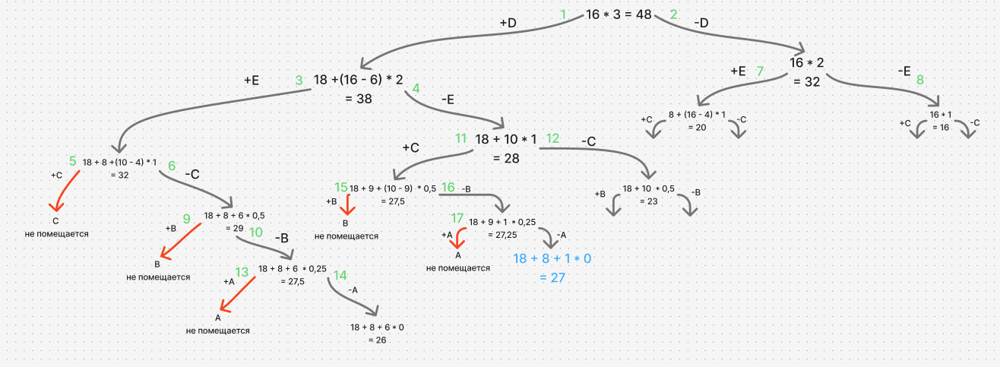

# Условие 

### Вариант 6:

| Предметы  |  A  | B  | C | D  | E |
|:----------|:---:|:--:|:-:|:--:|:-:|
| Стоимость |  3  | 5  | 9 | 18 | 8 |
| Вес       | 12  | 10 | 9 | 6  | 4 |

Ограничение вместимости: 16

# Решение 

## Шаг 1

Сортируем предметы по их ценности $(\frac {Стоимость}{вес})$

|    **Предметы**   | **D** | **E** | **C** | **B** | **A** |
|-------------------|:-----:|:-----:|:-----:|:-----:|:-----:|
| **Стоимость**     |   18  |   8   |   9   |   5   |   3   |
| **Вес**           |   6   |   4   |   9   |  10   |  12   |
| **Ценность**      |   3   |   2   |   1   |$\frac{1}{2}$|$\frac{1}{4}$|

## Шаг 2
Представим, что самого ценного предмета из тех, что еще не обработаны, у нас бесконечное количество и мы можем делить его на сколь угодно малые части. Тогда мы можем все оставшееся в рюкзаке место заполнить этим предметом. Тогда ценность будет

$$
3 * 16 = 48
$$

Это значение будет корнем нашего дерева, оно представляет оценку перспективности для задачи в целом.

## Шаг 3
Разобьем множество решений на два подмножества и начнем строить дерево. Левым потомком будет подмножество решений, в которых мы взяли самый ценный из оставшихся предметов, правым - где не взяли. 

На рисунке ниже изображено итоговое дерево, зелеными числами обозначается последовательность шагов, последовательность шагов строится на перспективности вершин (строить поддерево начинаем с более перспективной вершины), в случае когда перспективность совпадала более приоритетным была более низкая по уровню вершина 

## Ответ:

- максимально возможная стоимость предметов в рюкзаке - 27
- набор предметов, обеспечивающих максимальную стоимость - С и D
- общий вес предметов в рюкзаке - 15 
- свободное место в рюкзаке - 1 