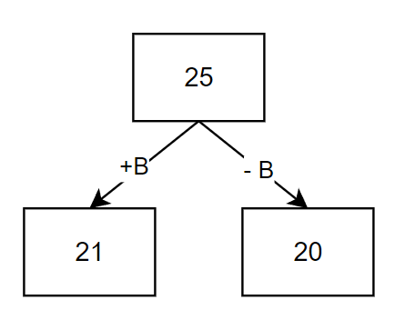
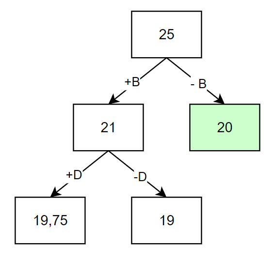
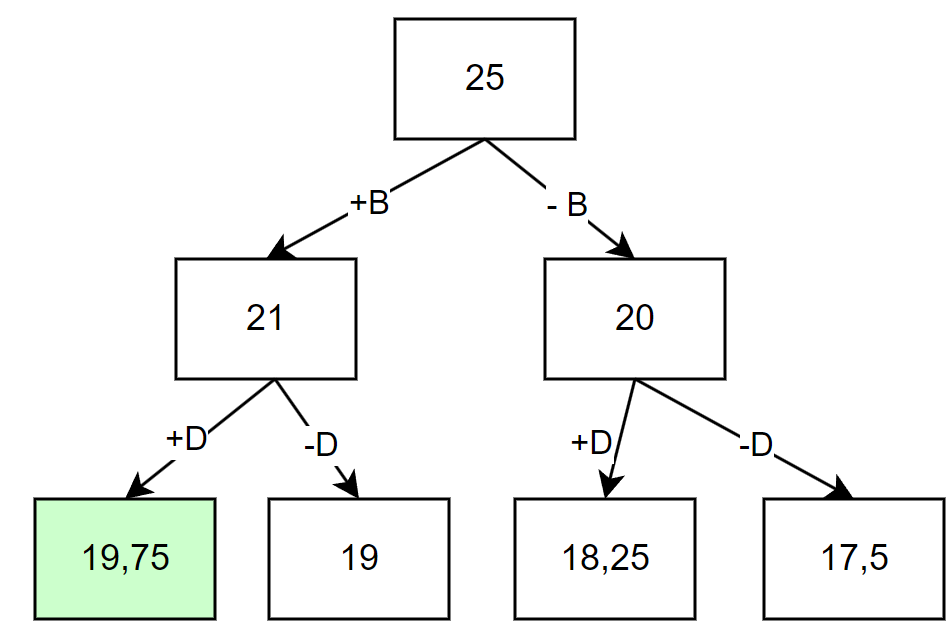
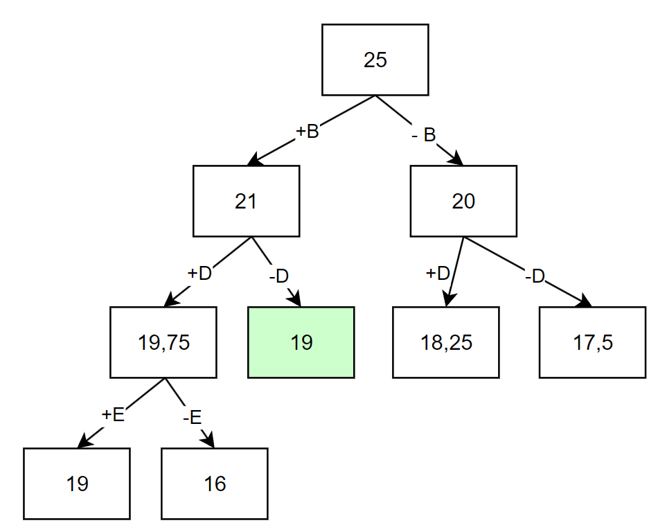
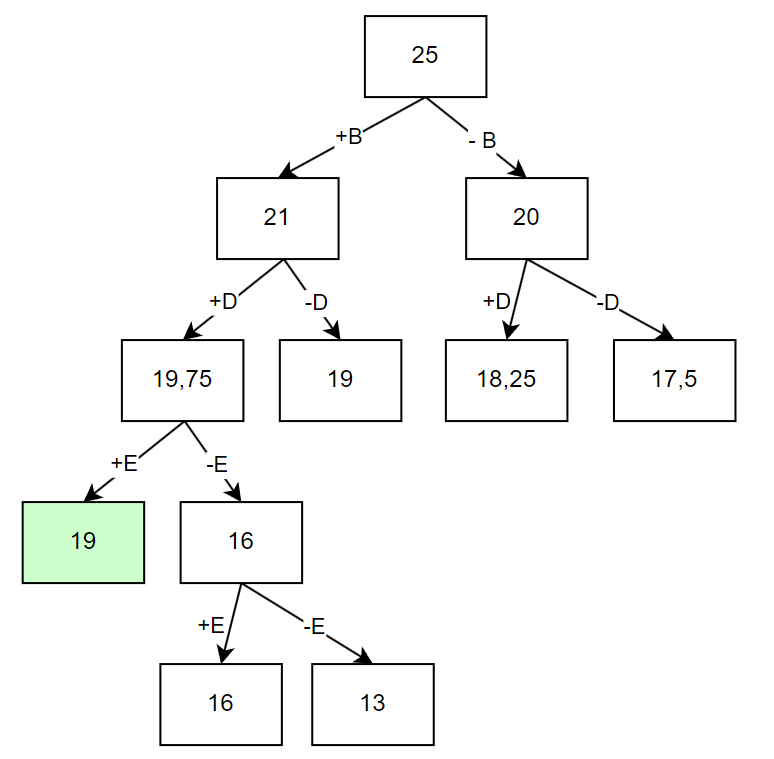
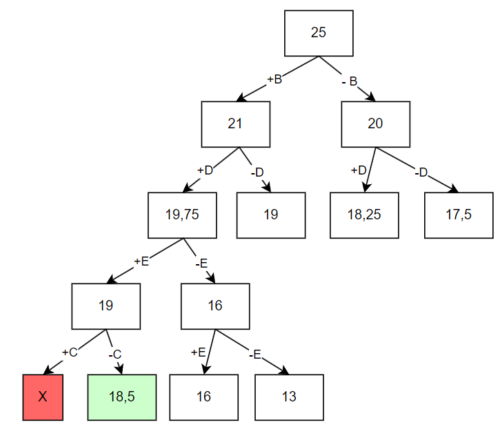
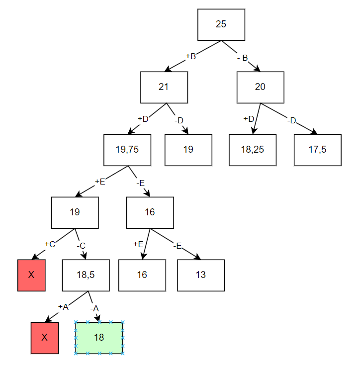

# Вариант 3:

| Предметы  |  A  | B  | C  | D  | E  |
|:----------|:---:|:--:|:--:|:--:|:--:|
| Стоимость | 3   | 5  | 5  | 6  |  7 |
| Вес       | 6   | 2  | 5  | 3  |  4 |

Ограничение вместимости: 10

## Шаг 1
Сортируем предметы по их ценности $(\frac {Стоимость}{вес})$

|    **Предметы**   | **B** | **D** | **E** | **C** | **A** |
|-------------------|:-----:|:-----:|:-----:|:-----:|:-----:|
| **Стоимость**     |   5   |   6   |   7   |   5   |   3   |
| **Вес**           |   2   |   3   |   4   |  5    |  6    |
| **Ценность**      |   2,5 |   2   |   1,75|  1    |  0,5  |

## Шаг 2
Представим, что самого ценного предмета из тех, что еще не обработаны, у нас бесконечное количество и мы можем делить его на сколь угодно малые части. Тогда мы можем все оставшееся в рюкзаке место заполнить этим предметом. Тогда ценность будет

$$
2,5 * 10 = 25
$$

Это значение будет корнем нашего дерева, оно представляет оценку перспективности для задачи в целом.

## Шаг 3
Разобьем множество решений на два подмножества и начнем строить дерево. Левым потомком будет подмножество решений, в которых мы взяли самый ценный из оставшихся предметов, правым - где не взяли. 

Оценка перспективности левого потомка = 

$$
5 + (10 - 2) * 2 = 21 
$$

Оценка перспективности правого потомка = 

$$
10 * 2 = 20
$$

Повторяем шаг 3 и продолжаем строить дерево из самой перспективной вершины.

Оценка перспективности левого потомка -

$$
6 + 5 + (8 - 3) * 1,75 = 19,75 
$$

Оценка перспективности правого потомка - 

$$
5 + (10 - 2) * 1,75 = 19
$$

Заметим, что самая перспективная вершина оказалась на другой ветке. Продолжаем строить из вершины с оценкой 20.

Оценка перспективности левого потомка -

$$
6 + (10 - 3) * 1,75 = 18,25
$$

Оценка перспективности правого потомка - 

$$
10 * 1,75 = 17,5
$$

Самая перспективная вершина - 19,75.

Оценка перспективности левого потомка -

$$
7 + 5 + 6 + (5 - 4) * 1 = 19
$$

Оценка перспективности правого потомка - 

$$
6 + 5 + 5 * 1 = 16
$$

Самая перспективная вершина - 19 (-D).

Оценка перспективности левого потомка -

$$
7 + 5 + (8 - 4) * 1 = 16
$$

Оценка перспективности правого потомка - 

$$
5 + 8 * 1 = 13
$$

Самая перспективная вершина - 19.

Оценка перспективности левого потомка -

$$
5 + 7 + 5 + 6 + (1 - 5) * 0,5 = 23 - 4 * 0,5
$$

Оценка перспективности правого потомка - 

$$
18 + 1 * 0,5 = 18,5
$$

Получили отрицательное значение, что значит предмет не поместится в рюкзак. Соответственно от этой вершины мы не будем продолжать поиск.

Самая перспективная вершина - 18,5.

Оценка перспективности левого потомка -

$$
5 + 6 + 7 + 5 + 3 = 26 > 25
$$

Оценка перспективности правого потомка - 

$$
18
$$

В левом потомке предмет A не помещается в рюкзак. От этой вершины мы больше не можем продолжать поиски.

Вершина на самом нижнем уровне является самой перспективной, тогда **18 - ответ к задаче.**

# Ответ

В рюкзак пойдут предметы E, D, B. Максимальная стоимость рюкзака: 7 + 6 + 5 = 18.