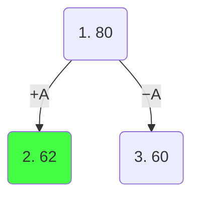
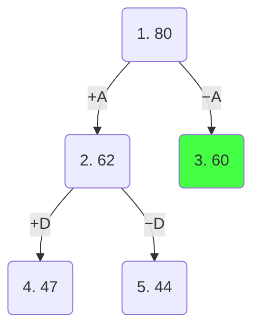
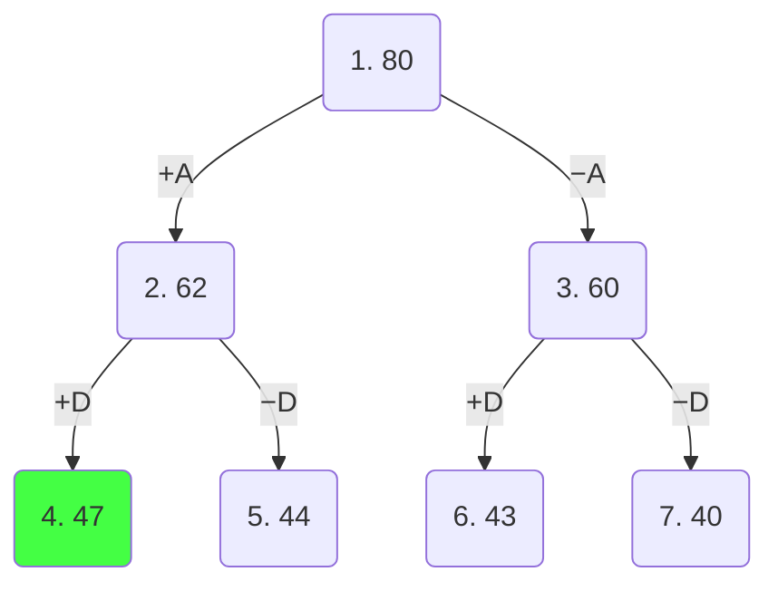
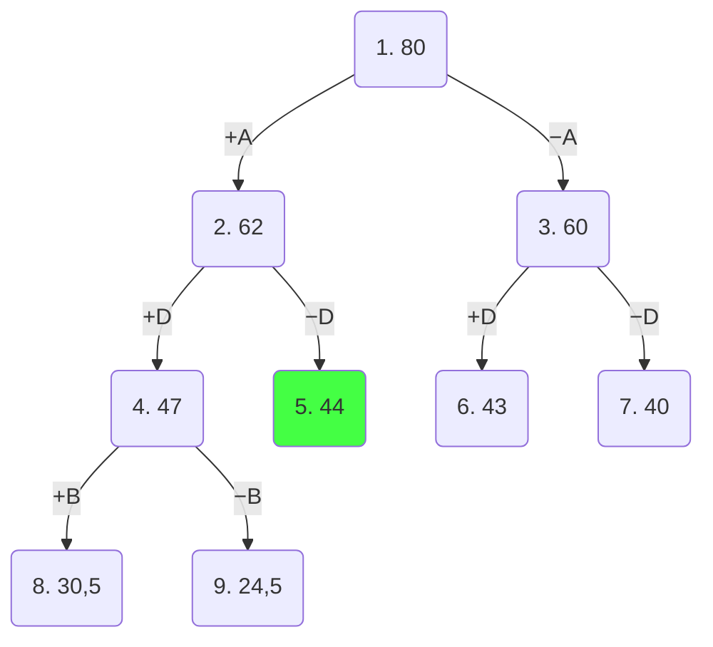
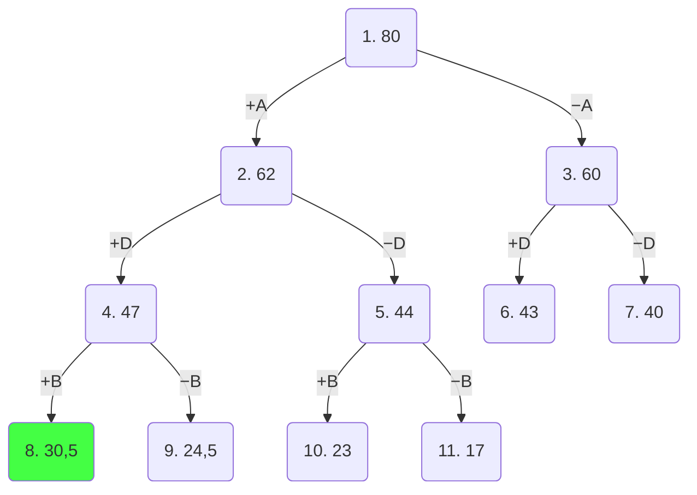
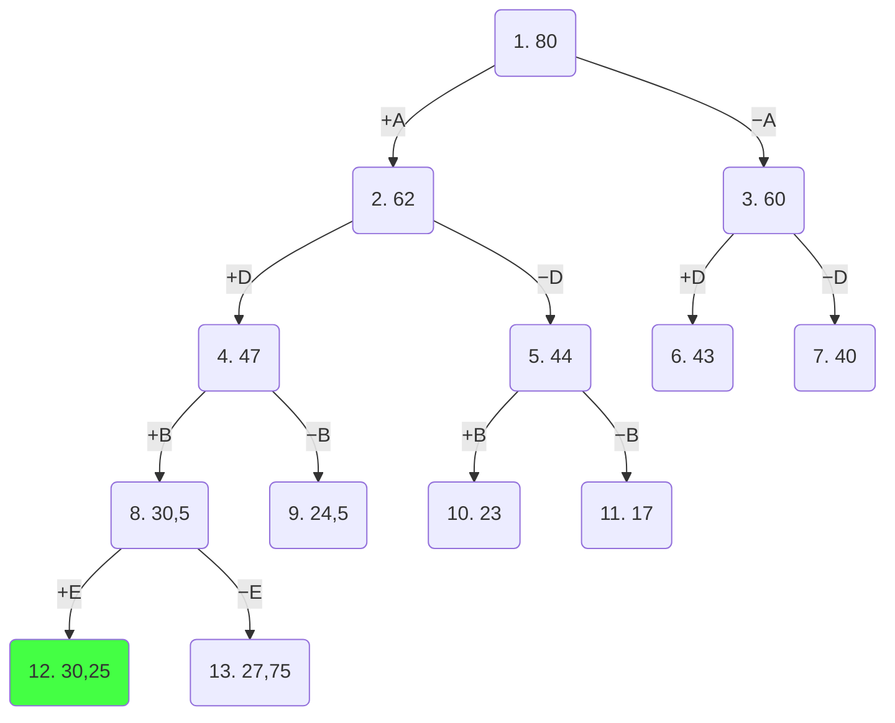
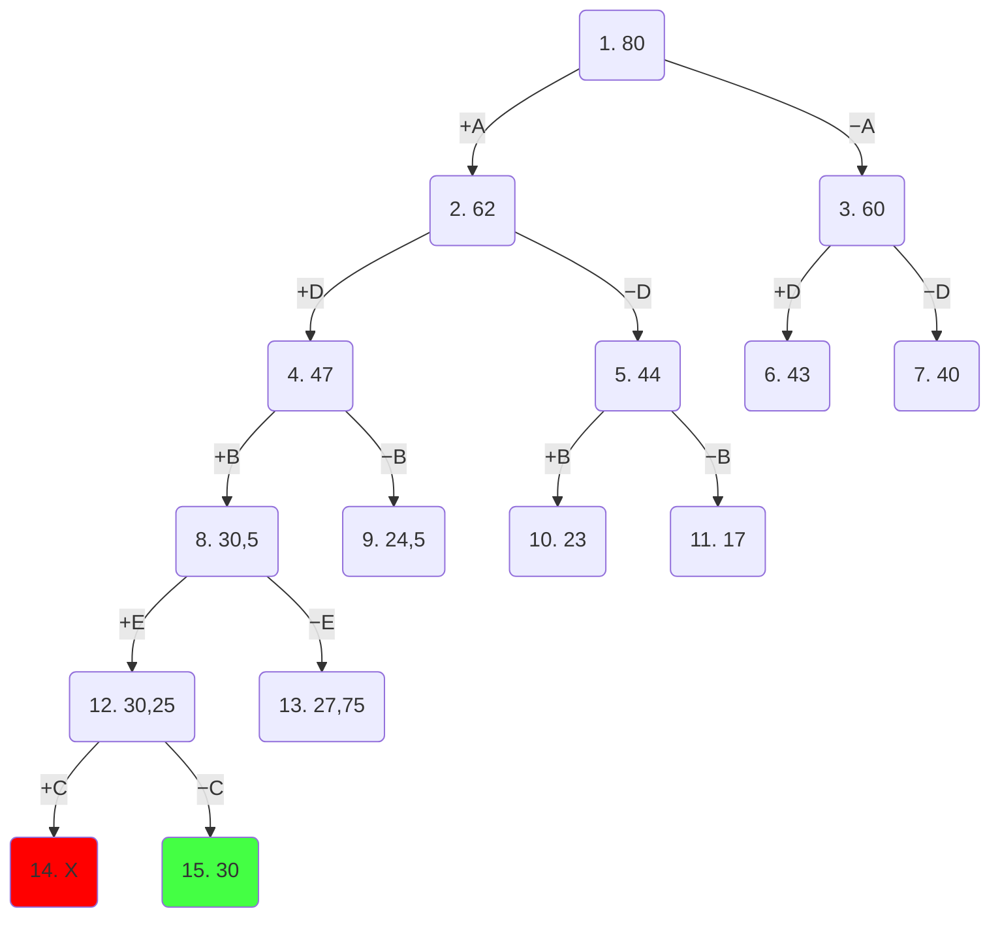

# Задание №12. Вариант 4
# Задача о рюкзаке. Метод ветвей и границ.

## Постановка задачи

Задача о рюкзаке (англ. Knapsack problem) — дано N предметов, ni предмет имеет массу wi > 0 и стоимость pi > 0. Необходимо выбрать из этих предметов такой набор, чтобы суммарная масса не превосходила заданной величины W (вместимость рюкзака), а суммарная стоимость была максимальна.

## Условия задачи

| **Предметы**  | **A** | **B** | **C** | **D** | **E** |
|---------------|:-----:|:-----:|:-----:|:-----:|:-----:|
| **Стоимость** |   8   |   8   |   3   |   9   |   5   |
| **Вес**       |   2   |   4   |  12   |   3   |  10   |

Ограничение вместимости — **20 у.е.**

## Шаг 1. Сортировка предметов по ценности

Вычислим ценность каждого предмета как отношение стоимости к весу $\frac{Стоимость}{Вес}$:

| **Предметы**  | **A** | **B** | **C** | **D** | **E** |
|---------------|:-----:|:-----:|:-----:|:-----:|:-----:|
| **Стоимость** |   8   |   8   |   3   |   9   |   5   |
| **Вес**       |   2   |   4   |  12   |   3   |  10   |
| **Ценность**  |   4   |   2   | 0,25  |   3   |  0,5  |

Отсортируем предметы по убыванию ценности:

| **Предметы**  | **A** | **D** | **B** | **E** | **C** |
|---------------|:-----:|:-----:|:-----:|:-----:|:-----:|
| **Стоимость** |   8   |   9   |   8   |   5   |   3   |
| **Вес**       |   2   |   3   |   4   |  10   |  12   |
| **Ценность**  |   4   |   3   |   2   |  0,5  | 0,25  |

## Шаг 2. Вычисление оценки корня дерева

Представим, что самого ценного предмета из тех, что ещё не обработаны, у нас бесконечное количество и мы можем делить его на сколь угодно малые части. Тогда мы заполняем всё доступное место самым ценным предметом (A, ценность = 4):

$$
4 \times 20 = 80
$$

Это значение будет корнем нашего дерева, оно представляет оценку перспективности для задачи в целом.

## Шаг 3. Построение дерева ветвей и границ

Разобьем множество решений на два подмножества и начнем строить дерево. Левым потомком будет подмножество решений, в которых мы взяли самый ценный из оставшихся предметов, правым - где не взяли. 

**Формула оценки перспективности** вершины: берём стоимость уже выбранных предметов + заполняем оставшееся место следующими предметами по жадному алгоритму.

### Узел 1 (корень): оценка = 80, ещё не выбрано ни одного предмета

Разбиваем на два подмножества по предмету **A**:

**Левый потомок (+A):** берём A (вес=2, стоимость=8), остаток = 18, заполняем D (ценность=3):

$$
8 + 18 \times 3 = 8 + 54 = 62
$$

**Правый потомок (−A):** не берём A, заполняем оставшиеся 20 предметом D (ценность=3):

$$
20 \times 3 = 60
$$

Самая перспективная вершина — **1** (оценка 62). Продолжаем из неё, рассматриваем предмет **D**.

**Левый потомок (+A+D):** берём A+D (вес=2+3=5, стоимость=8+9=17), остаток=15, заполняем B (ценность=2):

$$
17 + 15 \times 2 = 17 + 30 = 47
$$

**Правый потомок (+A−D):** берём A (вес=2, стоимость=8), не берём D, остаток=18, заполняем B (ценность=2):

$$
8 + 18 \times 2 = 8 + 36 = 44
$$

Самая перспективная вершина — **3** (оценка 60). Продолжаем из неё, рассматриваем предмет **D**.

**Левый потомок (−A+D):** не берём A, берём D (вес=3, стоимость=9), остаток=17, заполняем B (ценность=2):

$$
9 + 17 \times 2 = 9 + 34 = 43
$$

**Правый потомок (−A−D):** не берём A, не берём D, остаток=20, заполняем B (ценность=2):

$$
20 \times 2 = 40
$$

Самая перспективная вершина — **4** (оценка 47). Продолжаем из неё, рассматриваем предмет **B**.

**Левый потомок (+A+D+B):** берём A+D+B (вес=2+3+4=9, стоимость=8+9+8=25), остаток=11, заполняем E (ценность=0,5):

$$
25 + 11 \times 0,5 = 25 + 5,5 = 30,5
$$

**Правый потомок (+A+D−B):** берём A+D (вес=5, стоимость=17), не берём B, остаток=15, заполняем E (ценность=0,5):

$$
17 + 15 \times 0,5 = 17 + 7,5 = 24,5
$$

Самая перспективная вершина — **5** (оценка 44). Продолжаем из неё, рассматриваем предмет **B**.

**Левый потомок (+A−D+B):** берём A+B (вес=2+4=6, стоимость=8+8=16), не берём D, остаток=14, заполняем E (ценность=0,5):

$$
16 + 14 \times 0,5 = 16 + 7 = 23
$$

**Правый потомок (+A−D−B):** берём A (вес=2, стоимость=8), не берём D, не берём B, остаток=18, заполняем E (ценность=0,5):

$$
8 + 18 \times 0,5 = 8 + 9 = 17
$$

Самая перспективная вершина — **8** (оценка 30,5). Продолжаем из неё, рассматриваем предмет **E**.

**Левый потомок (+A+D+B+E):** берём A+D+B+E (вес=2+3+4+10=19, стоимость=8+9+8+5=30), остаток=1, заполняем C (ценность=0,25):

$$
30 + 1 \times 0,25 = 30,25
$$

**Правый потомок (+A+D+B−E):** берём A+D+B (вес=9, стоимость=25), не берём E, остаток=11, заполняем C (ценность=0,25). Однако вес C=12 > 11, поэтому берём долю 11/12:

$$
25 + 11 \times 0,25 = 25 + 2,75 = 27,75
$$

Самая перспективная вершина — **12** (оценка 30,25). Продолжаем из неё, рассматриваем последний предмет **C**.

**Левый потомок (+A+D+B+E+C):** берём A+D+B+E+C — суммарный вес = 2+3+4+10+12 = 31 > 20. Предмет C не помещается в рюкзак.

**Правый потомок (+A+D+B+E−C):** не берём C. Все предметы рассмотрены. Итоговая стоимость:

$$
8 + 9 + 8 + 5 = 30, \quad \text{вес} = 2+3+4+10 = 19
$$

Поскольку мы опустились до самого нижнего уровня (рассмотрели все предметы) и вершина на самом нижнем уровне является самой перспективной, то это и будет ответом.
Вершина **15** находится на самом нижнем уровне и имеет наибольшую оценку.

Чтобы восстановить все положенные в рюкзак предметы пройдемся по ребрам, которые привели нас к вершине **15**:
- **+A** → берём A
- **+D** → берём D
- **+B** → берём B
- **+E** → берём E
- **−C** → не берём C

## Ответ
В рюкзак пойдут предметы A, D, B, E. Максимальная стоимость рюкзака: 8 + 9 + 8 + 5 = **30**

| Параметр | Значение |
|----------|----------|
| **Предметы в рюкзаке** | A, D, B, E |
| **Максимальная стоимость** | 8 + 9 + 8 + 5 = **30** |
| **Общий вес предметов** | 2 + 3 + 4 + 10 = **19** |
| **Свободное место в рюкзаке** | 20 − 19 = **1** |