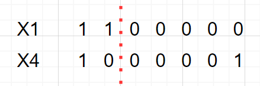
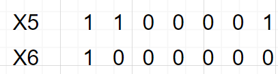
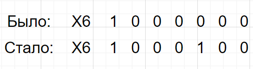
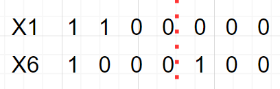
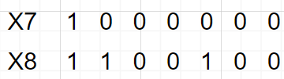
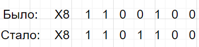
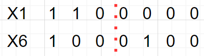
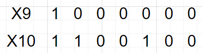

# Вариант 6
Решить задачу о рюкзаке с применением генетического алгоритма, с учетом следующих требований:
   - Придумать условия задачи с количеством предметов не менее 7.
   - Численность популяции не менее 4 особей, в скрещивании участвует половина популяции. 
   - Для скрещивания выбираются сильнейшие особи, скрещивание – одноточечное.
   - До выполнения алгоритма сформулировать стратегию применения оператора мутации и правила формирования нового поколения на основе новых особей и особей из предыдущего поколения
   - Сформировать не менее 3 поколений, не считая первоначального.

## Условия задачи
|    **Предметы**   | **A** | **B** | **C** | **D** | **E** | **F** | **G** |
|-------------------|:-----:|:-----:|:-----:|:-----:|:-----:|:-----:|:-----:|
| **Стоимость**     |   6   |   4   |   2   |   2   |   5   |   1   |   3   |
| **Вес**           |   6   |   3   |   5   |   4   |   6   |   4   |   7   |

Ограничение вместимости - **15** у.е.

**Стратегия применения оператора мутации**: в половине потомков случайно выбранный бит меняется на противоположный ( 0 на 1 или 1 на 0) с вероятностью 50%.

**Правило формирования нового поколения**: 2 лучших родителя из предыдущего поколения, 2 потомка после скрещивания и мутации.

## Выполнение алгоритма
### 1. Создаем начальную популяцию из 4 случайных особей, расчитываем вес взятых предметов и фитнес-функцию

|    **Xi**   | **Хромосома** | **Вес** | **Фитнес-функция** |
|-------------|:-------------:|:-------:|:------------------:|
| **X1**      |   1100000    |   6 + 3 = 9     |  6 + 4 = 10|
| **X2**      |   0011001   |   5 + 4 + 7 = 16   |   **ПЕРЕВЕС** (0)   |
| **X3**      |   0011000   |   5 + 4 = 9   |   2 + 2 = 4   |
| **X4**      |   1000001   |   6 + 7 = 13   |   6 + 3 = 9   |

### 2. Проводим одноточечное скрещивание с участием половины популяции, выбирая сильнейших особей.
Сильнейшие особи Х1 и Х4 с фитнес-функциями 10 и 9.

Получаем особи **Х5** и **Х6**.

### 3. Используем мутацию для случайной половины новых особей через изменение 5-го бита у особи Х6. 

Тогда особь Х6:

### 4. Формируем новое поколение, рассчитываем вес взятых предметов и фитнес-функцию.

|    **Xi**   | **Хромосома** | **Вес** | **Фитнес-функция** |
|-------------|:-------------:|:-------:|:------------------:|
| **X1**      |   1100000    |   6 + 3 = 9     |  6 + 4 = 10|
| **X4**      |   1000001   |   6 + 7 = 13   |   6 + 3 = 9   |
| **X5**      |   1100001   |   6 + 3 + 7 = 16   |   **ПЕРЕВЕС** (0)   |
| **X6**      |   1000100   |   6 + 6 = 12   |   6 + 5 = 11   |

### 5. Проводим одноточечное скрещивание с участием половины популяции, выбирая сильнейших особей.

Сильнейшие особи Х1 и Х6 с фитнес-функциями 10 и 11.

Получаем особи **Х7** и **Х8**.

### 6. Используем мутацию для случайной половины новых особей через изменение 4-го бита у особи Х8.

Тогда особь Х8:

### 7. Формируем новое поколение, рассчитываем вес взятых предметов и фитнес-функцию.

|    **Xi**   | **Хромосома** | **Вес** | **Фитнес-функция** |
|-------------|:-------------:|:-------:|:------------------:|
| **X1**      |   1100000    |   6 + 3 = 9     |  6 + 4 = 10|
| **X6**      |   1000100   |   6 + 6 = 12   |   6 + 5 = 11   |
| **X7**      |   1000000   |   6   |   6   |
| **X8**      |   1101100   |   6 + 3 + 4 + 6 = 19   |   **ПЕРЕВЕС** (0)   |

### 8. Проводим одноточечное скрещивание с участием половины популяции, выбирая сильнейших особей.

Сильнейшие особи Х1 и Х6 с фитнес-функциями 10 и 11.

Получаем особи **Х9** и **Х10**.

### 9. Мутация не произошла. Вероятность мутации - 50%.

### 10. Формируем новое поколение, рассчитываем вес взятых предметов и фитнес-функцию.

|    **Xi**   | **Хромосома** | **Вес** | **Фитнес-функция** |
|-------------|:-------------:|:-------:|:------------------:|
| **X1**      |   1100000    |   6 + 3 = 9     |  6 + 4 = 10|
| **X6**      |   1000100   |   6 + 6 = 12   |   6 + 5 = 11   |
| **X9**      |   1000000   |   6   |   6   |
| **X10**      |   1100100   |   6 + 3 + 6 = 15   |   6 + 4 + 5 = 15   |

Алгоритм завершил работу после формирования 3-го поколения, поскольку найдено решение, соответствующее точному ответу на задание.

# Ответ

## Максимально возможная стоимость предметов в рюкзаке - **15**.
## Набор предметов, обеспечивающих минимальную стоимость - **A, B, E**.
## Общий вес предметов в рюкзаке - **15**.
## Свободное место в рюкзаке - **0**.

Полученое решение совпадает с точным.