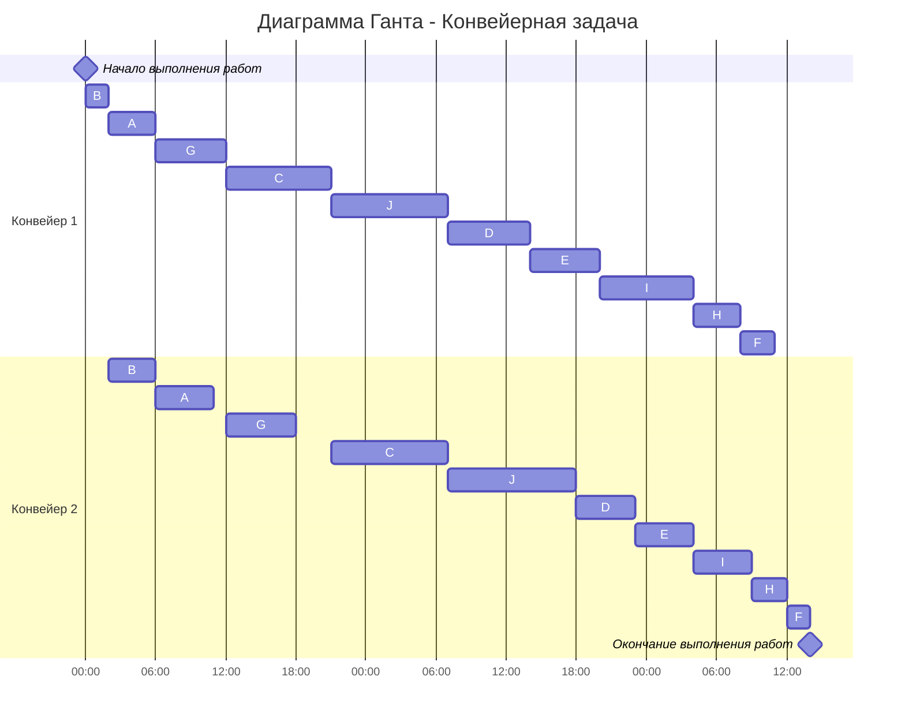

# Вариант 6

## Задача о распределении инвестиций между проектами

**Условие:**
Найти распределение инвестиций для получения максимальной прибыли.
Всего средств: 600.

Исходная матрица прибыли:
| $ | A | B | C | D | E |
|---|---|---|---|---|---|
| 100 | 8 | 6 | 6 | 5 | 4 |
| 200 | 15 | 8 | 9 | 7 | 8 |
| 300 | 16 | 12 | 13 | 15 | 14 |
| 400 | 19 | 15 | 17 | 18 | 16 |
| 500 | 20 | 19 | 19 | 21 | 21 |
| 600 | 25 | 24 | 24 | 23 | 22 |

### Шаг 1. Определение функции для проектов A и B

Рассчитаем максимальную прибыль при распределении средств только между проектами A и B.  

| $ | Комбинации (A+B) | $f(x)$ (макс прибыль) | Распределение (A / B) |
|---|---|---|---|
| 100 | $8+0$; $0+6$ | **8** | 100 / 0 |
| 200 | $15+0$; $8+6=14$; $0+8$ | **15** | 200 / 0 |
| 300 | $16+0$; $15+6=21$; $8+8=16$; $0+12$ | **21** | 200 / 100 |
| 400 | $19+0$; $16+6=22$; $15+8=23$; $8+12=20$; $0+15$ | **23** | 200 / 200 |
| 500 | $20+0$; $19+6=25$; $16+8=24$; $15+12=27$; $8+15=23$; $0+19$ | **27** | 200 / 300 |
| 600 | $25+0$; $20+6=26$; $19+8=27$; $16+12=28$; $15+15=30$; $8+19=27$; $0+24$ | **30** | 200 / 400 |

### Шаг 2. Определение функции для группы AB и проекта C

| $ | Комбинации ($f(x) + C$) | $f(x)$ | Распределение (AB / C) |
|---|---|---|---|
| 100 | $8+0$; $0+6$ | **8** | 100 / 0 |
| 200 | $15+0$; $8+6=14$; $0+9$ | **15** | 200 / 0 |
| 300 | $21+0$; $15+6=21$; $8+9=17$; $0+13$ | **21** | 300 / 0 **или** 200 / 100 |
| 400 | $23+0$; $21+6=27$; $15+9=24$; $8+13=21$; $0+17$ | **27** | 300 / 100 |
| 500 | $27+0$; $23+6=29$; $21+9=30$; $15+13=28$; $8+17=25$; $0+19$ | **30** | 300 / 200 |
| 600 | $30+0$; $27+6=33$; $23+9=32$; $21+13=34$; $15+17=32$; $8+19=27$; $0+24$ | **34** | 300 / 300 |

*Примечание:* Для суммы 300 получено два равнозначных варианта прибыли (21).

### Шаг 3. Определение функции для группы ABC и проекта D

| $ | Комбинации ($f(x) + D$) | $f(x)$ | Распределение (ABC / D) |
|---|---|---|---|
| 100 | $8+0$; $0+5$ | **8** | 100 / 0 |
| 200 | $15+0$; $8+5=13$; $0+7$ | **15** | 200 / 0 |
| 300 | $21+0$; $15+5=20$; $8+7=15$; $0+15$ | **21** | 300 / 0 |
| 400 | $27+0$; $21+5=26$; $15+7=22$; $8+15=23$; $0+18$ | **27** | 400 / 0 |
| 500 | $30+0$; $27+5=32$; $21+7=28$; $15+15=30$; $8+18=26$; $0+21$ | **32** | 400 / 100 |
| 600 | $34+0$; $30+5=35$; $27+7=34$; $21+15=36$; $15+18=33$; $8+21=29$; $0+23$ | **36** | 300 / 300 |

### Шаг 4. Определение функции для группы ABCD и проекта E

Вычисляем таблицу полностью, так как это требуется для обоснования решения.

| $ | Комбинации ($f_{ABCD}(x) + E$) | $f(x)$ | Распределение (ABCD / E) |
|---|---|---|---|
| 100 | $8+0$; $0+4$ | **8** | 100 / 0 |
| 200 | $15+0$; $8+4=12$; $0+8$ | **15** | 200 / 0 |
| 300 | $21+0$; $15+4=19$; $8+8=16$; $0+14$ | **21** | 300 / 0 |
| 400 | $27+0$; $21+4=25$; $15+8=23$; $8+14=22$; $0+16$ | **27** | 400 / 0 |
| 500 | $32+0$; $27+4=31$; $21+8=29$; $15+14=29$; $8+16=24$; $0+21$ | **32** | 500 / 0 |
| 600 | $36+0$; $32+4=36$; $27+8=35$; $21+14=35$; $15+16=31$; $8+21=29$; $0+22$ | **36** | 600 / 0 **или** 500 / 100 |

### Шаг 5. Обратный ход (Восстановление решения)

Максимальная прибыль равна **36**. У нас есть два варианта распределения на последнем шаге (600 / 0 и 500 / 100). Проследим каждый путь.

**Путь 1:** $E = 100$.
1. Если $E = 100$, то на $ABCD$ остается $500$.
2. Из Шага 3 для $500$ оптимально: $D = 100$, на $ABC$ остается $400$.
3. Из Шага 2 для $400$ оптимально: $C = 100$, на $AB$ остается $300$.
4. Из Шага 1 для $300$ оптимально: $A = 200, B = 100$.
**Результат 1:** A-200, B-100, C-100, D-100, E-100.
*Проверка:* $15 + 6 + 6 + 5 + 4 = 36$. Верно.

**Путь 2:** $E = 0$.
1. Если $E = 0$, то на $ABCD$ остается $600$.
2. Из Шага 3 для $600$ оптимально: $D = 300$, на $ABC$ остается $300$.
3. Из Шага 2 для $300$ есть **два** варианта:
    *   **Вариант 2.1:** $C = 0$, на $AB$ остается $300$.
        *   Из Шага 1 для $300$ оптимально: $A = 200, B = 100$.
        *   **Результат 2:** A-200, B-100, C-0, D-300, E-0.
        *   *Проверка:* $15 + 6 + 0 + 15 + 0 = 36$. Верно.
    *   **Вариант 2.2:** $C = 100$, на $AB$ остается $200$.
        *   Из Шага 1 для $200$ оптимально: $A = 200, B = 0$.
        *   **Результат 3:** A-200, B-0, C-100, D-300, E-0.
        *   *Проверка:* $15 + 0 + 6 + 15 + 0 = 36$. Верно.

### Ответ
Максимальная прибыль: **36**.
Возможные варианты распределения инвестиций:

1.  **A - 200, B - 100, C - 100, D - 100, E - 100**
2.  **A - 200, B - 100, C - 0, D - 300, E - 0**
3.  **A - 200, B - 0, C - 100, D - 300, E - 0**

---

# Конвейерная задача
Имеется 10 независимых заданий. Длительность заданий (по этапам): 
(4, 5), (2, 4), (9, 10), (7, 5), (6, 5), (3, 2), (6, 6), (4, 3), (8, 5), (10, 11)

| $   | A  | B  | C  | D  | E  | F  | G  | H  | I  | J  | 
|-----|----|----|----|----|----|----|----|----|----|----|
| I  | 4  | 2  | 9  | 7  | 6  | 3  | 6  | 4  | 8  | 10  |
| II | 5  | 4  | 10 | 5  | 5  | 2  | 6  | 3  | 5  | 11  |

1. Выделяем группу задач у которой первый этап меньше или равен второму и отсортировать ее по возрастанию первого этапа. 

К первой группе относятся: A, B, C, G, J.  

Сортировка по первому этапу: B - (2, 4), A - (4, 5), G - (6, 6), C - (9, 10), J - (10, 11).

2. Оставшиеся задачи сортируем по убыванию второго этапа.

D - (7, 5), E - (6, 5), I - (8, 5), H - (4, 3), F - (3, 2).

3. Объединяем списки задач в один

B - (2, 4), A - (4, 5), G - (6, 6), C - (9, 10), J - (10, 11), D - (7, 5), E - (6, 5), I - (8, 5), H - (4, 3), F - (3, 2).

4. Строим диаграмму Ганта. При этом учитываем, что у второго исполнителя в начале возникнет простой, а у первого исполнителя останется свободное время в конце. Также строго соблюдаем правило: второй исполнитель не может начать задачу, пока ее не завершит первый.

### Ответ: время выполнения работ - 62 часа
