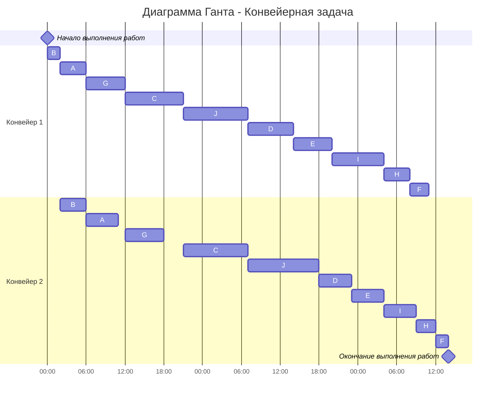

# Вариант 6

## Задача о распределении инвестиций между проектами

**Условие:**
Найти распределение инвестиций для получения максимальной прибыли.
Всего средств: 600.

Исходная матрица прибыли:
| $ | A | B | C | D | E |
|---|---|---|---|---|---|
| 100 | 8 | 6 | 6 | 5 | 4 |
| 200 | 15 | 8 | 9 | 7 | 8 |
| 300 | 16 | 12 | 13 | 15 | 14 |
| 400 | 19 | 15 | 17 | 18 | 16 |
| 500 | 20 | 19 | 19 | 21 | 21 |
| 600 | 25 | 24 | 24 | 23 | 22 |

### 1 шаг - Распределение инвестиций
На каждом этапе добавляется один новый проект и вычисляется оптимальный результат для всех возможных объемов инвестиций (от 100 до 600). Таким образом, каждая новая таблица учитывает решения предыдущей.  

1. Распределим инвестиции между проектами А и В

| А | В | Выбор|| A | B | Выбор || A | B | Выбор || A | B | Выбор || A | B | Выбор |
|:-:|:-:|:----:|:-:|:-:|:----:|:-:|:-:|:-:|:---:|:-:|:-:|:-:|:-:|:-:|:-:|:-:|:----:|:-:|
|0|2| → 8|   |0|3| → 12|    |0|4| → 15|    |0|5| → 19|    |0|6| → 24|
|1|1| → 14|    |1|2| → 16|    |1|3| → 20|    |1|4| → 23|    |1|5| → 27|
|2|0| → 15|    |2|1| → 21|    |2|2| → 23|    |2|3| → 27|    |2|4| → 30|
| | |    |    |3|0| → 16 |    |3|1| → 22|    |3|2| → 24|    |3|3| → 28|
| | |    |    | | |     |    |4|0| → 19|    |4|1| → 25|    |4|2| → 27|
| | |    |    | | |     |    | | |     |    |5|0| → 20|    |5|1| → 26|
| | |    |    | | |     |    | | |     |    | | |     |    |6|0| → 25|

Занесем в таблицу максимальные значения распределний, и как эти значения получились:
|$| A | B | C| D|E| А:В|
|:------|:-----:|:-----:|:-----:|:-----:|:-----:|:-----:|
| 100  | 8 | 6 | 6 | 5 | 4 | 8 (1/0)
| 200  | 15 | 8 | 9 | 7 | 8 | 15 (2/0)
| 300  | 16 | 12 | 13 | 15 | 14 | 21 (2/1)
| 400  | 19 | 15 | 17 | 18 | 16 | 23 (2/2)
| 500 | 20 | 19 | 19 | 21 | 21 | 27 (2/3)
| 600  | 25| 24| 24| 23| 22| 30 (2/4)

2. Распределим инвестиции между проектами А:В и С

| А:В | С | Выбор||  А:В | С | Выбор ||  А:В | С | Выбор ||  А:В | С | Выбор || А:В | С | Выбор
|:-:|:-:|:----:|:-:|:-:|:----:|:-:|:-:|:-:|:---:|:-:|:-:|:-:|:-:|:-:|:-:|:-:|:-:|:-:|
|0|2| → 9|    |0|3| → 13|    |0|4| → 17|    |0|5| → 19|    |0|6| → 24
|1|1| → 14|    |1|2| → 17|    |1|3| → 21|    |1|4| → 25|    |1|5| → 27
|2|0| → 15|   |2|1| → 21|    |2|2| → 24|    |2|3| → 28|    |2|4| → 32
| | |    |    |3|0| → 21|    |3|1| → 27|    |3|2| → 30|    |3|3| → 34
| | |    |    | | |     |    |4|0| → 23|    |4|1| → 29|    |4|2| → 32
| | |    |    | | |     |    | | |     |    |5|0| → 27|    |5|1| → 33
| | |    |    | | |     |    | | |     |    | | |     |    |6|0| → 30

Занесем в таблицу максимальные значения распределний, и как эти значения получились:
|$| A | B | C| D|E| А:В| (А:В):С |
|:------|:-----:|:-----:|:-----:|:-----:|:-----:|:-----:|:-----:|
| 100  | 8 | 6 | 6 | 5 | 4 | 8 (1/0) | 8 (1/0)
| 200  | 15 | 8 | 9 | 7 | 8 | 15 (2/0) | 15 (2/0)
| 300  | 16 | 12 | 13 | 15 | 14 | 21 (2/1)| 21 (3/2)
| 400  | 19 | 15 | 17 | 18 | 16 | 23 (2/2)| 27 (3/1)
| 500  | 20 | 19 | 19 | 21 | 21 | 27 (2/3)| 30 (3/2)
| 600  | 25 | 24 | 24 | 23 | 22 | 30 (2/4)| 34 (3/3)

3. Распределим инвестиции между проектами А:В:С и D

| А:В:С | D | Выбор|| А:В:С | D | Выбор || А:В:С | D | Выбор || А:В:С| D | Выбор || А:В:С| D | Выбор 
|:-:|:-:|:----:|:-:|:-:|:----:|:-:|:-:|:-:|:---:|:-:|:-:|:-:|:-:|:-:|:-:|:-:|:-:|:-:|
|0|2| → 7|    |0|3| → 15|    |0|4| → 18|    |0|5| → 21|    |0|6| → 23
|1|1| → 13|    |1|2| → 15|    |1|3| → 23|    |1|4| → 26|    |1|5| → 29
|2|0| → 15|   |2|1| → 20|    |2|2| → 22|    |2|3| → 30|    |2|4| → 33
| | |    |    |3|0| → 21|    |3|1| → 26|    |3|2| → 28|    |3|3| → 36
| | |    |    | | |     |    |4|0| → 27|    |4|1| → 32|    |4|2| → 34
| | |    |    | | |     |    | | |     |    |5|0| → 30|    |5|1| → 35
| | |    |    | | |     |    | | |     |    | | |     |    |6|0| → 34

Занесем в таблицу максимальные значения распределний, и как эти значения получились:
|$| A | B | C| D|E| А:В| (А:В):С |(А:В:С): D|
|:------|:-----:|:-----:|:-----:|:-----:|:-----:|:-----:|:-----:|:-----:|
| 100  | 8 | 6 | 6 | 5 | 4 | 8 (1/0) | 8 (1/0)| 8 (1/0)
| 200  | 15 | 8 | 9 | 7 | 8 | 15 (2/0) | 15 (2/0)| 15 (2/0)
| 300  | 16 | 12 | 13 | 15 | 14 | 21 (2/1)| 21 (3/0)| 21 (3/0)
| 400  | 19 | 15 | 17 | 18 | 16 | 23 (2/2)| 27 (3/1)| 27 (4/0)
| 500  | 20 | 19 | 19 | 21 | 21 | 27 (2/3)| 30 (3/2)| 32 (4/1)
| 600  | 25 | 24 | 24 | 23 | 22 | 30 (2/4)| 34 (3/3)| 36 (3/3)

4. Ответ должен быть в самой правой нижней ячейке, чтобы его получить нужно знать прибыль только от первых 4 проектов (уже посчитано в последнем столбце) и отдельно 5 проект

Посчитаем лишь это:

|А:В:С:D | Е | Выбор|
|:-----:|:-----:|:-----:|
|0|6| → 22|
|1|5| → 29|
|2|4| → 31|
|3|3| → 35|
|4|2| → 35|
|5|1| → 36|
|6|0| → 36|

5.  Занесем в таблицу:

|$| A | B | C| D|E| А:В| (А:В):С |(А:В:С): D|(А:В:С:D):Е|
|:------|:-----:|:-----:|:-----:|:-----:|:-----:|:-----:|:-----:|:-----:|:-----:|
| 100  | 8 | 6 | 6 | 5 | 4 | 8 (1/0) | 8 (1/0)| 8 (1/0)
| 200  | 15 | 8 | 9 | 7 | 8 | 15 (2/0) | 15 (2/0)| 15 (2/0)
| 300  | 16 | 12 | 13 | 15 | 14 | 21 (2/1)| 21 (3/0)| 21 (3/0)
| 400  | 19 | 15 | 17 | 18 | 16 | 23 (2/2)| 27 (3/1)| 27 (4/0)
| 500  | 20 | 19 | 19 | 21 | 21 | 27 (2/3)| 30 (3/2)| 32 (4/1)
| 600  | 25 | 24 | 24 | 23 | 22 | 30 (2/4)| 34 (3/3)| 36 (3/3)| 36 (5/1)

### 2 шаг - Получение оптимального решения
Из левого нижнего угла таблицы видно, что максимальная прибыль составляет **36$**. Она достиагется, если распределить исходную суммму следующим образом:

1. В таблице (A:В:С:D):E максимальная прибыль 36 достигается при  
   **E = 1 части**, а **A:В:С:D = 5 части**.

2. В таблице (A:В:С): D видно, что при 5 частях проект D получает  
   **1 часть**, а на A:В:С остаётся 4 части.

3. В таблице (A:В):C указано, что при 4 частях  
   **C получает 1 части**, а A:В делят между собой 3 части.

4. В таблице A:B при 23 блоках лучший выбор:  
   **A = 2 части**, **B = 1 части**.

### Ответ:
Распределение сумм инвестиций между всеми проектами:

| Проект | Часть | Инвестиции |
|:------:|:------------------:|:-----------:|
| A | 2 | 200 |
| B | 1 | 100 |
| C | 1 | 100 |
| D | 1 | 100 |
| E | 1 | 100 |

Максимальную сумма прибыли от инвестиций равна **36**

---

# Конвейерная задача
Имеется 10 независимых заданий. Длительность заданий (по этапам): 
(4, 5), (2, 4), (9, 10), (7, 5), (6, 5), (3, 2), (6, 6), (4, 3), (8, 5), (10, 11)

| $   | A  | B  | C  | D  | E  | F  | G  | H  | I  | J  | 
|-----|----|----|----|----|----|----|----|----|----|----|
| I  | 4  | 2  | 9  | 7  | 6  | 3  | 6  | 4  | 8  | 10  |
| II | 5  | 4  | 10 | 5  | 5  | 2  | 6  | 3  | 5  | 11  |

**По алгоритму найдём оптимальный порядок выполнения заданий:**
1. Выделяем группу задач у которой первый этап меньше или равен второму и отсортировать ее по возрастанию первого этапа. 

К первой группе относятся: A, B, C, G, J.  

Сортировка по первому этапу: B - (2, 4), A - (4, 5), G - (6, 6), C - (9, 10), J - (10, 11).

2. Оставшиеся задачи сортируем по убыванию второго этапа.

D - (7, 5), E - (6, 5), I - (8, 5), H - (4, 3), F - (3, 2).

3. Объединяем списки задач в один и получим оптимальный порядок выполнения заданий.

B - (2, 4), A - (4, 5), G - (6, 6), C - (9, 10), J - (10, 11), D - (7, 5), E - (6, 5), I - (8, 5), H - (4, 3), F - (3, 2).

4. Строим диаграмму Ганта. При этом учитываем, что у второго исполнителя в начале возникнет простой, а у первого исполнителя останется свободное время в конце. Также строго соблюдаем правило: второй исполнитель не может начать задачу, пока ее не завершит первый.

### Ответ: время выполнения работ - 62 часа
