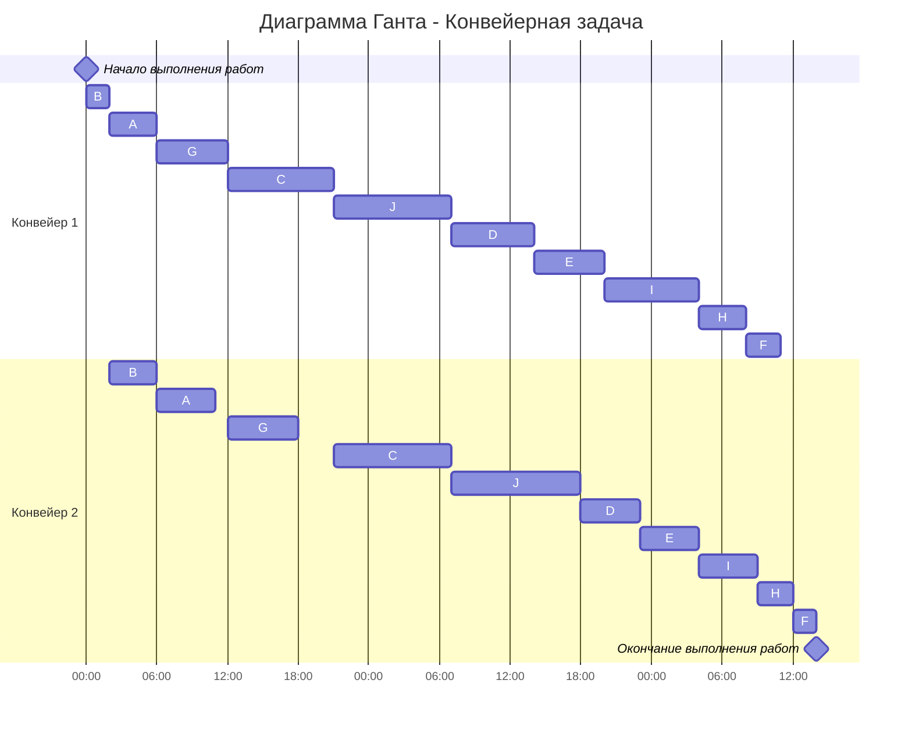

## Вариант 6:
# Задача о распределении инвестиций между проектами

| $   | A  | B  | C  | D  | E  |
|-----|----|----|----|----|----|
| 100 | 8  | 6  | 6  | 5  | 4  |
| 200 | 15 | 8  | 9  | 7  | 8  |
| 300 | 16 | 12 | 13 | 15 | 14 |
| 400 | 19 | 15 | 17 | 18 | 16 |
| 500 | 20 | 19 | 19 | 21 | 21 |
| 600 | 25 | 24 | 24 | 23 | 22 |

1. Первым шагом необоходимо сравнить только первые 2 проекта

### Для A и B
| $   | A B |
|-----|----|
| 100 |  8 (1/0)  |
| 200 |  15 (2/0) |
| 300 |  21 (2/1) |
| 400 |  23 (2/2) |
| 500 |  27 (2/3) |
| 600 |  30 (2/4) |

2. Вторым шагом мы сравниваем уже AB и С

### Для A, B и C
| $  | AB C |
|-----|----|
| 100 |  8 (1/0)  |
| 200 |  15 (2/0) |
| 300 |  21 (3/0) |
| 400 |  27 (3/1) |
| 500 |  30 (3/2) |
| 600 |  34 (3/3) |

3. Третьим шагом мы сравниваем уже ABС и D

### Для A, B, C и D
| $  | ABC D |
|-----|----|
| 100 |  8 (1/0)  |
| 200 |  15 (2/0) |
| 300 |  21 (3/0) |
| 400 |  27 (4/0) |
| 500 |  32 (4/1) |
| 600 |  36 (3/3) |

4. Четвертым шагом мы сравниваем уже ABCD и E и поскольку нам не максимальные значения нужны были только для вычисления, а дальше вычислять нам ничего не надо, то мы можем вычислить только распределение 600

| $  | ABCD E |
|-----|----|
| 600 |  36 (5/1)  |

5. Далее, распутывая инвестиции, мы замечаем, что решения у нас 2, выпишем оба, чтобы это сделать мы идем от обратного, проходя по каждой таблице в обратном порядке. Оба ответа правильные и одиннаково выгодные и уже человеку, для которого мы делаем эту задачу, придется решить какой для его больше подходит

## Ответ 1: A - 200, B - 100, C - 100, D - 100, E - 100
## Ответ 2: A - 200, B - 100, C - 0, D - 300, E - 0

# Конвейерная задача
Имеется 10 независимых заданий. Длительность заданий (по этапам): 
(4, 5), (2, 4), (9, 10), (7, 5), (6, 5), (3, 2), (6, 6), (4, 3), (8, 5), (10, 11)

| $   | A  | B  | C  | D  | E  | F  | G  | H  | I  | J  | 
|-----|----|----|----|----|----|----|----|----|----|----|
| I  | 4  | 2  | 9  | 7  | 6  | 3  | 6  | 4  | 8  | 10  |
| II | 5  | 4  | 10 | 5  | 5  | 2  | 6  | 3  | 5  | 11  |

1. Выделяем группу задач у которой первый этап меньше или равен второму и отсортировать ее по возрастанию первого этапа. 

К первой группе относятся: A, B, C, G, J.  

Сортировка по первому этапу: B - (2, 4), A - (4, 5), G - (6, 6), C - (9, 10), J - (10, 11).

2. Оставшиеся задачи сортируем по убыванию второго этапа.

D - (7, 5), E - (6, 5), I - (8, 5), H - (4, 3), F - (3, 2).

3. Объединяем списки задач в один

B - (2, 4), A - (4, 5), G - (6, 6), C - (9, 10), J - (10, 11), D - (7, 5), E - (6, 5), I - (8, 5), H - (4, 3), F - (3, 2).

4. Строим диаграмму Ганта. При этом учитываем, что у второго исполнителя в начале возникнет простой, а у первого исполнителя останется свободное время в конце. Также строго соблюдаем правило: второй исполнитель не может начать задачу, пока ее не завершит первый.

### Ответ: время выполнения работ - 62 часа