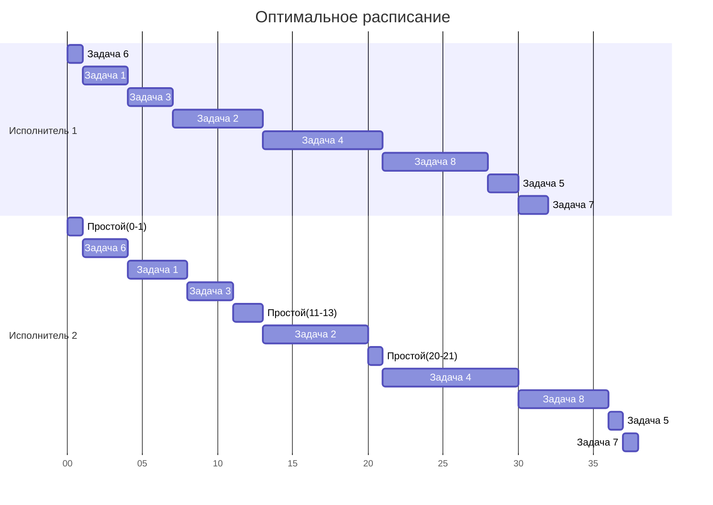

# Вариант 5

# Решение задачи 4.1: Распределение инвестиций между проектами

## Исходные данные

Имеется 500 единиц капитала для распределения между 4 проектами (A, B, C, D). Эффективность вложений задана таблицей:

| $   | A  | B  | C  | D  |
|-----|----|----|----|----|
| 100 | 5  | 3  | 5  | 4  |
| 200 | 8  | 7  | 10 | 8  |
| 300 | 18 | 8  | 15 | 14 |
| 400 | 21 | 10 | 20 | 19 |
| 500 | 25 | 22 | 21 | 26 |

Цель: максимизировать общую эффективность при условии, что все 500 единиц должны быть инвестированы.

---

## Этап 1: Объединение проектов A и B → столбец AB

Рассмотрим все возможные распределения средств между проектами A и B (сумма = 100, 200, ..., 500).

Для каждого объема инвестиций `S` ищем оптимальное распределение `(x, S-x)`, где `x` — средства в A, `S-x` — в B.

| Сумма ($) | Оптимальная сумма | Распределение (A/B) | Эффективность |
|-----------|-------------------|---------------------|---------------|
| 100       | 100               | (100/0)             | 5 + 0 = 5     |
|           |                   | (0/100)             | 0 + 3 = 3     |
|           | **→**             | **(100/0)**         | **5**         |
| 200       | 200               | (200/0)             | 8 + 0 = 8     |
|           |                   | (100/100)           | 5 + 3 = 8     |
|           |                   | (0/200)             | 0 + 7 = 7     |
|           | **→**             | **(200/0) или (100/100)** | **8**     |
| 300       | 300               | (300/0)             | 18 + 0 = 18   |
|           |                   | (200/100)           | 8 + 3 = 11    |
|           |                   | (100/200)           | 5 + 7 = 12    |
|           |                   | (0/300)             | 0 + 8 = 8     |
|           | **→**             | **(300/0)**         | **18**        |
| 400       | 400               | (400/0)             | 21 + 0 = 21   |
|           |                   | (300/100)           | 18 + 3 = 21   |
|           |                   | (200/200)           | 8 + 7 = 15    |
|           |                   | (100/300)           | 5 + 8 = 13    |
|           |                   | (0/400)             | 0 + 10 = 10   |
|           | **→**             | **(400/0) или (300/100)** | **21**     |
| 500       | 500               | (500/0)             | 25 + 0 = 25   |
|           |                   | (400/100)           | 21 + 3 = 24   |
|           |                   | (300/200)           | 18 + 7 = 25   |
|           |                   | (200/300)           | 8 + 8 = 16    |
|           |                   | (100/400)           | 5 + 10 = 15   |
|           |                   | (0/500)             | 0 + 22 = 22   |
|           | **→**             | **(500/0) или (300/200)** | **25**     |

> **Замечание**: В случае равенства эффективности выбираем любое из оптимальных распределений. Для восстановления пути выберем первое по порядку.

---

## Этап 2: Объединение AB и C → столбец ABC

Теперь объединяем результаты AB с проектом C. Для каждой суммы `S` перебираем, сколько выделяем на C (`c`), а оставшееся `S-c` — на группу AB.

| Сумма ($) | Оптимальная сумма | Распределение (AB/C) | Эффективность |
|-----------|-------------------|----------------------|---------------|
| 100       | 100               | (0/100)              | 0 + 5 = 5     |
|           |                   | (100/0)              | 5 + 0 = 5     |
|           | **→**             | **(100/0)**          | **5**         |
| 200       | 200               | (0/200)              | 0 + 10 = 10   |
|           |                   | (100/100)            | 5 + 5 = 10    |
|           |                   | (200/0)              | 8 + 0 = 8     |
|           | **→**             | **(0/200) или (100/100)** | **10**     |
| 300       | 300               | (0/300)              | 0 + 15 = 15   |
|           |                   | (100/200)            | 5 + 10 = 15   |
|           |                   | (200/100)            | 8 + 5 = 13    |
|           |                   | (300/0)              | 18 + 0 = 18   |
|           | **→**             | **(300/0)**          | **18**        |
| 400       | 400               | (0/400)              | 0 + 20 = 20   |
|           |                   | (100/300)            | 5 + 15 = 20   |
|           |                   | (200/200)            | 8 + 10 = 18   |
|           |                   | (300/100)            | 18 + 5 = 23   |
|           |                   | (400/0)              | 21 + 0 = 21   |
|           | **→**             | **(300/100)**        | **23**        |
| 500       | 500               | (0/500)              | 0 + 21 = 21   |
|           |                   | (100/400)            | 5 + 20 = 25   |
|           |                   | (200/300)            | 8 + 15 = 23   |
|           |                   | (300/200)            | 18 + 10 = 28  |
|           |                   | (400/100)            | 21 + 5 = 26   |
|           |                   | (500/0)              | 25 + 0 = 25   |
|           | **→**             | **(300/200)**        | **28**        |

---

## Этап 3: Объединение ABC и D → столбец ABCD

Теперь добавляем проект D. Нас интересует только сумма 500.

Перебираем, сколько выделяем на D (`d`), остальное — на ABC.

| d   | ABC = 500-d | Эффективность ABC | Эффективность D | Сумма |
|-----|-------------|-------------------|-----------------|-------|
| 0   | 500         | 28                | 0               | 28    |
| 100 | 400         | 23                | 4               | 27    |
| 200 | 300         | 18                | 8               | 26    |
| 300 | 200         | 10                | 14              | 24    |
| 400 | 100         | 5                 | 19              | 24    |
| 500 | 0           | 0                 | 26              | 26    |

**Максимум: 28 при d=0 → всё на ABC**

---

## Этап 4: Восстановление пути

Нам нужно получить распределение, дающее 28 единиц эффективности при 500 единицах капитала.

1. **ABCD = 500 → ABC = 500, D = 0**
2. **ABC = 500 → AB = 300, C = 200** (из таблицы ABC: 500 → 300/200)
3. **AB = 300 → A = 300, B = 0** (из таблицы AB: 300 → 300/0)

---

## Ответ к задаче 4.1

**Максимальная сумма прибыли от инвестиций: 28**

**Оптимальное распределение инвестиций:**

- Проект A: 300
- Проект B: 0
- Проект C: 200
- Проект D: 0

---

# Решение задачи 4.2: Конвейерная задача

## Исходные данные

8 независимых задач. Длительность заданий (по этапам): 

(3, 4), (6, 7), (3, 3), (8, 9), (2, 1), (1, 3), (2, 1), (7, 6)

---

## Этап 1: Алгоритм Джонсона

### Шаг 1: Разделение задач на две группы

**Группа 1**: задачи, у которых `t1 ≤ t2` (первый этап не длиннее второго):

- Задача 1: (3,4) → 3≤4
- Задача 2: (6,7) → 6≤7
- Задача 3: (3,3) → 3≤3
- Задача 4: (8,9) → 8≤9
- Задача 6: (1,3) → 1≤3

**Группа 2**: задачи, у которых `t1 > t2`:

- Задача 5: (2,1) → 2>1
- Задача 7: (2,1) → 2>1
- Задача 8: (7,6) → 7>6

---

### Шаг 2: Сортировка групп

**Группа 1** — по возрастанию `t1`:

- Задача 6: (1,3)
- Задача 1: (3,4)
- Задача 3: (3,3)
- Задача 2: (6,7)
- Задача 4: (8,9)

**Группа 2** — по убыванию `t2`:

- Задача 8: (7,6) → t2=6
- Задача 5: (2,1) → t2=1
- Задача 7: (2,1) → t2=1

(при равных `t2` — порядок произвольный, например, по номеру)

---

### Шаг 3: Объединение

**Окончательный порядок:**  
**Группа 1 + Группа 2**

**6, 1, 3, 2, 4, 8, 5, 7**

---

## Этап 2: Построение диаграммы Ганта

Обозначим:
- Исполнитель 1 — выполняет первый этап.
- Исполнитель 2 — выполняет второй этап.

Составим таблицу выполнения:

| Задача | t1 | t2 | Начало 1 | Конец 1 | Начало 2 | Конец 2 |
|--------|----|----|----------|---------|----------|---------|
| 6      | 1  | 3  | 0        | 1       | 1        | 4       |
| 1      | 3  | 4  | 1        | 4       | 4        | 8       |
| 3      | 3  | 3  | 4        | 7       | 8        | 11      |
| 2      | 6  | 7  | 7        | 13      | 13       | 20      |
| 4      | 8  | 9  | 13       | 21      | 21       | 30      |
| 8      | 7  | 6  | 21       | 28      | 30       | 36      |
| 5      | 2  | 1  | 28       | 30      | 36       | 37      |
| 7      | 2  | 1  | 30       | 32      | 37       | 38      |

---

### Диаграмма Ганта

---

## Ответ к задаче 4.2

**Оптимальный порядок задач:**  
**6 → 1 → 3 → 2 → 4 → 8 → 5 → 7**

**Минимальная длительность расписания:** **38 единиц времени**