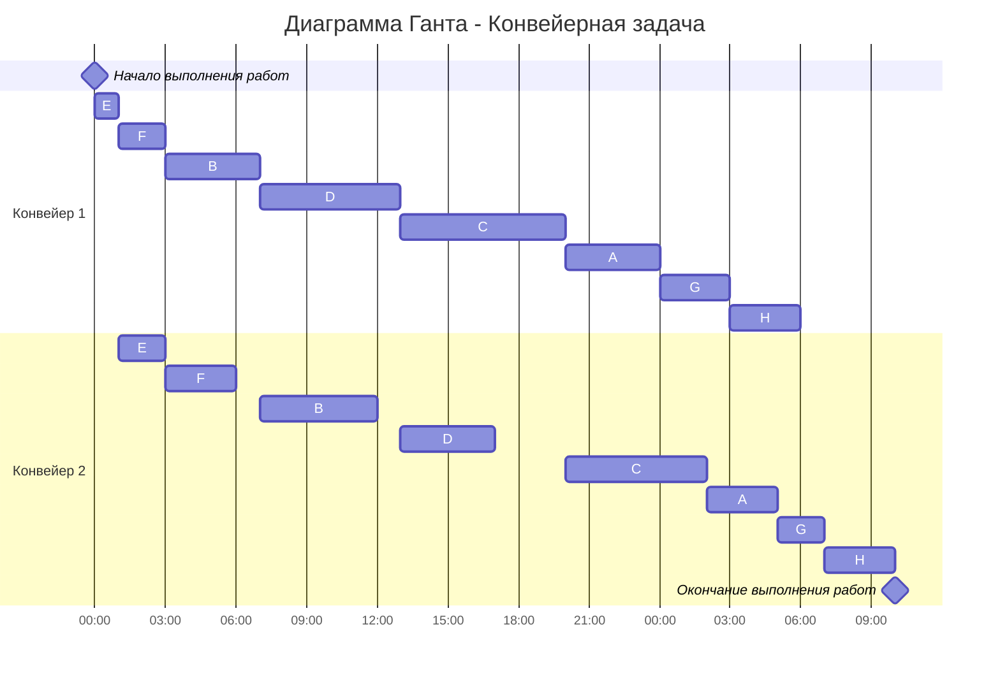

## Вариант 1:
# Задача о распределении инвестиций между проектами

| $   | A  | B  | C  | D  |
|-----|----|----|----|----|
| 20  | 7  | 2  | 1  | 4  |
| 40  | 10 |  9 | 12 | 13 |
| 60  | 15 | 13 | 14 | 14 |
| 80  | 17 | 15 | 15 | 18 |
| 100 | 22 | 21 | 19 | 20 |

1. Первым шагом необоходимо сравнить только первые 2 проекта

### Для A и B
| $  | A B |
|----|----|
| 20 |  7 (1/0)  |
| 40 |  10 (2/0) |
| 60 | 16 (1/2) |
| 80 | 20 (1/3) |
| 100| 24 (3/2) |

2. Вторым шагом мы сравниваем уже AB и С

### Для A, B b C
| $  | AB C |
|----|----|
| 20 |  7 (1/0)  |
| 40 |  12 (0/2) |
| 60 | 19 (1/2) |
| 80 | 22 (2/2) |
| 100| 24 (5/0) |

3. Третьим шагом мы сравниваем уже ABC и D и поскольку нам не максимальные значения нужны были только для вычисления, а дальше вычислять нам ничего не надо, то мы можем вычислить только распределение 100$

| $  | ABC D |
|----|----|
| 100 |  32 (3/2)  |

4. Далее, распутывая инвестиции, мы идем от последнего, то есть 40$ ивестируем в D -> 40$ инвестируем в С -> и оставшиеся 20 в А, а прибыль составит 32$

## Ответ: 32$ при инвестиции по 40$ в D и C и 20$ в А

# Конвейерная задача
Имеется 8 независимых заданий. Длительность заданий (по этапам): 
A - (4, 3), B - (4, 5), C - (7, 9), D - (6, 7), E - (1, 3), F - (2, 2), G - (3, 2), H - (3, 2)

1. Первым шагом необходимо выделить группу задач у которой первый этап меньше или равен второму и отсортировать ее по возрастанию первого этапа 

(1, 3), (2, 2), (4, 5), (6, 7), (7, 9)

2. Вторым шагом необходимо отсортировать оставшиеся задачи по убыванию второго этапа

(4, 3), (3, 2), (3, 2)

3. Далее объединяем списки задач в один

E - (1, 3), F - (2, 2), B - (4, 5), D - (6, 7), C - (7, 9), A - (4, 3), G - (3, 2), H - (3, 2)

4. Следующим шагом строим диаграмму Ганта. При этом учитываем, что у второго исполнителя в начале возникнет простой, а у первого исполнителя останется свободное время в конце. Также строго соблюдаем правило: второй исполнитель не может начать задачу, пока ее не завершит первый.

### Ответ: время выполнения работ - 22 часа
