## Вариант 2:
### Задача о распределении инвестиций между проектами

| $   | A | B  | C  | D  |
|-----|---|----|----|----|
| 50  | 2 | 4  | 4  | 7  |
| 100 | 4 | 5  | 7  |  8 |
| 150 | 5 | 10 | 9  | 11 |
| 200 | 8 | 12 | 13 | 12 |
| 250 | 9 | 13 | 14 | 14 |

## 1. Рассмотрим проекты A и B. Найдём максимальную прибыль для всех объёмов инвестиций.

### Таблица оптимальных значений для проектов A и B

| $ | AB | Лучшее соотношение|
|-----|----|-----------------|
| 50 | 4 | 0/1 |
| 100 | 6 | 1/1 |
| 150 | 10 | 0/3 |
| 200 | 12 | 0/4 |
| 250 | 14 | 1/4 |

### Для $ = 50:

| A | B | Значение |
|---|---|----------|
| 0 | 1 | **4** |
| 1 | 0 | 2 |

### Для $ = 100:

| A | B | Значение |
|---|---|----------|
| 0 | 2 | 5 |
| 1 | 1 | **6** |
| 2 | 0 | 4 |

### Для $ = 150:

| A | B | Значение |
|---|---|----------|
| 0 | 3 | **10** |
| 1 | 2 | 7 |
| 2 | 1 | 8 |
| 3 | 0 | 5 |

=> выбираем **10 (max)**

### Для $ = 200:

| A | B | Значение |
|---|---|----------|
| 0 | 4 | **12** |
| 1 | 3 | **12** |
| 2 | 2 | 9 |
| 3 | 1 | 9 |
| 4 | 0 | 8 |

### Для $ = 250:

| A | B | Значение |
|---|---|----------|
| 0 | 5 | 13 |
| 1 | 4 | **14** |
| 2 | 3 | **14** |
| 3 | 2 | 10 |
| 4 | 1 | 12 |
| 5 | 0 | 9 |

## 2. Рассмотрим проекты AB и C.

### Таблица оптимальных значений для проектов A, B и C

| $ | AB C | Лучшее соотношение|
|-----|----|-------------------|
| 50 | 4 | 1/0 или 0/1 |
| 100 | 8 | 1/1 |
| 150 | 11 | 1/2 |
| 200 | 14 | 3/1 |
| 250 | 17 | 1/4 |

### Для $ = 50:

| AB | C | Значение |
|---|---|----------|
| 0 | 1 | **4** |
| 1 | 0 | **4** |

### Для $ = 100:

| AB | C | Значение |
|---|---|----------|
| 0 | 2 | 7 |
| 1 | 1 | **8** |
| 2 | 0 | 6 |

### Для $ = 150:

| AB | C | Значение |
|---|---|----------|
| 0 | 3 | 9 |
| 1 | 2 | **11** |
| 2 | 1 | 10 |
| 3 | 0 | 10 |

### Для $ = 200:

| AB | C | Значение |
|---|---|----------|
| 0 | 4 | 13 |
| 1 | 3 | 13 |
| 2 | 2 | 13 |
| 3 | 1 | **14** |
| 4 | 0 | 12 |

### Для $ = 250:

| AB | C | Значение |
|---|---|----------|
| 0 | 5 | 14 |
| 1 | 4 | **17** |
| 2 | 3 | 15 |
| 3 | 2 | **17** |
| 4 | 1 | 16 |
| 5 | 0 | 14 |

## 3. Рассмотрим проекты ABC и D. 

### Таблица оптимальных значений для проектов A, B, C и D

| $ | ABC D |
|---|----|
| 250 | 21 (4/1) |

### Для $ = 250:

| ABC | D | Значение |
|---|---|----------|
| 0 | 5 | 14 |
| 1 | 4 | 16 |
| 2 | 3 | 19 |
| 3 | 2 | 19 |
| 4 | 1 | **21** |
| 5 | 0 | 17 |

## 4. Распутывание инвестиций

Идем от последнего шага и 
1. Максимум 21 достигается при ABC=200$ и D=50$.
2. Смотрим таблицу для ABC при бюджете 200$: Максимум 14 достигается при AB=150$ и C=50$.
3. Смотрим таблицу для AB при бюджете 150$: Максимум 10 достигается при A=0$ и B=150$.

Итоговое распределение:
*   D: 50$ 
*   C: 50$ 
*   B: 150$ 
*   A: 0$ 

## Ответ: 21 (при инвестиции 150$ в B, 50$ в C и 50$ в D)

### Конвейерная задача
Имеется 9 независимых заданий. Длительность заданий (по этапам): 

A - (7, 5), B - (4, 3), C - (8, 10), D - (5, 4), E - (3, 5), F - (2, 4), G - (10, 6), H - (2, 4), I - (8, 6)

1. Первым шагом необходимо выделить группу задач у которой первый этап меньше или равен второму и отсортировать ее по возрастанию первого этапа

F - (2, 4), H - (2, 4), E - (3, 5), C - (8, 10)

2. Вторым шагом необходимо отсортировать оставшиеся задачи по убыванию второго этапа

G - (10, 6), I - (8, 6), A - (7, 5), D - (5, 4), B - (4, 3)

3. Далее объединяем списки задач в один

F(2, 4), H(2, 4), E(3, 5), C(8, 10), G(10, 6), I(8, 6), A(7, 5), D(5, 4), B(4, 3)

4. Следующим шагом строим диаграмму Ганта. При этом учитываем, что у второго исполнителя в начале возникнет простой, а у первого исполнителя останется свободное время в конце. Также строго соблюдаем правило: второй исполнитель не может начать задачу, пока ее не завершит первый.

```mermaid
gantt
    title Диаграмма Ганта - Конвейерная задача
    dateFormat HH:mm   
    axisFormat %H:%M
   
    section Конвейер 1
    F (2)        :a1, 00:00, 2h
    H (2)        :a2, after a1, 2h
    E (3)        :a3, after a2, 3h
    C (8)        :a4, after a3, 8h
    G (10)       :a5, after a4, 10h
    I (8)        :a6, after a5, 8h
    A (7)        :a7, after a6, 7h
    D (5)        :a8, after a7, 5h
    B (4)        :a9, after a8, 4h

    section Конвейер 2
    F (4)        :b1, after a1, 4h
    H (4)        :b2, after a2 b1, 4h
    E (5)        :b3, after a3 b2, 5h
    C (10)       :b4, after a4 b3, 10h
    G (6)        :b5, after a5 b4, 6h
    I (6)        :b6, after a6 b5, 6h
    A (5)        :b7, after a7 b6, 5h
    D (4)        :b8, after a8 b7, 4h
    B (3)        :b9, after a9 b8, 3h

    Окончание работ : milestone, m2, after b9, 0h


```

### Ответ: время выполнения работ - 52 часа