### Вариант 5:

| Задания      |  A  |  B  |  C  |  D  |  E  |
|:-------------|:---:|:---:|:---:|:---:|:---:|
| Длительность |  60 |  48 |  36 |  24 |  12 |

| Исполнители           |  1  |  2  |  3  |
|:----------------------|:---:|:---:|:---:|
| Производительность(p) |  6  |  4  |  2  |

___

1. Первым шагом необходимо найти длительность оптимального распределения по формуле:

$$  
T_{min} = \frac {V_1 + V_2 + ... + V_n}{p_1 + p_2 + ... + p_k}  
$$  

$$  
T_{min} = \frac {60 + 48 + 36 + 24 + 12}{6 + 4 + 2}  = \frac {180}{12} = 15 \text{ часов}
$$

2. Вторым шагом необходимо расставить приоритеты задач (в зависимости от времени выполнения)

| Задания      |  A  |  B  |  C  |  D  |  E  |
|:-------------|:---:|:---:|:---:|:---:|:---:|
| Длительность |  60 |  48 |  36 |  24 |  12 |
| Приоритет    |  1  |  2  |  3  |  4  |  5  |

3. Третим шагом будем назначать исполнителей на задачи. Назначим на самую приоритетную задачу самого производительного исполнителя, на вторую по приоритетности второго по производительности исполнителя и так далее пока не закончатся исполнители.

| Задания      |  A  |  B  |  C  |  D  |  E  |
|:-------------|:---:|:---:|:---:|:---:|:---:|
| Длительность |  60 |  48 |  36 |  24 |  12 |
| Приоритет    |  1  |  2  |  3  |  4  |  5  |
| Исполнитель  |  1  |  2  |  3  |  -  |  -  |

4. Они будут выполняют эти задачи до тех пор, пока длительность более приоритетной задачи не опустится ниже менее приоритетной или пока одна из работ не закончится, расчитаем это по следующией формуле:

$$
L_1 - V_1t = L_2 - V_2t 
$$
где L - длительность, V  - производительность исполнителя, t - через сколько сравняются  

### Расчет для задач A и B:

$$
60 - 6t = 48 - 4t
$$
$$
12 = 2t
$$
$$
t = 6
$$
#### Задачи А и В сравняются через 6 часов

### Расчет для задач B и С:

$$
48 - 4t = 36 - 2t
$$
$$
12 = 2t
$$
$$
t = 6
$$

#### Задачи С и В сравняются через 6 часов

### Расчет для задач С и D:

$$
36 - 2t = 24
$$
$$
12 = 2t
$$
$$
t = 6
$$

#### Задачи С и D сравняются через 6 часов

5. Делаем вывод о том, что чтобы сравнять приоритеты всем задачам потребется одинаковое количество времени, визуализируем таблицу по прошествию 6 часов с новыми приоритетами

* исполнитель задачи A за 6 часов выполнит 36 ед работы
* исполнитель задачи B за 6 часов выполнит 24 ед работы
* исполнитель задачи C за 6 часов выполнит 12 ед работы

| Задания      |  A  |  B  |  C  |  D  |  E  |
|:-------------|:---:|:---:|:---:|:---:|:---:|
| Длительность |  60 - 36 = 24 |  48 - 24 = 24 |  36 - 12 = 24 |  24 |  12 |
| Приоритет    |  1  |  1  |  1  |  1  |  2  |
| Исполнитель  |  -  |  -  |  -  |  -  |  -  |

6. Далее мы объединяем задачи А, В, C и D и назначаем на них всех трех исполнителей

| Задания      |   А, В, C и D |  E  |
|:-------------|:------:|:---:|
| Длительность |   24    |  12 |
| Приоритет    |    1   |  2  |
| Исполнитель  |  1, 2, 3 |  -  |

Вычислим общую скорость выполнения задач А, В, C и D:

$$
P_{1, 2, 3} = \frac {6 + 4 + 2}{4} = 3
$$

7. Они будут выполнять эти задачи до тех пор, пока длительность более приоритетной задачи не опустится ниже менее приоритетной или пока одна из работ не закончится, расчитаем через сколько часов

### Расчет для первых двух задач ABCD и E:

$$
24 - 3t = 12
$$
$$
12 = 3t
$$
$$
t = 4
$$

#### Задачи ABCD и E сравняются через 4 часа

8. Визуализируем таблицу по прошествию 4 часов с новыми приоритетами

* исполнитель 1, 2 и 3 за 4 часа выполнят 12 ед работы

| Задания      |   А, В, C и D |  E  |
|:-------------|:------:|:---:|
| Длительность |   24 - 12 = 12    |  12 |
| Приоритет    |    1   |  2  |
| Исполнитель  |  1, 2, 3 |  -  |

9. Объединим задачи АВCD и E и назначаем на них всех исполнителей

| Задания      |  ABCDE      |
|:-------------|:---------:|
| Длительность |   12   |
| Приоритет    |    1      |
| Исполнитель  | 1 и 2 и 3 |

Далее, необохдимо вычислить общую скорость выполнения задач:

$$
P_{1,2,3} = \frac {6 + 4 + 2}{5} =  \frac {12}{5}
$$

10. Расчитаем время, за которое исполнители выполнят задачу ABCDE.

$$
12 - \frac {12}{5}t = 0
$$

$$
12 = \frac {12}{5}t
$$

$$
12 * \frac {5}{12} = t
$$

$$
t = 5
$$

11. Посчитаем суммарное время работы и сравним с $T_{min}$

$$
t_{1} + t_{2} + t_{3} = 6 + 4 + 5 = 15
$$
$T_{min}$ равно 15, что мы рассчитали в самом начале.
Итоговое время, затраченное исполнителями на выполнение всех заданий равно $T_{min}$. Значит, мы выполнили алгоритм правильно

12. Создадим деаграмму ганта

```mermaid
gantt
    title Диаграмма Ганта
    dateFormat HH:mm   
    axisFormat %H:%M
   
    section Исполнитель 1
    A         :a1, 00:00, 6h
    A         :a2, after a1, 1h
    B         :a3, after a2, 1h
    C         :a4, after a3, 1h
    D         :a5, after a4, 1h
    A         :a6, after a5, 1h
    B         :a7, after a6, 1h
    C         :a8, after a7, 1h
    D         :a9, after a8, 1h
    E         :a10, after a9, 1h

    section Исполнитель 2
    B         :b1, 00:00, 6h
    B         :a2, after a1, 1h
    C         :a3, after a2, 1h
    D         :a4, after a3, 1h
    A         :a5, after a4, 1h
    B         :a6, after a5, 1h
    C         :a7, after a6, 1h
    D         :a8, after a7, 1h
    E         :a9, after a8, 1h
    A         :a10, after a9, 1h

    section Исполнитель 3
    C         :c1, 00:00, 6h
    C         :a2, after a1, 1h
    D         :a3, after a2, 1h
    A         :a4, after a3, 1h
    B         :a5, after a4, 1h
    C         :a6, after a5, 1h
    D         :a7, after a6, 1h
    E         :a8, after a7, 1h
    A         :a9, after a8, 1h
    B         :a10, after a9, 1h


    Окончание работ : milestone, m2, after a10, 0h


```

