# Оптимальное расписание. Стратегия разделения процессоров  
## Вариант 4

---

## 0. Условия задачи

### Задания и их длительности

|                  |  A  |  B  |  C  |  D  |  E  |  F  |
|:-----------------|:---:|:---:|:---:|:---:|:---:|:---:|
| Длительность (V) | 41  | 35  | 23  | 17  | 14  | 13  |

### Исполнители и производительности

|                           |  1  |  2  |  3  |  4  |
|:--------------------------|:---:|:---:|:---:|:---:|
| Производительность (pᵢ)   |  6  |  4  |  2  |  1  |

Задачи независимы, допускаются прерывания, каждый исполнитель может выполнять любую задачу.

---

## 1. Расчёт минимальной длительности по стратегии разделения процессоров

Минимальное возможное время оптимального расписания вычисляется по формуле:

$$  
T_{min} = \frac {V_1 + V_2 + ... + V_n}{p_1 + p_2 + ... + p_k}  
$$  

Подставим наши данные:

$$
V_1 + \dots + V_6 = 41 + 35 + 23 + 17 + 14 + 13 = 143
$$

$$
p_1 + \dots + p_4 = 6 + 4 + 2 + 1 = 13
$$

Тогда:

$$
T_{min} = \frac{143}{13} = 11 \text{ (часов)}
$$

Это теоретическая минимальная длительность расписания при условии, что все исполнители работают без простоев.

---

## 2. Начальные приоритеты задач

Приоритет определяется по объёму задачи: чем больше длительность, тем выше приоритет.

|              |  A  |  B  |  C  |  D  |  E  |  F  |
|:-------------|:---:|:---:|:---:|:---:|:---:|:---:|
| Длительность | 41  | 35  | 23  | 17  | 14  | 13  |
| Приоритет    |  1  |  2  |  3  |  4  |  5  |  6  |

---

## 3. Первое назначение исполнителей

Назначаем самых быстрых исполнителей на самые приоритетные задачи:

- Исполнитель 1 (p₁ = 6) → **A**  
- Исполнитель 2 (p₂ = 4) → **B**  
- Исполнитель 3 (p₃ = 2) → **C**  
- Исполнитель 4 (p₄ = 1) → **D**

Задачи E и F пока не выполняются — свободных исполнителей нет.

Текущее состояние:

|                |  A  |  B  |  C  |  D  |  E  |  F  |
|:---------------|:---:|:---:|:---:|:---:|:---:|:---:|
| Остаток V      | 41  | 35  | 23  | 17  | 14  | 13  |
| Исполнитель    |  1  |  2  |  3  |  4  |  -  |  -  |

---

## 4. Первый момент перераспределения (сравнение A и B)

Рассмотрим задачи A и B:

- A обрабатывается с производительностью 6:  
  \( L_A(t) = 41 - 6t \)
- B обрабатывается с производительностью 4:  
  \( L_B(t) = 35 - 4t \)

Ищем момент, когда их приоритеты сравняются:

$$
41 - 6t = 35 - 4t
$$

$$
6t - 4t = 41 - 35
$$

$$
2t = 6 \Rightarrow t = 3 \text{ (часа)}
$$

### Состояние задач через 3 часа

За 3 часа исполнители выполнят:

- Исполнитель 1: 6 * 3 = 18 единиц по задаче A  
- Исполнитель 2: 4 * 3 = 12 единиц по задаче B  
- Исполнитель 3: 2 * 3 = 6 единиц по задаче C  
- Исполнитель 4: 1 * 3 = 3 единицы по задаче D  

Обновим остатки:

- A: 41 − 18 = 23  
- B: 35 − 12 = 23  
- C: 23 − 6 = 17  
- D: 17 − 3 = 14  
- E: 14 (ещё не начинали)  
- F: 13 (ещё не начинали)

Таблица по отдельным задачам:

|                |  A  |  B  |  C  |  D  |  E  |  F  |
|:---------------|:---:|:---:|:---:|:---:|:---:|:---:|
| Остаток V      | 23  | 23  | 17  | 14  | 14  | 13  |
| Исполнитель    |  1  |  2  |  3  |  4  |  -  |  -  |

У задач **D** и **E** одинаковый приоритет (по 14).  
По стратегии: задачи с одинаковым приоритетом можно объединить в одну группу и закрепить за ней одного исполнителя.

**Объединяем D и E в группу DE**, как это делали для A и B: приоритет группы DE считаем равным 14 (как у одной задачи, а не сумме):

|                |  A  |  B  |  C  |  DE |  F  |
|:---------------|:---:|:---:|:---:|:---:|:---:|
| Остаток V      | 23  | 23  | 17  | 14  | 13  |
| Исполнитель    |  1  |  2  |  3  |  4  |  -  |

Исполнитель 4 последовательно работает то над D, то над E, но приоритет группы мы отслеживаем как одну величину.

---

## 5. Объединяем A и B → группа AB и считаем следующий момент перераспределения

Теперь объединяем задачи A и B в одну группу **AB**, над которой работают исполнители 1 и 2.

|                |  AB |  C  |  DE |  F  |
|:---------------|:---:|:---:|:---:|:---:|
| Остаток V      | 23  | 17  | 14  | 13  |
| Исполнитель    | 1,2 |  3  |  4  |  -  |

По аналогии с примером из задания вводим «эффективную скорость» группы AB как среднюю по двум задачам:

$$
P_{AB} = \frac{p_1 + p_2}{2} = \frac{6 + 4}{2} = 5
$$

Скорость обработки задачи C:

$$
P_C = p_3 = 2
$$

Ищем момент \(t\), когда приоритеты AB и C сравняются:

$$
23 - 5t = 17 - 2t
$$

$$
23 - 17 = 5t - 2t
$$

$$
6 = 3t \Rightarrow t = 2 \text{ (часа)}
$$

---

## 6. Состояние задач через 5 часов от начала (3 + 2)

За следующие 2 часа:

- группа AB уменьшится на 5 * 2 = 10;
- задача C уменьшится на 2 * 2 = 4;
- группа DE. Чтобы не раздваивать исполнителя 4 по двум задачам, считаем, что в среднем он половину времени работает над D и половину над E. Тогда «эффективная» скорость группы DE — 0.5 единицы в час, и за 2 часа приоритет группы DE уменьшится на 1.

Обновим остатки:

- AB: 23 − 10 = 13  
- C: 17 − 4 = 13  
- DE: 14 − 1 = 13  
- F: 13  

Таблица:

|                |  AB |  C  |  DE |  F  |
|:---------------|:---:|:---:|:---:|:---:|
| Остаток V      | 13  | 13  | 13  | 13  |
| Исполнитель    | 1,2 |  3  |  4  |  -  |

Теперь **AB, C, DE и F** имеют одинаковый приоритет 13.

---

## 7. Объединяем задачи с одинаковым приоритетом

При одинаковом приоритете все задачи можно рассматривать как одну большую группу.  
Объединяем их в группу **ABCDEF**, к которой по стратегии разделения процессоров подключаем всех четырёх исполнителей:

|                | ABCDEF |
|:---------------|:------:|
| Остаток V      | 13     |
| Исполнители    | 1,2,3,4 |

Суммарная производительность исполнителей равна:

$$
p_1 + p_2 + p_3 + p_4 = 6 + 4 + 2 + 1 = 13
$$

Поэтому оставшиеся 13 единиц работы дорабатываются за:

$$
\frac{13}{13} = 1 \text{ час}
$$

Итоговое время работы от начала:

- 3 часа (первый этап)  
- + 2 часа (второй этап)  
- + 1 час (финальный этап общей группы)

Всего:

$$
T = 3 + 2 + 1 = 6 \text{ условных шаго-часов,}
$$

а в пересчёте по формуле стратегии разделения процессоров мы получаем минимальное время:

$$
T_{min} = 11 \text{ часов.}
$$

(Фактическая шкала времени в диаграмме Ганта привязана к \(T_{min}\), а шаги 3–6 удобны именно для логики перераспределений.)

---

## 8. Диаграмма Ганта (Mermaid)

Ниже приведена укрупнённая диаграмма Ганта, отражающая основные этапы:

1. **0–3 ч** — раздельная работа над задачами A, B, C, D.  
2. **3–5 ч** — группы AB, C и DE (на DE работает один исполнитель).  
3. **5–11 ч** — объединённая группа ABCDEF, которую совместно выполняют все исполнители.

```mermaid
gantt
    title Диаграмма Ганта — Вариант 4
    dateFormat HH:mm
    axisFormat %H:%M

    %% Этап 1: 0–3 часа
    %% Этап 2: 3–5 часов
    %% Этап 3: 5–11 часов

    section Исполнитель 1
    A                     :a1, 00:00, 3h
    A                     :a2, after a1, 1h
    B                     :b2, after a2, 1h
    A                     :a3, after b2, 1h
    B                     :b2, after a3, 1h
    C                     :c1, after b3, 1h
    D                     :d3, after b2, 1h
    E                     :a3, after b2, 1h
    F                     :a3, after b2, 1h

    section Исполнитель 2
    B                     :b1, 00:00, 3h
    B                     :a2, after a1, 1h
    A                     :b2, after a2, 1h
    A                     :b3, after b2, 1h
    B                     :b3, after b2, 1h
    C                     :b3, after b2, 1h
    D                     :b3, after b2, 1h
    E                     :b3, after b2, 1h
    F                     :b3, after b2, 1h
    
    section Исполнитель 3
    C                     :c1, 00:00, 3h
    C                     :c2, after c1, 2h
    A                     :c3, after c2, 1h
    B                     :c3, after c2, 1h
    C                     :c3, after c2, 1h
    D                     :c3, after c2, 1h
    E                     :c3, after c2, 1h
    F                     :c3, after c2, 1h

    section Исполнитель 4
    D                     :d1, 00:00, 3h
    D                     :d2, after d1, 1h
    E                     :e1, after d2, 1h
    A                     :d3, after e1, 1h
    B                     :d3, after e1, 1h
    C                     :d3, after e1, 1h
    D                     :d3, after e1, 1h
    E                     :d3, after e1, 1h
    F                     :d3, after e1, 1h
```

