### Вариант 1:

| Задания      |  A  |  B  |  C  |  D  |  E  |
|:-------------|:---:|:---:|:---:|:---:|:---:|
| Длительность | 40  |  30 |  20 |  10 |  5  |

| Исполнители           |  1  |  2  |  3  |
|:----------------------|:---:|:---:|:---:|
| Производительность(p) |  4  |  2  |  1  |

___

1. Первым шагом необходимо найти длительность оптимального распределения по формуле:

$$  
T_{min} = \frac {V_1 + V_2 + ... + V_n}{p_1 + p_2 + ... + p_k}  
$$  

$$  
T_{min} = \frac {40 + 30 + 20 + 10 + 5}{4 + 2 + 1}  = 15 (часов)
$$  

2. Вторым шагом необходимо расставить приоритеты задач (в зависимости от времени выполнения)

| Задания      |  A  |  B  |  C  |  D  |  E  |
|:-------------|:---:|:---:|:---:|:---:|:---:|
| Длительность | 40  |  30 |  20 |  10 |  5  |
| Приоритет    |  1  |  2  |  3  |  4  |  5  |

3. назначить на самую приоритетную задачу столько изготовителей сколько можем

| Задания      |  A  |  B  |  C  |  D  |  E  |
|:-------------|:---:|:---:|:---:|:---:|:---:|
| Длительность | 40  |  30 |  20 |  10 |  5  |
| Приоритет    |  1  |  2  |  3  |  4  |  5  |
| Исполнитель  |  1  |  2  |  3  |  -  |  -  |

4. Они выполняют эти задачи до тех пор, пока длительность более приоритетной задачи не опустится ниже менее приоритетной или пока одна из работ не закончится, расчитать это можно по следующией формуле:

$$
L_1 - V_1t = L_2 - V_2t 
$$
где L - длительность, V  - производительность исполнителя, t - через сколько сравняются  

Расчет для первых двух задач (AB):

$$
40 - 4t = 30 - 2t
$$
$$
10 = 2t
$$
$$
t = 5
$$
### Задачи А и В сравняются через 5 часов

Расчет для задач B и С:

$$
20 - t = 30 - 2t
$$
$$
10 = t
$$
$$
t = 10
$$

### Задачи С и В сравняются через 10 часов

Расчет для задач С и D:

$$
20 - t = 10
$$
$$
10 = t
$$
$$
t = 10
$$

### Задачи С и D сравняются через 10 часов

5. Далее, мы можем сделать вывод, что меньшее количество времени чтобы сравнятся потребуется задачам А и В (5 часов), поэтому необходимо визуализировать таблицу по прошествию 5 часов с новыми приоритетами

* исполнитель первой задачи за 5 часов выполнит 20 ед работы
* исполнитель второй задачи за 5 часов выполнит 10 ед работы
* исполнитель третей задачи за 5 часов выполнит 5 ед работы

| Задания      |  A  |  B  |  C  |  D  |  E  |
|:-------------|:---:|:---:|:---:|:---:|:---:|
| Длительность | 40 - 20 = 20  |  30 - 10 = 20 |  20 - 5 = 15 |  10 |  5  |
| Приоритет    |  1  |  2  |  3  |  4  |  5  |
| Исполнитель  |  1  |  2  |  3  |  -  |  -  |

6. Далее мы объединяем задачи А и В и назначаем на них первого и второго исполнителей 

| Задания      |   AB   |  C  |  D  |  E  |
|:-------------|:------:|:---:|:---:|:---:|
| Длительность |   20   |  15 |  10 |  5  |
| Приоритет    |    1   |  2  |  3  |  4  |
| Исполнитель  |  1 и 2 |  3  |  -  |  -  |

Далее, необохдимо вычислить общую скорость выполнения задач А и В:

$$
P_{12} = \frac {4 + 2}{2} = 3
$$

7. Они выполняют эти задачи до тех пор, пока длительность более приоритетной задачи не опустится ниже менее приоритетной или пока одна из работ не закончится

Расчет для первых двух задач AB и С:

$$
20 - 3t = 15 - t
$$
$$
5 = 2t
$$
$$
t = 2.5
$$

### Задачи АВ и С сравняются через 2.5 часа

Расчет для задач С и D:

$$
15 - t = 10
$$
$$
5 = t
$$
$$
t = 5
$$

### Задачи С и D сравняются через 5 часов

8. Далее, мы можем сделать вывод, что меньшее количество времени чтобы сравнятся потребуется задачам АВ и С (2,5 часа), поэтому необходимо визуализировать таблицу по прошествию 2,5 часа с новыми приоритетами

* исполнитель 1 и 2 за 2,5 часа выполнит 7.5 ед работы
* исполнитель 3 за 2,5 часа выполнит 2,5 ед работы

| Задания      |   AB   |  C  |  D  |  E  |
|:-------------|:------:|:---:|:---:|:---:|
| Длительность |   20 - 7,5 = 12,5   |  15 - 2,5 = 12,5 |  10 |  5  |
| Приоритет    |    1   |  2  |  3  |  4  |
| Исполнитель  |  1 и 2 |  3  |  -  |  -  |

9. Таким образом, мы объединяем задачи АВ и С и назначаем на них первого, второго и третьего исполнителей 

| Задания      |  ABC      |  D  |  E  |
|:-------------|:---------:|:---:|:---:|
| Длительность |   12,5    |  10 |  5  |
| Приоритет    |    1      |  2  |  3  |
| Исполнитель  | 1 и 2 и 3 |  -  |  -  |

Далее, необохдимо вычислить общую скорость выполнения задач А и В и С:

$$
P_{123} = \frac {4 + 2 + 1}{3} =  \frac {7}{3}
$$

10. Они выполняют эти задачи до тех пор, пока длительность более приоритетной задачи не опустится ниже менее приоритетной или пока одна из работ не закончится

Расчет для двух задач ABС и D: 

$$
12,5 - \frac {7}{3}t = 10
$$
$$
2,5 = \frac {7}{3}t
$$
$$
t =1 \frac {1}{14}
$$

### Задачи АВС и D сравняются через 1,071 часа

11. Далее, мы можем сделать вывод, что меньшее количество времени чтобы сравнятся потребуется задачам АВС и D (1,071 часа), поэтому необходимо визуализировать таблицу по прошествию 1,071 чаcа с новыми приоритетами

* исполнитель 1 и 2 и 3 за 1,071 часа выполнит 2,5 ед работы

| Задания      |  ABC                |  D  |  E  |
|:-------------|:-------------------:|:---:|:---:|
| Длительность |   12,5 - 2,5 = 10   |  10 |  5  |
| Приоритет    |    1                |  2  |  3  |
| Исполнитель  | 1 и 2 и 3           |  -  |  -  |

12. Таким образом, мы объединяем задачи АВС и D и назначаем на них первого, второго и третьего исполнителей 

| Задания      |  ABCD          |  E  |
|:-------------|:--------------:|:---:|
| Длительность |   10           |  5  |
| Приоритет    |    1           |  2  |
| Исполнитель  | 1 и 2 и 3      |  -  |

Далее, необохдимо вычислить общую скорость выполнения задач А и В и С и D:

$$
P_{123} = \frac {4 + 2 + 1}{4} =  \frac {7}{4}
$$

13. Они выполняют эти задачи до тех пор, пока длительность более приоритетной задачи не опустится ниже менее приоритетной или пока одна из работ не закончится

Расчет для двух задач ABСD и Е: 

$$
10 - \frac {7}{4}t = 5
$$
$$
5 = \frac {7}{4}t
$$
$$
t =  2\frac {6}{7}
$$

### Задачи АВСD и С сравняются через 2,85714 часа

14. Далее, мы можем сделать вывод, что меньшее количество времени чтобы сравнятся потребуется задачам АВСD и Е (2,85714 часа), поэтому необходимо визуализировать таблицу по прошествию 2,85714 часа с новыми приоритетами

* исполнитель 1 и 2 и 3 за 2,85714 часа выполнит 5 ед работы

| Задания      |  ABCD          |  E  |
|:-------------|:--------------:|:---:|
| Длительность |   10 - 5 = 5   |  5  |
| Приоритет    |    1           |  2  |
| Исполнитель  | 1 и 2 и 3      |  -  |

15. Таким образом, мы объединяем задачи АВС и D и назначаем на них первого, второго и третьего исполнителей 

| Задания      |      ABCDE        |
|:-------------|:-----------------:|
| Длительность |        5          |
| Приоритет    |        1          |
| Исполнитель  |    1 и 2 и 3      |

16. Далее, необходимо создать диаграмму Ганта

```mermaid
gantt
    title Диаграмма Ганта
    dateFormat HH:mm   
    axisFormat %H:%M
   
    section Исполнитель 1
    A         :a1, 00:00, 5h
    A         :a2, after a1, 1.25h
    B         :a3, after a2, 1.25h
    A         :a4, after a3, 0.357h
    B         :a5, after a4, 0.357h
    C         :a6, after a5, 0.357h
    A         :a7, after a6, 0.714h
    B         :a8, after a7, 0.714h
    C         :a9, after a8, 0.714h
    D         :a10, after a9, 0.714h
    A         :a11, after a10, 0.7h
    B         :a12, after a11, 0.7h
    C         :a13, after a12, 0.7h
    D         :a14, after a13, 0.7h
    E         :a15, after a14, 0.7h

    section Исполнитель 2
    B         :b1, 00:00, 5h
    B         :b2, after b1, 1.25h
    A         :b3, after b2, 1.25h
    B         :b4, after b3, 0.357h
    C         :b5, after b4, 0.357h
    A         :b6, after b5, 0.357h
    B         :b7, after b6, 0.714h
    C         :b8, after b7, 0.714h
    A         :b9, after b8, 0.714h
    D         :b10, after b9, 0.714h
    B         :b11, after b10, 0.7h
    C         :b12, after b11, 0.7h
    D         :b13, after b12, 0.7h
    E         :b14, after b13, 0.7h
    A         :b15, after b14, 0.7h

    section Исполнитель 3
    C         :c1, 00:00, 5h
    C         :c2, after c1, 2.5h
    C         :c3, after c2, 0.357h
    A         :c4, after c3, 0.357h
    B         :c5, after c4, 0.357h
    C         :c6, after c5, 0.714h
    D         :c7, after c6, 0.714h
    A         :c8, after c7, 0.714h
    B         :c9, after c8, 0.714h
    C         :c10, after c9, 0.7h
    D         :c11, after c10, 0.7h
    E         :c12, after c11, 0.7h
    A         :c13, after c12, 0.7h
    B         :c14, after c13, 0.7h


    Окончание работ : milestone, m2, after b9, 0h


```

