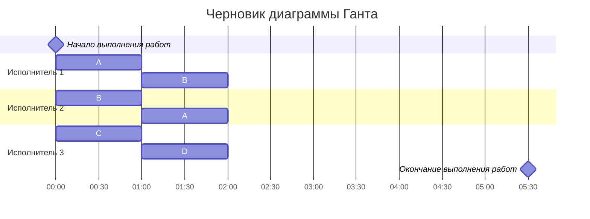
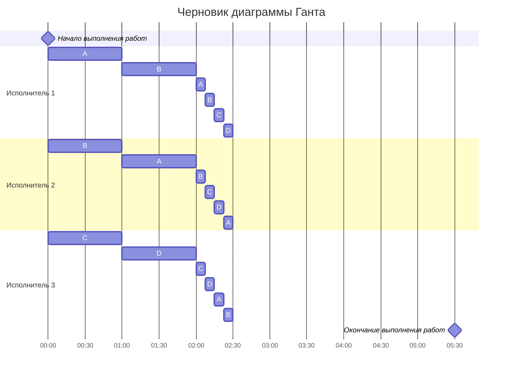
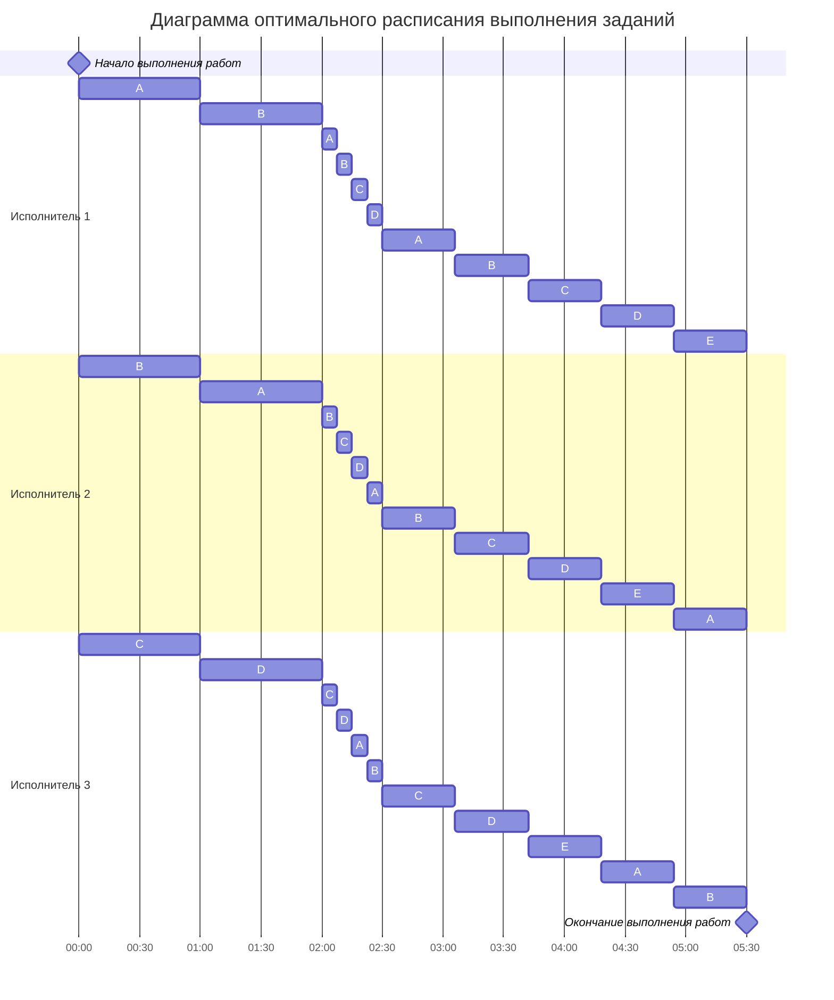

# Вариант 3
Условие:

| Задания      |  A  |  B  |  C  |  D  |  E  |
|:-------------|:---:|:---:|:---:|:---:|:---:|
| Длительность |  18 |  18 |  12 |  12 |  6  |

| Исполнители           |  1  |  2  |  3  |
|:----------------------|:---:|:---:|:---:|
| Производительность(p) |  6  |  4  |  2  |

## Решение

1. Найдем длительность оптимального расписания по формуле

$$
    T_{min} = \frac {V_1 + V_2 + ... + V_n}{p_1 + p_2 + ... + p_k} = \frac {18+18+12+12+6}{6+4+2} = 5\frac {1}{2}
$$

### Первый период времени

2. Расставим приоритеты выполнения заданий

| Задания      |  A  |  B  |  C  |  D  |  E  |
|:-------------|:---:|:---:|:---:|:---:|:---:|
| Длительность |  18 |  18 |  12 |  12 |  6  |
| Приоритет    |  1  |  1  |  2  |  2  |  3  |

Так как задания A и B имеют одинаковый приоритет (1), **объединим их в AB.**
Так как задания C и D имеют одинаковый приоритет (2), **объединим их в CD.**

3. Назначим исполнителей на задание, при необходимости найдём их производительность.

На задание AB можно назначить максимум *двух* исполнителей, тогда:

$$
    P_{12} = \frac {6+4}{2} = 5
$$

На задание CD можно назначить максимум *одного* исполнителя, в этом случае, производительность $P_{3} = 2$.

4. Рассмотрим случаи равенства заданий для нахождения минимального времени

|    AB = CD   |  CD = E |
|:-------------|:-------:|
| 18-5t = 12-2t|12 - 2t = 6|
| 6 = 3t       |  2t = 6 |
| t = 2        |  t = 3|

Выбираем для периода **t = 2**

5. Тогда начало диаграммы Ганта будет выглядеть так:

### Второй период времени

6. Вычислим новые длительности заданий и обновим приоритеты

Для A и B: $18-5t = 18-5*2 = 8$

Для C и D: $12-2t = 12-2*2 = 8$

| Задания      |  A  |  B  |  C  |  D  |  E  |
|:-------------|:---:|:---:|:---:|:---:|:---:|
| Длительность |  8 |  8 |  8 |  8 |  6  |
| Приоритет    |  1  |  1  |  1  |  1  |  2  |

Так как задания A, B, C и D имеют одинаковый приоритет (1), **объединим их в ABCD.**

7. Назначим исполнителей на задание, при необходимости найдём их производительность.

На задание ABCD можно назначить максимум *трёх* исполнителей, тогда:

$$
    P_{123} = \frac {6+4+2}{3} = 4
$$

8. Рассмотрим случай равенства заданий для нахождения минимального времени

$$
ABCD = E
$$
$$
8-4t = 6
$$
$$
4t = 2
$$
$$
t = 0,5
$$

Выбираем для периода **t = 0,5**

9. Тогда начало диаграммы Ганта будет выглядеть так:

### Третий период времени

10. Вычислим новые длительности заданий и обновим приоритеты

Для A, B, C и D: $8-4*0,5 = 6$

| Задания      |  A  |  B  |  C  |  D  |  E  |
|:-------------|:---:|:---:|:---:|:---:|:---:|
| Длительность |  6 |  6 |  6 |  6 |  6  |
| Приоритет    |  1  |  1  |  1  |  1  |  1  |

Теперь все задания имеют одну длительность и одинаковый приоритет. Можем завершить построение диаграммы Ганта.

## Ответ 

**Длительность полученного расписания - $5\frac {1}{2}$**

