# Вариант 5

Дана матрица затрат для задач A, B, C, D, E и исполнителей 1, 2, 3, 4, 5:

|       | **1** | **2** | **3** | **4** | **5** |
|-------|:-----:|:-----:|:-----:|:-----:|:-----:|
| **A** |  10   |  14   |   8   |  14   |  10   |
| **B** |  14   |   8   |   6   |   7   |  12   |
| **C** |   5   |  15   |   7   |   5   |  14   |
| **D** |  12   |  10   |  11   |  11   |   9   |
| **E** |  14   |  10   |   5   |  14   |  14   |

1. Проведем редукцию матрицы по строкам.

|       | **1** | **2** | **3** | **4** | **5** | **Min** |
|-------|:-----:|:-----:|:-----:|:-----:|:-----:|:-------:|
| **A** |   2   |   6   |   0   |   6   |   2   |    8    |
| **B** |   8   |   2   |   0   |   1   |   6   |    6    |
| **C** |   0   |  10   |   2   |   0   |   9   |    5    |
| **D** |   3   |   1   |   2   |   2   |   0   |    9    |
| **E** |   9   |   5   |   0   |   9   |   9   |    5    |

Выполним редукцию матрицы по столбцам.

|         | **1** | **2** | **3** | **4** | **5** |
|---------|:-----:|:-----:|:-----:|:-----:|:-----:|
| **A**   |   2   |   5   |   0   |   6   |   2   |
| **B**   |   8   |   1   |   0   |   1   |   6   |
| **C**   |   0   |   9   |   2   |   0   |   9   |
| **D**   |   3   |   0   |   2   |   2   |   0   |
| **E**   |   9   |   4   |   0   |   9   |   9   |
| **Min** |   0   |   1   |   0   |   0   |   0   |

Итогом 1 и 2 пункта получаем редуцированную матрицу, где нули обозначают наименее затратные варианты назначений.

|       | **1** | **2** | **3** | **4** | **5** |
|-------|:-----:|:-----:|:-----:|:-----:|:-----:|
| **A** |   2   |   5   |   0   |   6   |   2   |
| **B** |   8   |   1   |   0   |   1   |   6   |
| **C** |   0   |   9   |   2   |   0   |   9   |
| **D** |   3   |   0   |   2   |   2   |   0   |
| **E** |   9   |   4   |   0   |   9   |   9   |

2. Построим двудольный граф, вынесем на него те ребра, для которых в редуцированной матрице указаны нули.

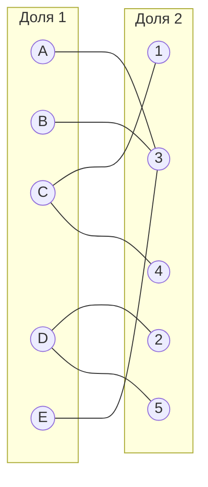

Выберем произвольное паросочетание $[A, 3]$, $[C, 1]$, $[D, 2]$ и попытаемся построить совершенное паросочетание с помощью чередующихся деревьев.

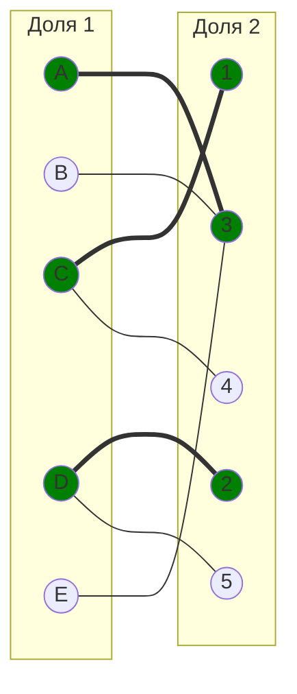

Попытаемся построить чередующееся дерево из непокрытой вершины E.

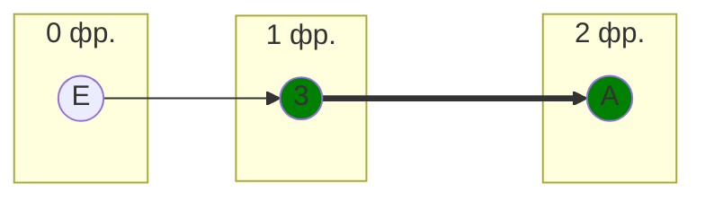

В построенном дереве нет цепей, чередующихся относительно текущего паросочетания, ветка закончилась в покрытой вершине A, которая не имеет других свободных нулевых ребер. Вращать паросочетание некуда.

3. Проведем повторную редукцию матрицы затрат.

Во множество X выпишем все **покрытые построенным деревом** вершины первой доли графа, во множество Y все **покрытые построенным деревом** вершины из второй доли графа.

$$
X = \{A, E\}
$$

$$
Y = \{3\}
$$

Необходимо найти минимальный элемент из строк, включенных во множество X и столбцов, не включенных во множество Y.

В нашем случае это будут строки A, E и столбцы 1, 2, 4, 5. Минимальный элемент 2, расположен в строке A и столбце 1. 

Вычтем 2 из всех непокрытых строк (A, E) и прибавим 2 ко всем покрытым столбцам (3).

|       | **1** | **2** | **3** | **4** | **5** |       |
|-------|:-----:|:-----:|:-----:|:-----:|:-----:|:-----:|
| **A** |   0   |   3   | 0 |   4   |   0   |  -2   |
| **B** |   8   |   1   |   2 |   1   |   6   |       |
| **C** |   0   |   9   |   4   |   0   |   9   |       |
| **D** |   3   |   0   |   4   |   2   |   0   |       |
| **E** |   7   |   2   | 0 |   7   |   7   |  -2   |
|       |       |       |  +2   |       |       |       |

Выполним редукцию по строке B

|       | **1** | **2** | **3** | **4** | **5** |
|-------|:-----:|:-----:|:-----:|:-----:|:-----:|
| **A** |   0   |   3   | 0 |   4   |   0   |
| **B** |   7   |   0   |   1 |   0   |   5   |
| **C** |   0   |   9   |   4   |   0   |   9   |
| **D** |   3   |   0   |   4   |   2   |   0   |
| **E** |   7   |   2   | 0 |   7   |   7   |

В ячейках A1, A5, B2, B4 появились новые нули.
Попробуем построить паросочетание. Добавим соответствующие ребра в двудольный граф.

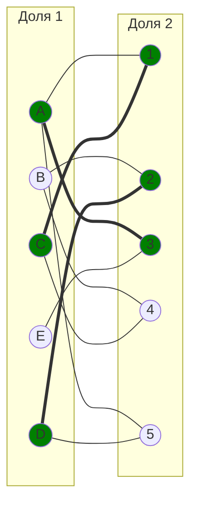

4. Попытаемся построить совершенное паросочетание с помощью чередующихся деревьев.

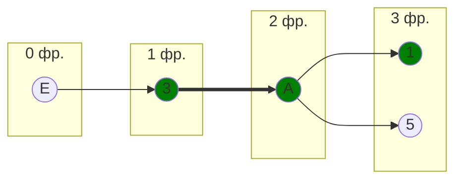

Построенное дерево содержит цепь, чередующиеся относительно текущего паросочетания. Цепь начинается и заканчивается в непокрытых вершинах, все ребра в цепи чередуются по вхождению в текущее паросочетание.

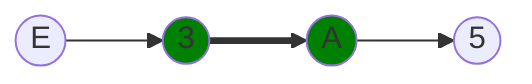

"Перекрасим" найденную цепь и проверим полученные паросочетания.

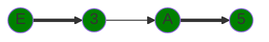

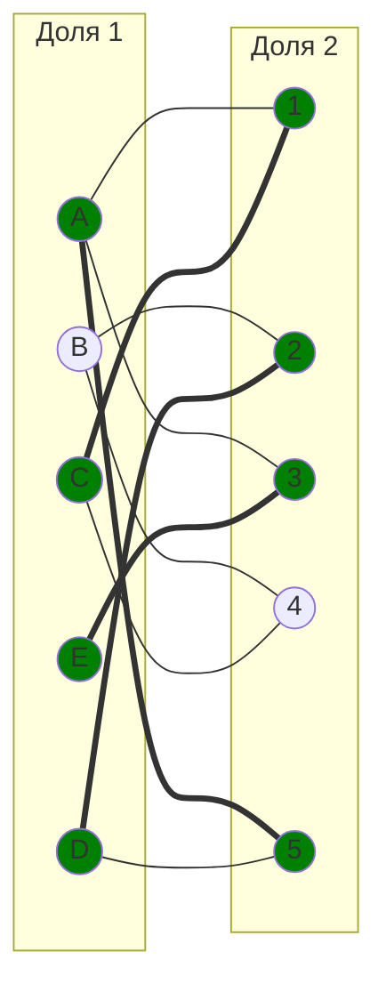

На данном этапе остается не покрыта точка B, ее и берем для 0 фр.

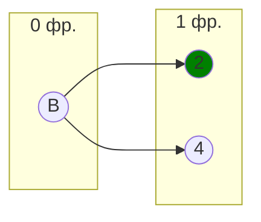
Построенное дерево содержит цепь, чередующиеся относительно текущего паросочетания. Цепь начинается и заканчивается в непокрытых вершинах, все ребра в цепи чередуются по вхождению в текущее паросочетание.

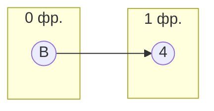

"Перекрасим" найденную цепь и проверим полученные паросочетания.

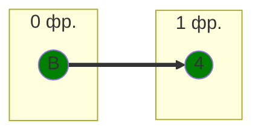
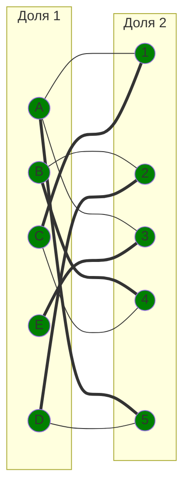

| Оператор | Задача | Стоимость |
| --- | --- | --- |
| A | 5 | 10 |
| B | 4 | 7 |
| C | 1 | 5 |
| D | 2 | 10 |
| E | 3 | 5 |

Общая стоимость: 10 + 7 + 5 + 10 + 5 = 37

## Ответ
Минимальная стоимость затрат 37, при следующих назначениях:
- задача A, исполнитель 5,
- задача B, исполнитель 4,
- задача C, исполнитель 1,
- задача D, исполнитель 2,
- задача E, исполнитель 3.