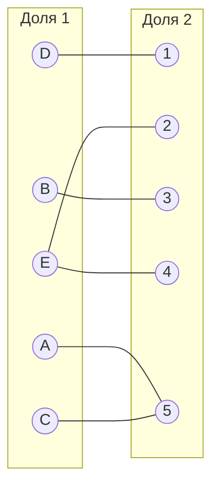
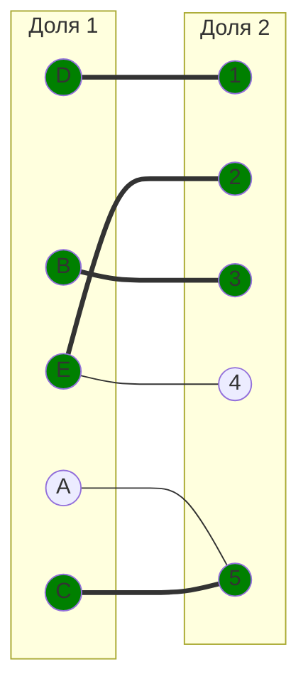
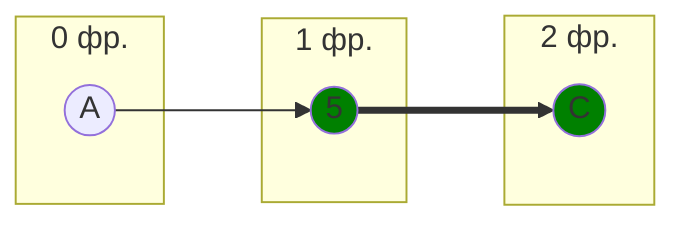
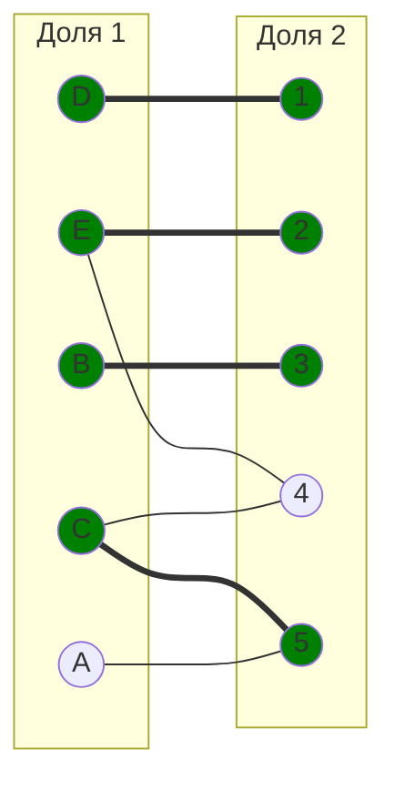
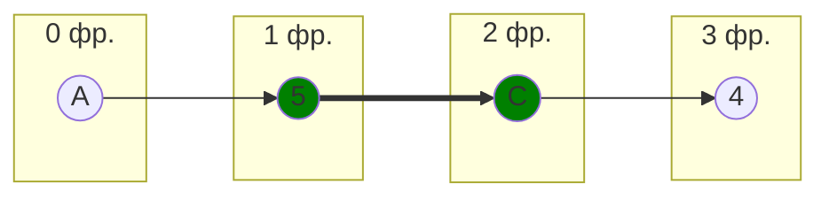
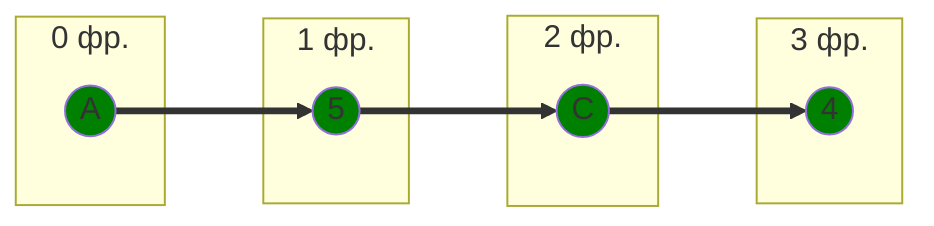
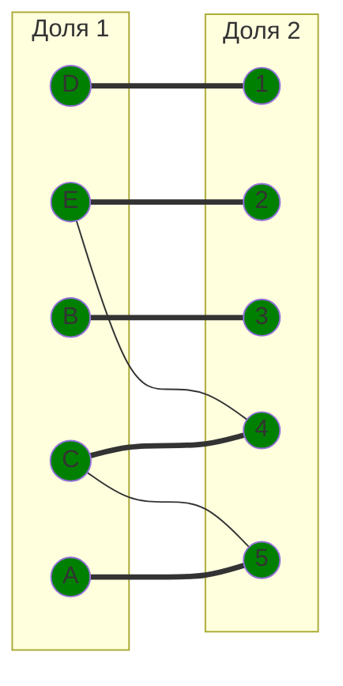

# Задача назначений
## Вариант 7:
#### Матрица затрат:

|       | **1** | **2** | **3** | **4** | **5** |
|-------|:-----:|:-----:|:-----:|:-----:|:-----:|
| **A** |  13   |  13   |   8   |  10   |   5   |
| **B** |  12   |   9   |   6   |   8   |  14   |
| **C** |  14   |  12   |  10   |   9   |   7   |
| **D** |   5   |  11   |  15   |  11   |   8   |
| **E** |  15   |   9   |  10   |   9   |  15   |

### 1. Редукция
Найдём минимальный элемент в каждой строке

|       | **1** | **2** | **3** | **4** | **5** | **min** 
|-------|:-----:|:-----:|:-----:|:-----:|:-----:|:-----:|
| **A** |  13   |  13   |   8   |  10   |   5   |   5   |
| **B** |  12   |   9   |   6   |   8   |  14   |  6   |
| **C** |  14   |  12   |  10   |   9   |   7   |   7   |
| **D** |   5   |  11   |  15   |  11   |   8   |   5   |
| **E** |  15   |   9   |  10   |   9   |  15   |  9   |

Вычтем минимальную стоимость из всех элементов соответствующего столбца

|       | **1** | **2** | **3** | **4** | **5** |
|-------|:-----:|:-----:|:-----:|:-----:|:-----:|
| **A** |  8   |  8   |   3   |  5   |   0   |
| **B** |  6   |   3   |   0   |   2   |  8   |
| **C** |  7   |  5   |  3   |   2   |   0   |
| **D** |   0   |  6   |  10   |  6   |   3   |
| **E** |  6   |   0   |  1   |   0   |  6   |

Делать редукцию по столбцам не надо, так как в каждом столбце минимальный элемент это 0

### 2. Поиск совершенного паросочетания
Построим двудольный граф, где вершины - работы и исполнители, взяв только самые "выгодные" рёбра - те, у которых в таблице значения 0 

Выберем случайное паросочетание $[D, 1]$, $[E, 2]$, $[B, 3]$, $[C, 5]$

Пробуем построить дерево из оставшейся непокрытой вершины $A$

В построенном дереве нет цепей, чередующееся относительно текущего паросочетания, единственная ветка закончилась в покрытой вершине, следовательно совершенного паросочетания нет

#### Проведем повторную редукцию матрицы затрат

Во множество X выпишем все **покрытые построенным деревом** вершины первой доли графа, во множество Y все **покрытые построенным деревом** вершины из второй доли графа.

$$
X = \{A, C\}
$$

$$
Y = \{5 \}
$$

Необходимо найти минимальный элемент из строк, включенных во множество X и столбцов, не включенных во множество Y. В нашем случае это будут строки A, C и столбцы 1, 2, 3, 4. Минимальный элемент 2, расположен в строке C и столбце 4.

Вычтем найденное значение из строк множества X и прибавим к столбцам множества Y:

|       | **1** | **2** | **3** | **4** | **5** |      |
|-------|:-----:|:-----:|:-----:|:-----:|:-----:|:-----:|
| **A** |  8   |  8   |   3   |  5   |   0   |   -2   |
| **B** |  6   |   3   |   0   |   2   |  8   |      |
| **C** |  7   |  5   |  3   |   2   |   0   |   -2 |
| **D** |   0   |  6   |  10   |  6   |   3   |      |
| **E** |  6   |   0   |  1   |   0   |  6   |      |
|       |      |       |      |       |   +2   |      |

Таким образом получаем

|       | **1** | **2** | **3** | **4** | **5** |
|-------|:-----:|:-----:|:-----:|:-----:|:-----:|
| **A** |  6   |  6   |   1   |  3   |   0   |
| **B** |  6   |   3   |   0   |   2   |  10   |
| **C** |  5   |  3   |  1   |   0   |   0   |
| **D** |   0   |  6   |  10   |  6   |   5   |
| **E** |  6   |   0   |  1   |   0   |  8   |

Появились новые, а также исчезли некоторые старые нулевые значения. Отразим изменение в графе 

Пробуем построить дерево из оставшейся непокрытой вершины $A$

Построенное дерево содержит чередующуюся, относительно текущего паросочетания, цепь A5 - 5C - C4, цепь начинается и заканчивается в непокрытых вершинах, все ребра в цепи чередуются по вхождению в текущее паросочетание

"Перекрасим" найденную цепь и проверим полученное паросочетание

Полученное расписание является совершенным. Выпишем полученные назначения и их стоимости из исходной матрицы:

- E2 - 9
- B3 - 6
- A5 - 5
- C4 - 9
- D1 - 5

Общая стоимость затрат = 9 + 6 + 5 + 9 + 5 = 34.

## Ответ
Минимальная стоимость затрат 34, при следующих назначениях:
- задача A, исполнитель 5,
- задача B, исполнитель 3,
- задача C, исполнитель 4,
- задача D, исполнитель 1.
- задача E, исполнитель 2.