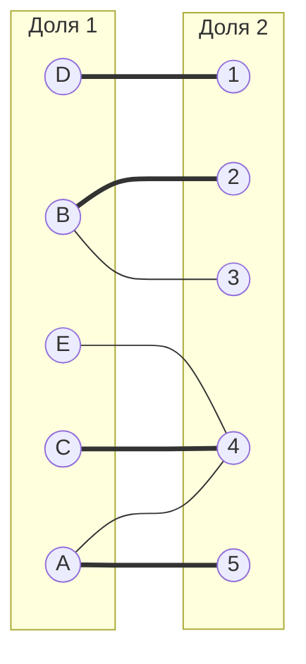
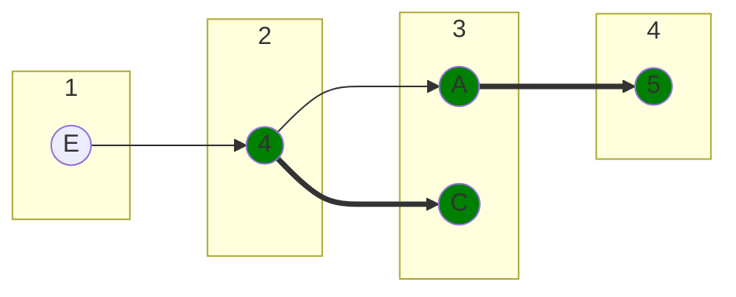
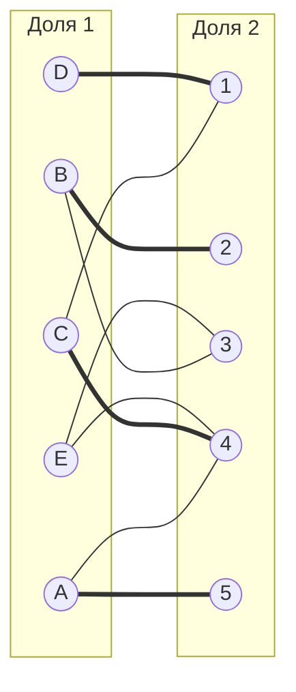

# Задача о назначении. Вариант 2
Дана матрица затрат для задач A, B, C, D, Е и исполнителей 1, 2, 3, 4, 5:

|       | **1** | **2** | **3** | **4** | **5** |
|-------|:-----:|:-----:|:-----:|:-----:|:-----:|
| **A** |   11   |   11   |   15   |   6   |   8   | 
| **B** |   10   |   10   |   7   |   8   |   15   |
| **C** |   9   |   13   |   12   |   7   |   15   |
| **D** |   5   |   13   |   15   |   15   |   15  |
| **E** |   15   |   14   |   9   |   7   |   13    |

1. Проведем редукцию матрицы затрат. Вычтем из каждой строки минимальное значение, представленное в этой строке.

|       | **1** | **2** | **3** | **4** | **5** | **Min** |
|-------|:-----:|:-----:|:-----:|:-----:|:-------:|:-------:|
| **A** |   5   |   5   |   9   |   0   |   2    |   -6    |
| **B** |   3   |   3   |   0   |   1   |   8    |   -7    |
| **C** |   2   |   6   |   5   |   0   |   8    |   -7    |
| **D** |   0   |   8   |   8   |   10   |   10    |   -5    |
| **E** |   8   |   7   |   2   |   0   |   6    |   -7    |

После чего вычтем из каждого столбца минимальное значение, представленное в этом столбце.

|         | **1** | **2** | **3** | **4** | **5** |
|---------|:-----:|:-----:|:-----:|:-----:|:-------:|
| **A**   |   5   |   2   |   9   |   0   |    0    |
| **B**   |   3   |   0   |   0   |   1   |    6    |
| **C**   |   2   |   3   |   5   |   0   |    6    |
| **D**   |   0   |   5   |   8   |   10   |    8    |
| **E**   |   8   |   4   |   2   |   0   |   4     |
| **Min** |   0   |   3   |   0   |   0   |   2     |

Получим редуцированную матрицу, где нули обозначают наименее затратные варианты назначений.

|       | **1** | **2** | **3** | **4** | **5** |
|-------|:-----:|:-----:|:-----:|:-----:|:-----:|
| **A** |   5   |   2   |   9   |   *0*   |   *0*   |
| **B** |   3   |   *0*   |   *0*   |   1   |   6   |
| **C** |   2   |   3   |   5   |   *0*   |   6   |
| **D** |   *0*   |   5   |   8   |   10   |   8   |
| **E** |   8   |   4   |   2   |   *0*   |   4   |

2. Построим двудольный граф, вынесем на него те ребра, для которых в редуцированной матрице указаны нули.

Начальное паросочетание: [A5] [B2] [C4] [D1]

3. Строим дерево

Цепи нет, 5-й фронт пустой. 

4. Проводим диагональную редукцию

| **X** | **Y** |
|-------|:-----:|
| {A C E} | {4 5} |

|       | **1** | **2** | **3** | **4** | **5** |
|-------|:-----:|:-----:|:-----:|:-----:|:-----:|
| **A** |   5   |   2   |   9   |   0   |   0   |
| **B** |   3   |   0   |   0   |   1   |   6   |
| **C** |   2   |   3   |   5   |   0   |   6   |
| **D** |   0   |   5   |   8   |   10   |   8   |
| **E** |   8   |   4   |   2   |   0   |   4   |

|       | **1** | **2** | **3** | **4** | **5** |
|-------|:-----:|:-----:|:-----:|:-----:|:-----:|
| **A** |   3   |   0   |   7   |   0   |   0   |
| **B** |   3   |   0   |   0   |   3   |   8   |
| **C** |   0   |   1   |   3   |   0   |   6   |
| **D** |   0   |   5   |   8   |   12   |   10   |
| **E** |   6   |   2   |   0   |   0   |   4   |

5. Строим двудольный граф

