# Задача о назначении. Вариант 2
Дана матрица затрат для задач A, B, C, D, Е и исполнителей 1, 2, 3, 4, 5:

|       | **1** | **2** | **3** | **4** | **5** |
|-------|:-----:|:-----:|:-----:|:-----:|:-----:|
| **A** |   11   |   11   |   15   |   6   |   8   | 
| **B** |   10   |   10   |   7   |   8   |   15   |
| **C** |   9   |   13   |   12   |   7   |   15   |
| **D** |   5   |   13   |   15   |   15   |   15  |
| **E** |   15   |   14   |   9   |   7   |   13    |

1. Проведем редукцию матрицы затрат. Вычтем из каждой строки минимальное значение, представленное в этой строке.

|       | **1** | **2** | **3** | **4** | **5** | **Min** |
|-------|:-----:|:-----:|:-----:|:-----:|:-------:|:-------:|
| **A** |   5   |   5   |   9   |   0   |   2    |   -6    |
| **B** |   3   |   3   |   0   |   1   |   8    |   -7    |
| **C** |   2   |   6   |   5   |   0   |   8    |   -7    |
| **D** |   0   |   8   |   8   |   10   |   10    |   -5    |
| **E** |   8   |   7   |   2   |   0   |   6    |   -7    |

После чего вычтем из каждого столбца минимальное значение, представленное в этом столбце.

|         | **1** | **2** | **3** | **4** | **5** |
|---------|:-----:|:-----:|:-----:|:-----:|:-------:|
| **A**   |   5   |   2   |   9   |   0   |    0    |
| **B**   |   3   |   0   |   0   |   1   |    6    |
| **C**   |   2   |   3   |   5   |   0   |    6    |
| **D**   |   0   |   5   |   8   |   10   |    8    |
| **E**   |   8   |   4   |   2   |   0   |   4     |
| **Min** |   0   |   3   |   0   |   0   |   2     |

Получим редуцированную матрицу, где нули обозначают наименее затратные варианты назначений.

|       | **1** | **2** | **3** | **4** | **5** |
|-------|:-----:|:-----:|:-----:|:-----:|:-----:|
| **A** |   5   |   2   |   9   |   *0*   |   *0*   |
| **B** |   3   |   *0*   |   *0*   |   1   |   6   |
| **C** |   2   |   3   |   5   |   *0*   |   6   |
| **D** |   *0*   |   5   |   8   |   10   |   8   |
| **E** |   8   |   4   |   2   |   *0*   |   4   |

2. Построим двудольный граф, вынесем на него те ребра, для которых в редуцированной матрице указаны нули.

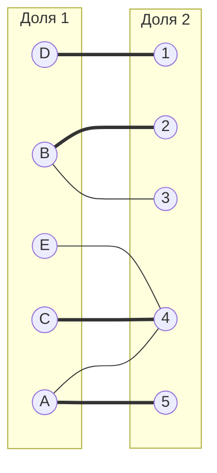
Начальное паросочетание: [A5] [B2] [C4] [D1]

3. Строим дерево

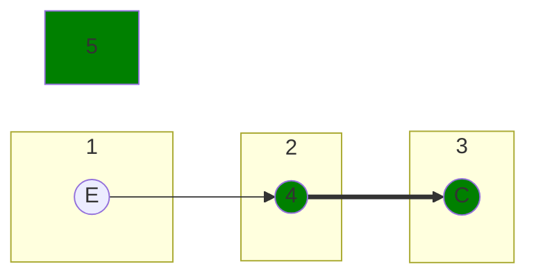

В построенном дереве нет цепей, чередующееся относительно текущего паросочетания, обе ветки закончились в покрытых вершинах, то есть в указанном графе нет совершенного паросочетания.

4. Проводим диагональную редукцию

Во множество X выпишем все **покрытые построенным деревом** вершины первой доли графа, во множество Y все **покрытые построенным деревом** вершины из второй доли графа.

| **X** | **Y** |
|-------|:-----:|
| {A C E} | {4 5} |

Необходимо найти минимальный элемент из строк, включенных во множество X и столбцов, не включенных во множество Y. В нашем случае это будут строки A, C, E и столбцы 4, 5. Минимальный элемент 2, расположен в строке A и столбце 2. 

Вычтем найденное значение из строк множества X и прибавим к столбцам множества Y (переставим столбцы и строчки для удобства):

|       | **4** | **5** | **1** | **2** | **3** |       |
|-------|:-----:|:-----:|:-----:|:-----:|:-----:|:-----:|
| **A** |   0   |   0   |   **5**   |   **2**   |   **9**   |   -2   |
| **C** |   0   |   6   |   **2**   |   **3**   |   **5**   |   -2   |
| **E** |   0   |   4   |   **8**   |   **4**   |   **2**   |   -2   |
| **B** |   **1**   |   **6**   |   3   |   0   |   0   |
| **D** |   **10**   |   **8**   |   0   |   5   |   8   |
|       |   +2       |     +2    |

Переставим столбцы и строки обратно, запишем результаты редукции:

|       | **1** | **2** | **3** | **4** | **5** |
|-------|:-----:|:-----:|:-----:|:-----:|:-----:|
| **A** |   3   |   0   |   7   |   0   |   0   |
| **B** |   3   |   0   |   0   |   3   |   8   |
| **C** |   0   |   1   |   3   |   0   |   6   |
| **D** |   0   |   5   |   8   |   12   |   10   |
| **E** |   6   |   2   |   0   |   0   |   4   |

В ячейках E3 и C1 появилось новое нулевое значение

5. Строим двудольный граф

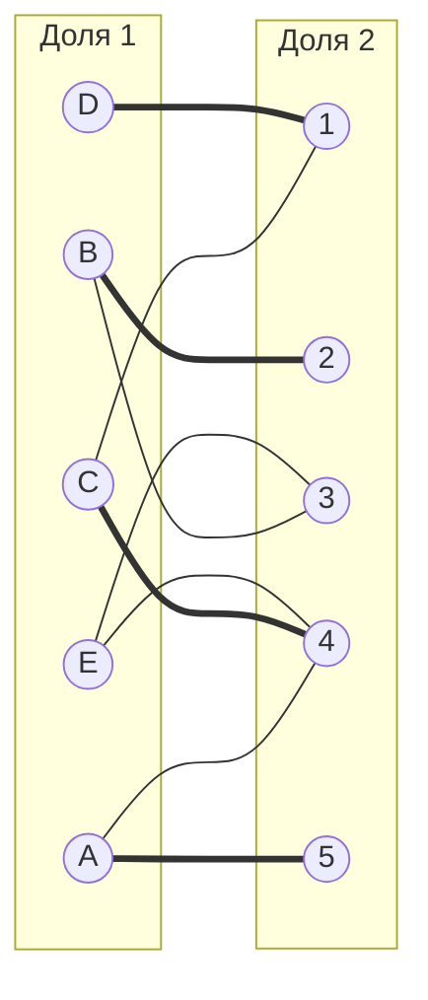
Ищем чередующиеся цепи:

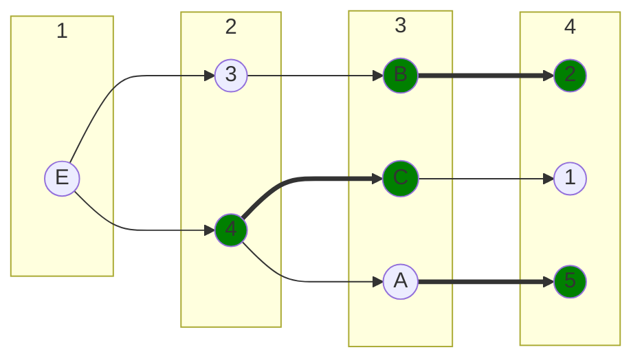

Чередующаяся цепь:

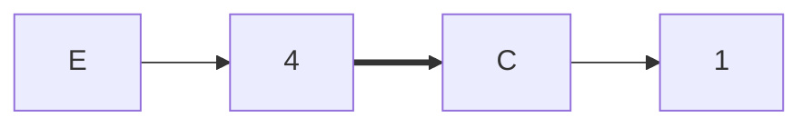

Перекрашиваем:

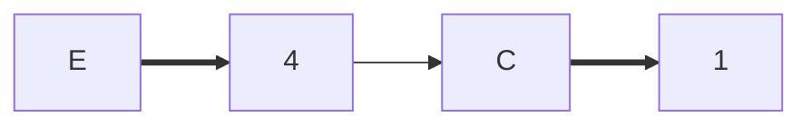

Проводим изменения:

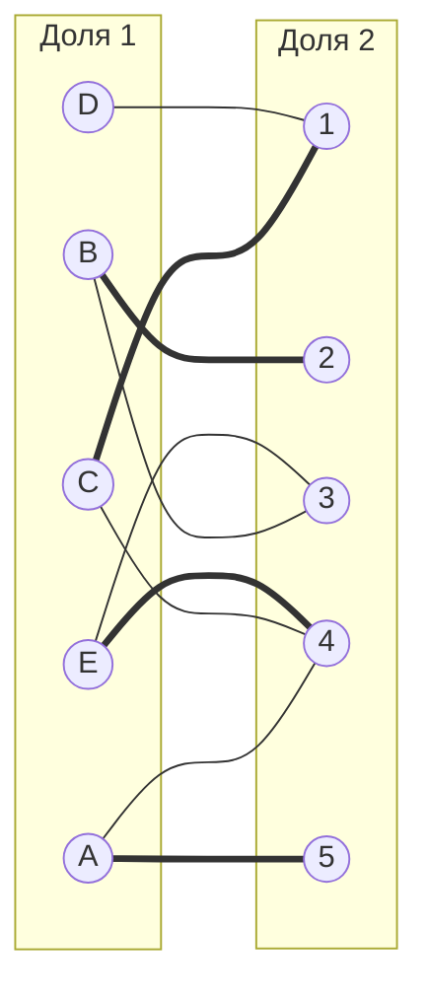
Повторно ищем чередующиеся цепи:

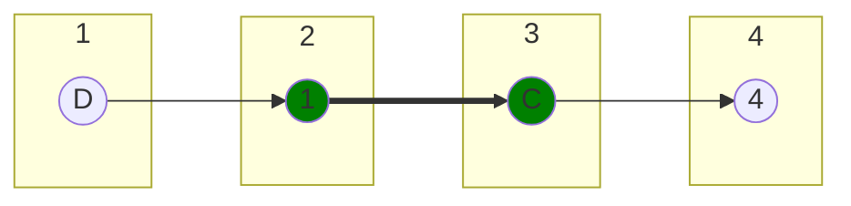

Чередования:

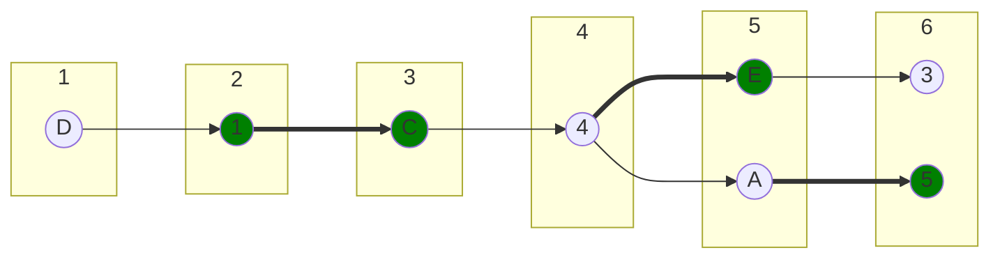

Чередующаяся цепь:

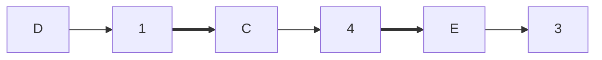

Перекрашиваем:

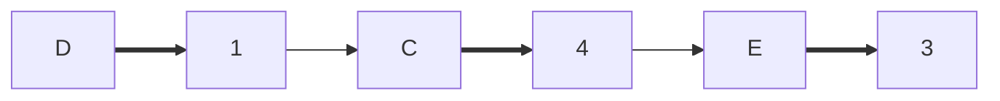

6. Итоговый граф:

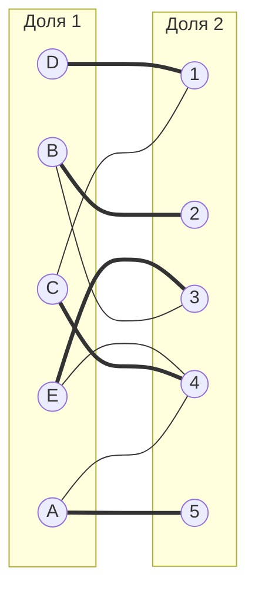

Все вершины покрыты, значит задача решена. 

Минимальные назначения:

[A5] = 8

[B2] = 10

[C4] = 7

[D1] = 5

[E3] = 9

Минимальная стоимость: 8+10+7+5+9 = 39

## Ответ
Минимальная стоимость затрат 39, при следующих назначениях:
- задача B, исполнитель 2,
- задача A, исполнитель 5,
- задача C, исполнитель 4,
- задача D, исполнитель 1,
- задача E, исполнитель 3.
