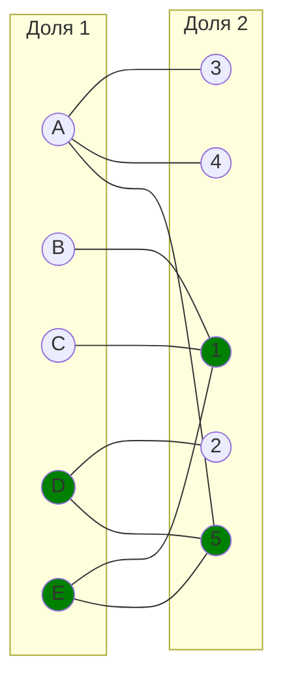
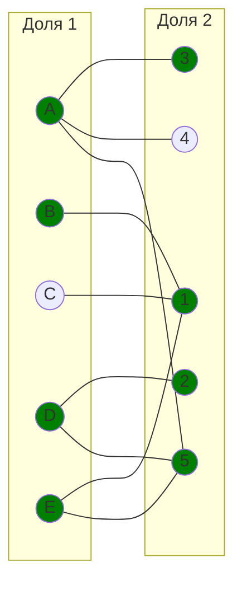
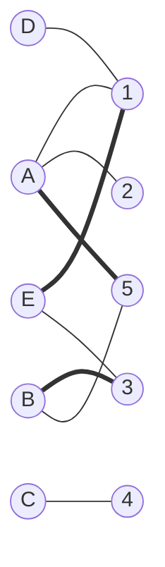
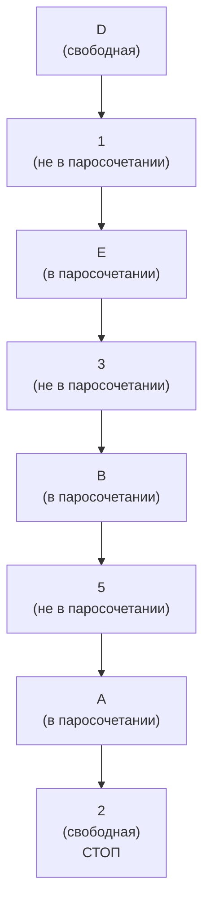
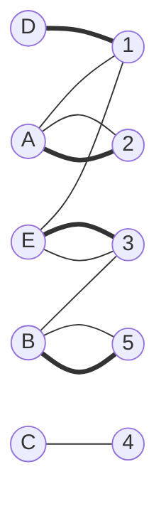
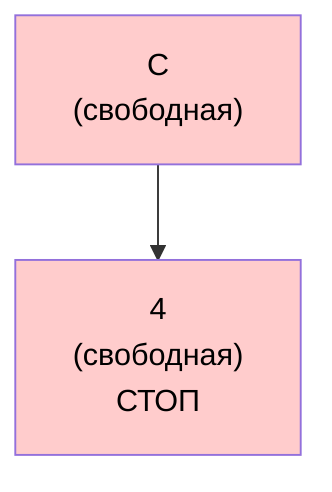
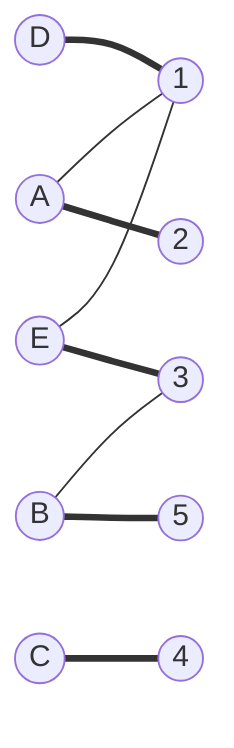

### Вариант 1:

1. В двудольном графе одна доля состоит из вершин А, В, С, D, Е, а другая - из вершин 1, 2, 3, 4, 5. Список смежных вершин этого графа: A(3,4,5), B(1), C(1), D(2,5), E(1,5). Волновым методом найти максимальное паросочетание в у в качестве начального паросочетания набор рёбер $[E,1]$, $[D,5]$. Строго следуйте алгорказанном графе, выбравитму, рассмотренному на занятиях.

Текущее паросочетание: $M_0$ = E,1, D,5
Покрытые вершины: E, D (левая доля), 1, 5 (правая доля)
Непокрытые вершины: A, B, C (левая доля), 2, 3,4 (правая доля)

### Шаг 1. Построение фронтов
#### Фронт 0 (начальный)
Состоит из всех непокрытых вершин левой доли:
Фронт 0: {A, B, C}

#### Фронт 1
Из фронта 0 идём по рёбрам в правую долю.
- A -> 3, 4, 5
- B -> 1 
- C -> 1 

Фронт 1: {1, 3, 4, 5}

Проверка: 
Есть ли в фронте 1 непокрытая вершина?
- Вершина 3 - не покрыта
- Вершина 4 - не покрыта

Можно построить чередующуюся цепь

### Шаг 2. Восстановление чередующейся цепи
Выберем, например, вершину 3 из фронта 1
Чередующаяся цепь:

Начало: A (фронт 0, непокрытая)

A -> 3 

Конец: 3 (фронт 1, непокрытая)
Цепь:

A -> 3 - ребро, не входящее в $М_0$

Обновляем паросочетание:

$M_1 = {[E,1],[D,5],[A,3]}$

### Шаг 3. Поиск новой чередующейся цепи 

Покрытые вершины: E, D, А (левая доля), 1, 5, 3 (правая доля)
Непокрытые вершины: B, C (левая доля), 2, 4 (правая доля)

#### Фронт 0 (начальный)
Состоит из всех непокрытых вершин левой доли:
Фронт 0: { В, С}

#### Фронт 1
Из фронта 0 идём по рёбрам в правую долю по непокрытым паросочетанием ребрам.
- B -> 1 
- C -> 1 

#### Фронт 2
Из фронта 1 идём по рёбрам в правую долю по покрытым паросочетанием ребрам.
- 1 -> B
- 1 -> C
- 1 -> Е

так как надо идти только по покрытым ребрам, то следующая вершина - Е

#### Фронт 3
Из фронта 2 идём по рёбрам в правую долю по непокрытым паросочетанием ребрам.
- Е -> 1
- Е -> 5

так как надо идти только по непокрытым ребрам, то следующая вершина - 5, но она не свободна

#### Фронт 4
Из фронта 3 идём по рёбрам в правую долю по покрытым паросочетанием ребрам.
- 5 -> Е
- 5 -> D
- 5 -> A

так как надо идти только по покрытым ребрам, то следующая вершина - D

#### Фронт 5
Из фронта 4 идём по рёбрам в правую долю по непокрытым паросочетанием ребрам.
- D -> 2
- D -> 5

А вершина 2 - свободная справа, значит мы нашли увеличивающую цепь: 

#### B -> 1 -> E -> 5 -> D -> 2

### Шаг 4. Перекрашиваем цепь 

рёбра цепи, которые были в $M_1$ - убираем. Те, которых не было - добавляем.

$M_1 = {[E,1],[D,5],[A,3]}$

- Ребро B -> 1: добавили в M

- Ребро 1 -> E: убрали из M

- Ребро E -> 5 добавили в M

- Ребро 5 -> D убрали из M

- Ребро D -> 2 добавили в M

Новое паросочетание: $M_2 = {[A,3],[B,1],[D,2],[E,5]}$

### Шаг 5. Проверка на возможность увеличения

Свободная вершина слева осталась только C -> 1 eё единственный сосед - 1, но 1 уже занята вершиной B. У B нет других рёбер кроме B -> 1, значит увеличить паросочетание нельзя

## Ответ 

Максимальное паросочетание:

$M = {[A,3],[B,1],[D,2],[E,5]}$

Совершенного паросочетания нет, так как B и C имеют единственного соседа 1, и одновременно покрыть их невозможно.

---

# Максимальное паросочетание в двудольном графе

2. В двудольном графе одна доля состоит из вершин А, В, С, D, Е, а другая - из вершин 1, 2, 3, 4, 5. Список смежных вершин этого графа: A(1,2,5), B(3,5), C(4), D(1), E(1,3). С помощью чередующихся деревьев найти максимальное паросочетание в указанном графе, выбрав в качестве начального паросочетания набор рёбер $[А,5]$, $[B,3]$, $[E,1]$. Строго следуйте алгоритму, рассмотренному на занятиях.

## Исходные данные

Двудольный граф:
- Доля 1: A, B, C, D, E
- Доля 2: 1, 2, 3, 4, 5

Связи между вершинами:
- A связана с: 1, 2, 5
- B связана с: 3, 5
- C связана с: 4
- D связана с: 1
- E связана с: 1, 3

Начальное паросочетание: [A,5], [B,3], [E,1] 

Графическое представление начального состояния:

---

# Шаг 1: Поиск чередующейся цепи

Ищем вершину из доли 1, не покрытую текущим паросочетанием:

Непокрытые вершины в доле 1: D, C

Начинаем с вершины D и строим дерево уровней:

Уровень 0: D (свободная вершина)

Уровень 1: 1 (сосед D по ребру, не входящему в паросочетание)
- Вершина 1 покрыта ребром [E,1] из паросочетания

Уровень 2: E (вершина, связанная с 1 через паросочетание [E,1])
- Вершина E имеет соседей: 1 (уже есть), 3

Уровень 3: 3 (сосед E по ребру, не входящему в паросочетание)
- Вершина 3 покрыта ребром [B,3] из паросочетания

Уровень 4: B (вершина, связанная с 3 через паросочетание [B,3])
- Вершина B имеет соседей: 3 (уже есть), 5

Уровень 5: 5 (сосед B по ребру, не входящему в паросочетание)
- Вершина 5 покрыта ребром [A,5] из паросочетания

Уровень 6: A (вершина, связанная с 5 через паросочетание [A,5])
- Вершина A имеет соседей: 1 (уже есть), 2, 5 (уже есть)

Уровень 7: 2 (сосед A по ребру, не входящему в паросочетание)
- Вершина 2 свободна! (не входит в паросочетание)

ЧЕРЕДУЮЩАЯСЯ ЦЕПЬ НАЙДЕНА: D-1-E-3-B-5-A-2

Представление дерева:

Проверка чередования рёбер:
- D-1: не в паросочетании 
- 1-E: в паросочетании 
- E-3: не в паросочетании 
- 3-B: в паросочетании
- B-5: не в паросочетании 
- 5-A: в паросочетании 
- A-2: не в паросочетании 

Цепь заканчивается в свободной вершине 2 - чередующаяся цепь валидна!

---

# Шаг 2: Увеличение паросочетания

Инвертируем рёбра в найденной цепи D-1-E-3-B-5-A-2:

Рёбра, входящие в паросочетание (удаляем): [E,1], [B,3], [A,5]
Рёбра, не входящие в паросочетание (добавляем): [D,1], [E,3], [B,5], [A,2]

Новое паросочетание: [D,1], [A,2], [E,3], [B,5]

Размер: 4 ребра (было 3, стало 4)

Новое состояние:

Оставшиеся свободные вершины в доле 1: C

---

# Шаг 3: Продолжаем поиск

Непокрытые вершины в доле 1: C

Начинаем с вершины C:

Уровень 0: C (свободная вершина)

Уровень 1: 4 (сосед C по ребру, не входящему в паросочетание)
- Вершина 4 свободна! (не входит в паросочетание)

ЧЕРЕДУЮЩАЯСЯ ЦЕПЬ НАЙДЕНА: C-4

Представление дерева:

Проверка:
- C-4: не в паросочетании 

Цепь заканчивается в свободной вершине 4 - чередующаяся цепь валидна!

---

# Шаг 4: Увеличение паросочетания

Инвертируем рёбра в найденной цепи C-4:

Рёбра, входящие в паросочетание (удаляем): нет
Рёбра, не входящие в паросочетание (добавляем): [C,4]

Новое паросочетание: [D,1], [A,2], [E,3], [C,4], [B,5]

Размер: 5 рёбер (было 4, стало 5)

Новое состояние:

Оставшиеся свободные вершины в доле 1: нет

Все вершины доли 1 покрыты - алгоритм завершается.

---

# Результат

## Максимальное паросочетание: [D,1], [A,2], [E,3], [C,4], [B,5]

Количество рёбер: 5

Особенность: Все вершины обеих долей покрыты паросочетанием - это совершенное паросочетание.

Таблица эволюции паросочетания:

| Этап | Паросочетание | Размер | Свободные в доле 1 | Статус |
|------|---------------|--------|-------------------|--------|
| Начало | [A,5], [B,3], [E,1] | 3 | D, C | имеются свободные |
| После шага 2 | [D,1], [A,2], [E,3], [B,5] | 4 | C | имеются свободные |
| После шага 4 | [D,1], [A,2], [E,3], [C,4], [B,5] | 5 | нет | максимальное и совершенное |

---

# Обоснование

Для решения задачи применён алгоритм нахождения максимального паросочетания в двудольном графе с использованием чередующихся цепей.

Теорема Бережа: Паросочетание в двудольном графе является максимальным тогда и только тогда, когда в этом графе не существует цепей, чередующихся относительно паросочетания.

Согласно алгоритму, мы выбрали начальное паросочетание из трёх рёбер и систематически искали чередующиеся цепи, начиная со свободных вершин доли 1. Каждая найденная цепь позволила увеличить паросочетание на одно ребро.

После нахождения двух чередующихся цепей мы получили паросочетание из 5 рёбер, которое покрывает все 10 вершин графа. Отсутствие свободных вершин в доле 1 означает, что невозможно построить новую чередующуюся цепь. Следовательно, по теореме Бережа найденное паросочетание является максимальным.

Полученное паросочетание также является совершенным, так как покрывает все вершины обеих долей.