# Решение задачи о назначениях

Дана матрица затрат для задач A, B, C, D, E и исполнителей 1, 2, 3, 4, 5:

|       | **1** | **2** | **3** | **4** | **5** |
|-------|:-----:|:-----:|:-----:|:-----:|:-----:|
| **A** |   5   |   9   |  10   |  14   |  13   |
| **B** |   6   |   6   |   6   |   8   |  13   |
| **C** |  11   |  14   |  14   |  14   |  10   |
| **D** |   9   |  13   |  10   |  11   |   5   |
| **E** |   5   |  14   |  11   |  10   |  14   |

## 1. Редукция матрицы затрат

**Шаг 1.** Редукция по строкам. Вычтем из каждой строки её минимальный элемент:

|       | **1** | **2** | **3** | **4** | **5** | **Min** |
|-------|:-----:|:-----:|:-----:|:-----:|:-----:|:-------:|
| **A** |   0   |   4   |   5   |   9   |   8   |   -5    |
| **B** |   0   |   0   |   0   |   2   |   7   |   -6    |
| **C** |   1   |   4   |   4   |   4   |   0   |   -10   |
| **D** |   4   |   8   |   5   |   6   |   0   |   -5    |
| **E** |   0   |   9   |   6   |   5   |   9   |   -5    |

**Шаг 2.** Редукция по столбцам. Вычтем из каждого столбца его минимальный элемент:

|       | **1** | **2** | **3** | **4** | **5** | **Min** |
|-------|:-----:|:-----:|:-----:|:-----:|:-----:|:-------:|
| **A** |   0   |   4   |   5   |   9   |   8   |    0    |
| **B** |   0   |   0   |   0   |   2   |   7   |    0    |
| **C** |   1   |   4   |   4   |   4   |   0   |    0   |
| **D** |   4   |   8   |   5   |   6   |   0   |   -2    |
| **E** |   0   |   9   |   6   |   5   |   9   |    0   |

Получим редуцированную матрицу, где нули обозначают наименее затратные варианты назначений.

|       | **1** | **2** | **3** | **4** | **5** |
|-------|:-----:|:-----:|:-----:|:-----:|:-----:|
| **A** |   0   |   4   |   5   |   7   |   8   |
| **B** |   0   |   0   |   0   |   0   |   7   |
| **C** |   1   |   4   |   4   |   2   |   0   |
| **D** |   4   |   8   |   5   |   4   |   0   |
| **E** |   0   |   9   |   6   |   3   |   9   |

## 2. Построение графа и начального паросочетания

Построим двудольный граф по нулевым значениям. Выберем начальное паросочетание: **[A, 1], [B, 2], [C, 5]**.

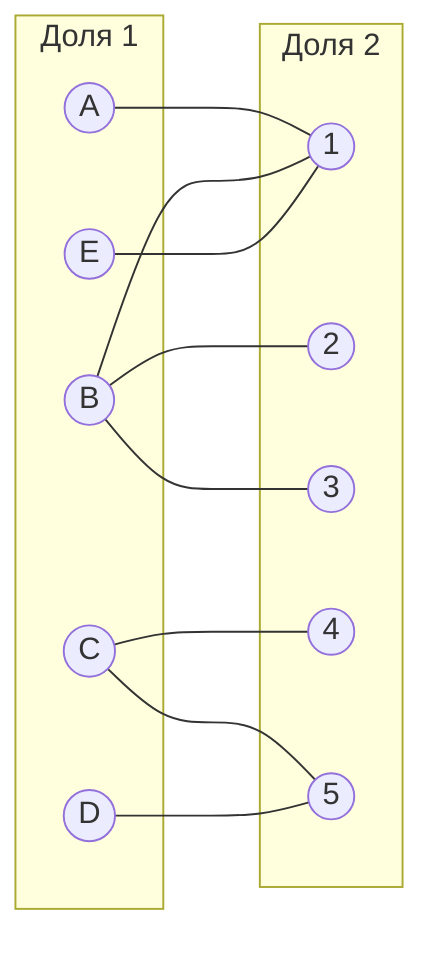
Выберем произвольное паросочетание $[A, 1], [B, 2], [C, 5]$. и попытаемся построить совершенное паросочетание с помощью чередующихся деревьев.

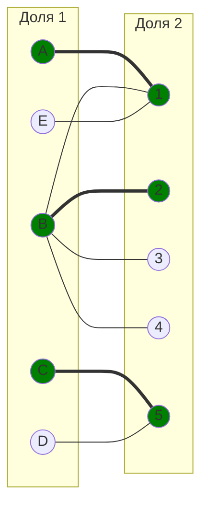
Попытаемся построить дерево из оставшихся непокрытых вершин D и E.

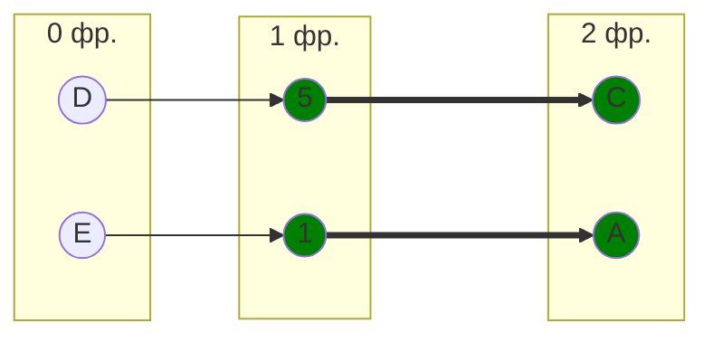

В построенном дереве нет цепей, чередующееся относительно текущего паросочетания, обе ветки закончились в покрытых вершинах, то есть в указанном графе нет совершенного паросочетания.

## 3. Проведем повторную редукцию матрицы затрат.

Во множество X выпишем все **покрытые построенным деревом** вершины первой доли графа, во множество Y все **покрытые построенным деревом** вершины из второй доли графа.

$$
X = \{A, C, D, E\}
$$

$$
Y = \{1, 5 \}
$$

Необходимо найти минимальный элемент из строк, включенных во множество X и столбцов, не включенных во множество Y. В нашем случае это будут строки A, B, C, D, E и столбцы 2, 3, 4. 

|       | **2** | **3** | **4** |
|-------|:-----:|:-----:|:-----:|
| **A** |   4   |   5   |   7   |
| **C** |   4   |   4   | **2** |
| **D** |   8   |   5   |   4   |
| **E** |   9   |   6   |   3   |

Минимальный элемент 2 (ячейка **C4**)

Вычтем найденное значение из строк множества X и прибавим к столбцам множества Y:

|       | **1** | **2** | **3** | **4** | **5** |       | 
|-------|:-----:|:-----:|:-----:|:-----:|:-----:|:-----:|
| **A** |   0   |   2   |   3   |   5   |   8   |   -2   |
| **B** |   2   |   0   |   0   |   0   |   9   |      |
| **C** |   1   |   2   |   2   | **0** |   0   |   -2   |
| **D** |   4   |   6   |   3   |   2   |   0   |   -2   |
| **E** |   0   |   7   |   4   |   1   |   9   |   -2   |
|       | **+2**|       |       |       | **+2**|      |

## 4. Поиск совершенного паросочетания в расширенном графе

В ячейке **C4**  появилось новое нулевое значение, добавим соответствующее ребро в двудольный граф.

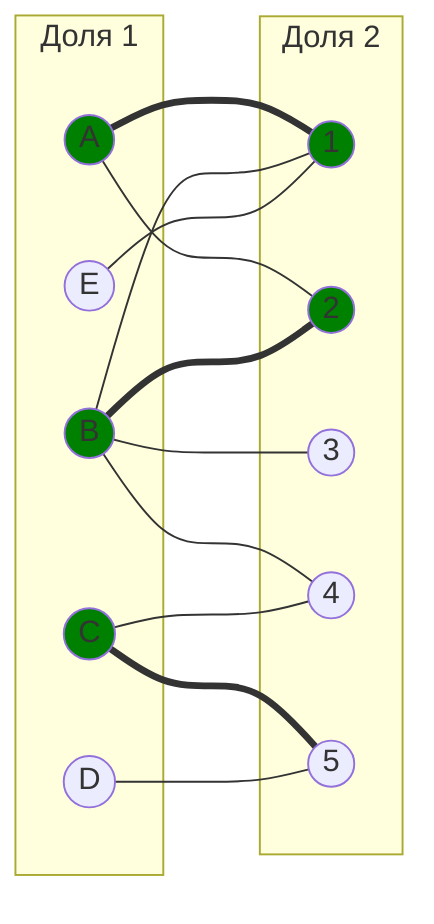
В текущем графе нет совершенного паросочетания, так как вершины D и E остаются непокрытыми. 

Построим чередующееся дерево, чтобы найти путь к свободному исполнителю.

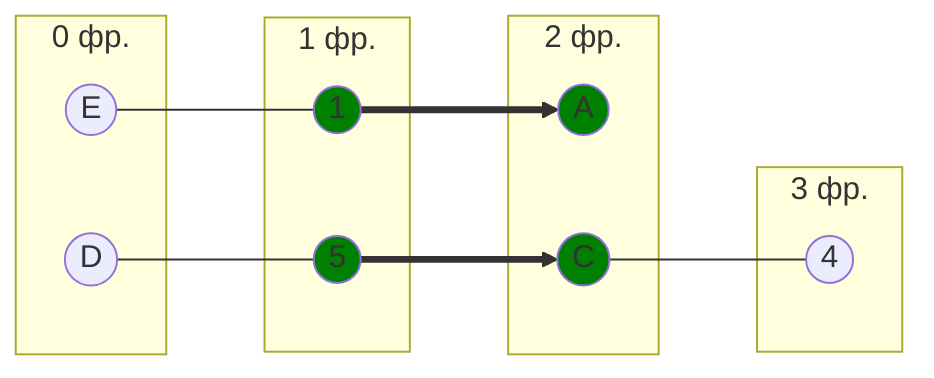
"Перекрашиваем" найденную цепь:

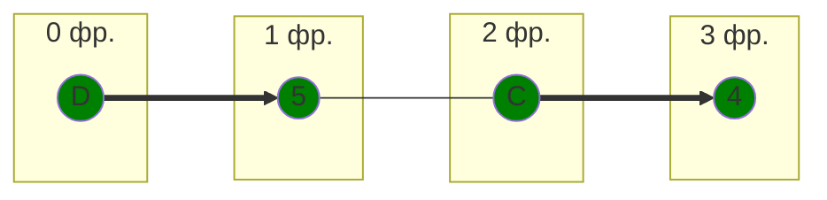
Построим граф с учетом этой цепи:

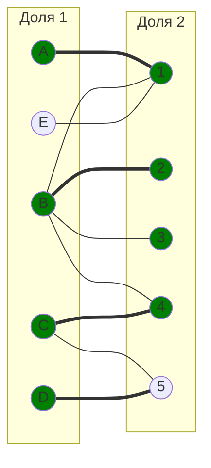

## 5. Проведем повторную редукцию матрицы затрат.

Во множество X выпишем все **покрытые построенным деревом** вершины первой доли графа, во множество Y все **покрытые построенным деревом** вершины из второй доли графа.

$$
X = \{A, C, D, E\}
$$

$$
Y = \{1, 4, 5 \}
$$

Необходимо найти минимальный элемент из строк, включенных во множество X и столбцов, не включенных во множество Y. В нашем случае это будут строки A, C, D, E и столбцы 2, 3. 

|       | **2** | **3** |
|-------|:-----:|:-----:|
| **A** |   2   |   3   | 
| **C** |   2   |   2   | 
| **D** |   6   |   3   |  
| **E** |   7   |   4   |   

Минимальный элемент 2 (ячейка **A2**)

Вычтем найденное значение из строк множества X и прибавим к столбцам множества Y:

|       | **2** | **3** |       |
|-------|:-----:|:-----:|:-----:|
| **A** |   2   |   3   |  -2   | 
| **C** |   2   |   2   |  -2   | 
| **D** |   6   |   3   |  -2   | 
| **E** |   7   |   4   |  -2   | 
|       | **+2**|       |       | 

Получаем матрицу:

|       | **2** | **3** |       
|-------|:-----:|:-----:|
| **A** |   0   |   1   | 
| **C** |   0   |   0   | 
| **D** |   4   |   1   |
| **E** |   5   |   2   |  

Добавляем ребра A2, C2 и C3. Нарисуем текущее состояние графа. Здесь вершина E остается непокрытой, а исполнитель 3 свободен.

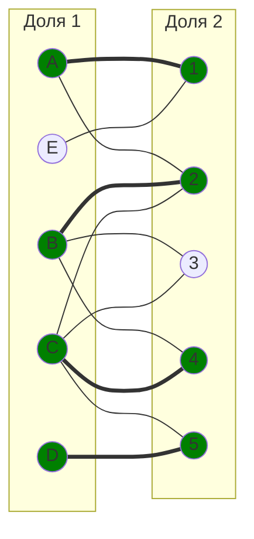

Построим чередующееся дерево из непокрытой вершины **E**. Благодаря проведенной редукции и появлению новых нулевых ребер, нам удается проложить путь до свободного исполнителя 3.

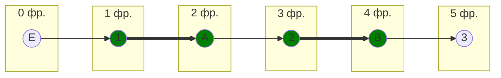

"Перекрашиваем" найденную цепь:

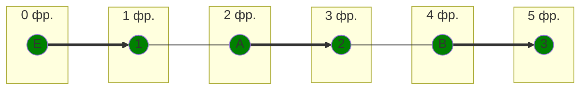

## 6. Итоговый граф

Построим итоговую версию графа, чтобы убедиться, что все вершины покрыты и паросочетание является совершенным.

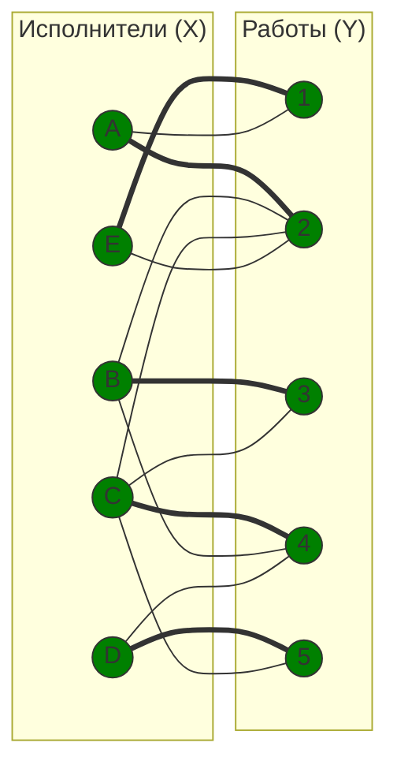

**Вывод**: Полученное паросочетание является совершенным, так как каждый исполнитель назначен на уникальную работу.

Выпишем вес каждого ребра из исходной матрицы, чтобы посчитать сумму:

### A2 — 9
### B3 — 6
### C4 — 14
### D5 — 5
### E1 — 5

# Ответ:  Итоговая сумма составляет 39 единиц.