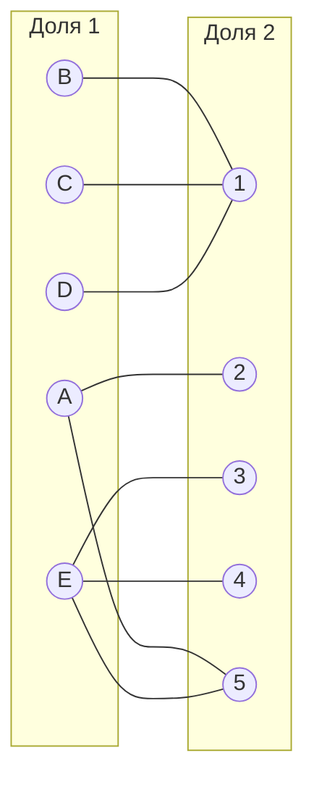
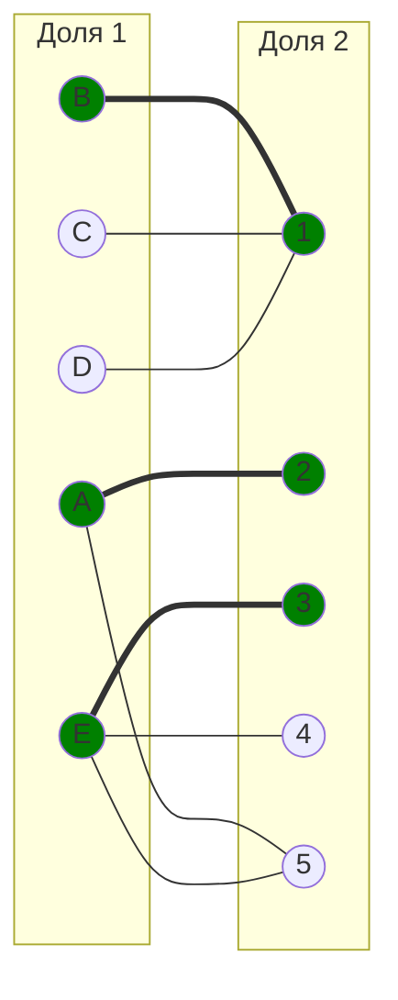
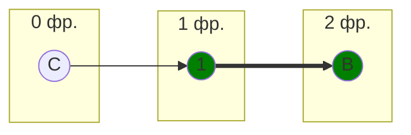
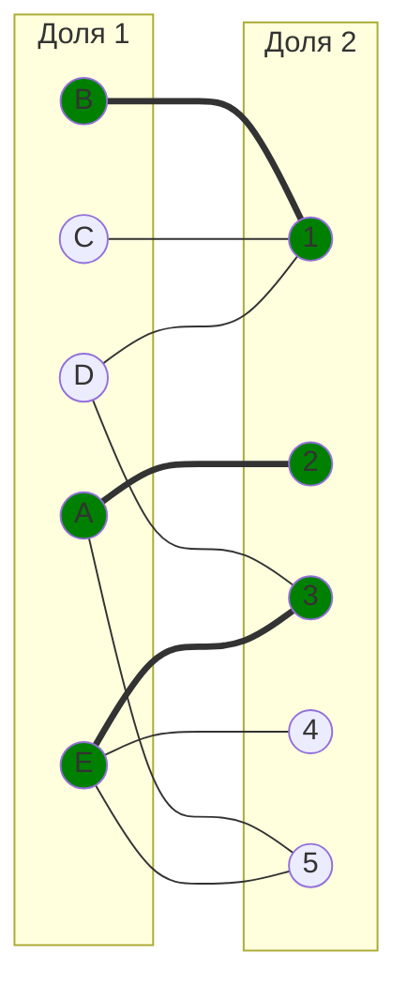
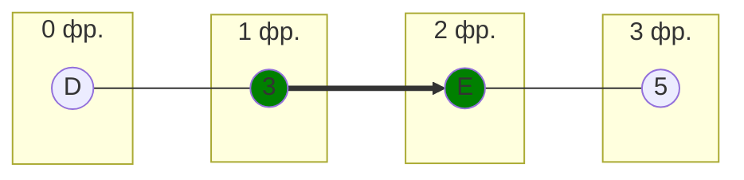
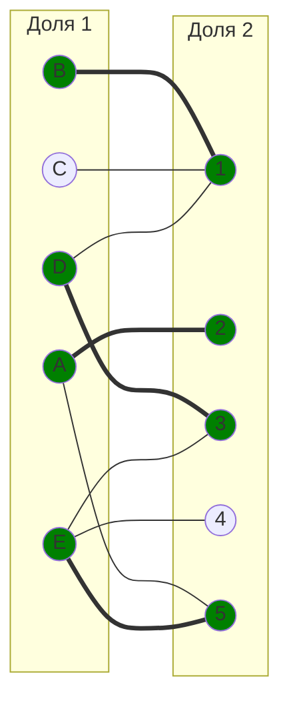
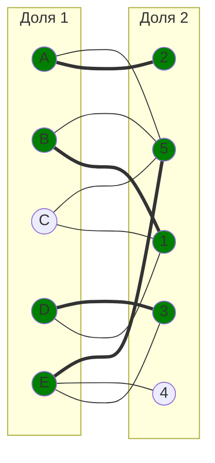
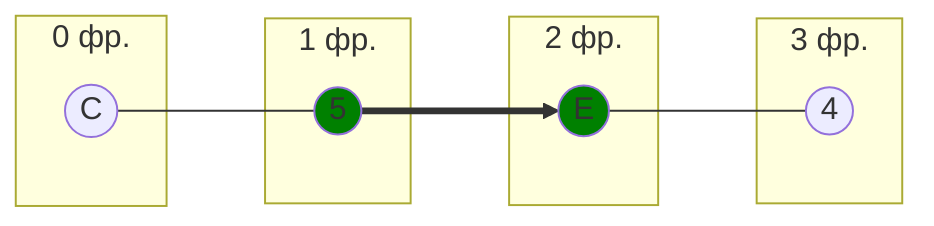
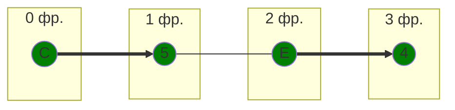
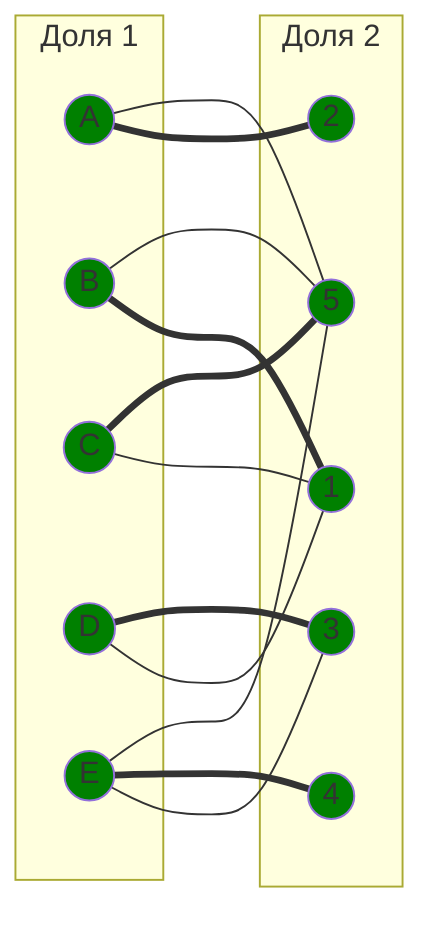

# Задание №8

## Вариант 6 — Задача о назначении. Венгерский алгоритм

---

## Постановка задачи

Дан полный двудольный граф:

- первая доля — задачи **A, B, C, D, E**
- вторая доля — исполнители **1, 2, 3, 4, 5**

Матрица затрат:

|       | **1** | **2** | **3** | **4** | **5** |
| ----- | :---: | :---: | :---: | :---: | :---: |
| **A** |  11   |   7   |  11   |  15   |   9   |
| **B** |   6   |  12   |  14   |  13   |  12   |
| **C** |   6   |  14   |  13   |  13   |  12   |
| **D** |   8   |  11   |  10   |  15   |  13   |
| **E** |  12   |  13   |   9   |  11   |  11   |

Требуется найти совершенное паросочетание минимальной стоимости  
(задачу о назначении) методом Венгерского алгоритма.

## Шаг 1. Редукция матрицы затрат

### 1.1. Вычитание минимального элемента из каждой строки

Минимумы строк:

| A   | B   | C   | D   | E   |
| --- | --- | --- | --- | --- |
| 7   | 6   | 6   | 8   | 9   |

После вычитания:

|       | **1** | **2** | **3** | **4** | **5** |
| ----- | :---: | :---: | :---: | :---: | :---: |
| **A** |   4   |   0   |   4   |   8   |   2   |
| **B** |   0   |   6   |   8   |   7   |   6   |
| **C** |   0   |   8   |   7   |   7   |   6   |
| **D** |   0   |   3   |   2   |   7   |   5   |
| **E** |   3   |   4   |   0   |   2   |   2   |

### 1.2. Вычитание минимального элемента из каждого столбца

Минимумы столбцов:

| столбец | 1   | 2   | 3   | 4   | 5   |
| ------- | --- | --- | --- | --- | --- |
| минимум | 0   | 0   | 0   | 2   | 2   |

После вычитания:

|       | **1** | **2** | **3** | **4** | **5** |
| ----- | :---: | :---: | :---: | :---: | :---: |
| **A** |   4   |   0   |   4   |   6   |   0   |
| **B** |   0   |   6   |   8   |   5   |   4   |
| **C** |   0   |   8   |   7   |   5   |   4   |
| **D** |   0   |   3   |   2   |   5   |   3   |
| **E** |   3   |   4   |   0   |   0   |   0   |

Получена редуцированная матрица.

## Шаг 2. Построение двудольного графа по нулевым элементам

Нули в матрице:

- A2, A5
- B1
- C1
- D1
- E3, E4, E5

Строим граф нулевых рёбер:

## Шаг 3. Поиск максимального паросочетания в графе нулей

Выберем начальное паросочетание:

B–1

A–2

E–3

Непокрытые вершины левой доли: C, D
Строим чередующееся дерево от вершины C.

Построение чередующегося дерева

Из B нет новых нулевых рёбер к непокрытым вершинам.

Попытка от вершины D:

Совершенное паросочетание пока не найдено.

## Шаг 4. Повторная редукция матрицы

Множества вершин, покрытых деревом:

X = {C, D, B}

Y = {1}

Ищем минимальный элемент среди:
строк X и столбцов не из Y → столбцы {2,3,4,5}

|       | **1** | **2** | **3** | **4** | **5** |
| ----- | :---: | :---: | :---: | :---: | :---: |
| **A** |   4   |   0   |   4   |   6   |   0   |
| **B** |   0   |   6   |   8   |   5   |   4   |
| **C** |   0   |   8   |   7   |   5   |   4   |
| **D** |   0   |   3   |   2   |   5   |   3   |
| **E** |   3   |   4   |   0   |   0   |   0   |

Минимальный элемент = 2
(например D–3 = 2)

Вычитаем 2 из строк X
и прибавляем 2 к столбцу Y:

Новая матрица:

|       | **1** | **2** | **3** | **4** | **5** |
| ----- | :---: | :---: | :---: | :---: | :---: |
| **A** |   6   |   0   |   4   |   6   |   0   |
| **B** |   0   |   4   |   6   |   3   |   2   |
| **C** |   0   |   6   |   5   |   3   |   2   |
| **D** |   0   |   1   |   0   |   3   |   1   |
| **E** |   5   |   4   |   0   |   0   |   0   |

Добавился новый ноль: D3

Добавляем ребро D–3.

Старые нули сохранены: B–1, C–1, D–1, A–2, A–5, E–3, E–4, E–5

Теперь попробуем улучшить паросочетание. У задачи D появилось новое нулевое ребро к исполнителю 3, который сейчас занят задачей E. При этом у E есть свободное ребро к 4 и 5.

Рассмотрим чередующуюся цепь:

Перекрасим её:

Новое паросочетание:

A → 2

B → 1

D → 3

E → 5

Построим граф с учетом этой цепи:

Теперь покрыты все задачи, кроме C.

Таким образом, единственная непокрытая вершина левой доли - C.

Вершина B покрыта, но не имеет других нулевых рёбер к непокрытым исполнителям.

Следовательно, нужна ещё одна редукция.

## Шаг 5. Повторная редукция матрицы затрат.

Определим множества:

X = {C, B} - вершины первой доли, покрытые деревом

Y = {1} - вершины второй доли, покрытые деревом

Минимальный элемент: 2 (в ячейках B–5 и C–5).

Вычитаем 2 из строк X
и прибавляем 2 к столбцу Y.

Новая матрица:

|       | **1** | **2** | **3** | **4** | **5** |
| ----- | :---: | :---: | :---: | :---: | :---: |
| **A** |   8   |   0   |   4   |   6   |   0   |
| **B** |   0   |   2   |   4   |   1   |   0   |
| **C** |   0   |   4   |   3   |   1   |   0   |
| **D** |   0   |   1   |   0   |   3   |   1   |
| **E** |   7   |   4   |   0   |   0   |   0   |

Теперь в ячейках B–5 и C–5 появились новые нули.

Добавим соответствующие рёбра в граф.

Построим чередующееся дерево от непокрытой вершины C:

Исполнитель 5 занят E, но у E есть другие нулевые рёбра: E–3, E–4.

Выберем E–4 (свободен), тогда цепь:

Перекрасим её:

Новое паросочетание:

- A–2
- B–1
- C–5
- D–3
- E–4

Проверим граф:

Все вершины покрыты, следовательно совершенное паросочетание найдено.

Общая стоимость затрат:

Смотрим в исходную матрицу затрат

- A2 - 7
- B1 - 6
- C5 - 12
- D3 - 10
- E4 - 11

Общая стоимость затрат = 7 + 6 + 12 + 10 + 11 = 46

Ответ:

Минимальная стоимость затрат 46, при следующих назначениях:

- задача A, исполнитель 2,
- задача B, исполнитель 1,
- задача C, исполнитель 5,
- задача D, исполнитель 3,
- задача E, исполнитель 4.
