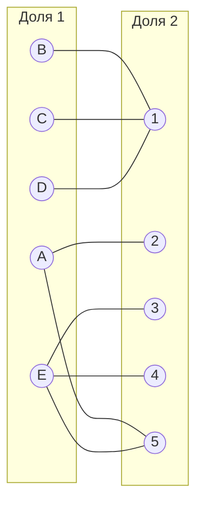
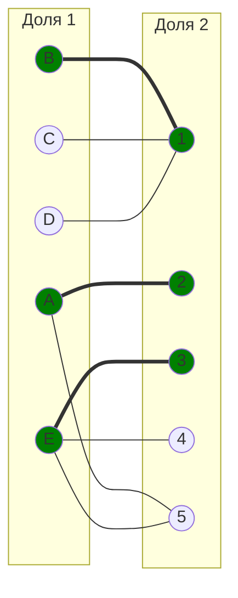
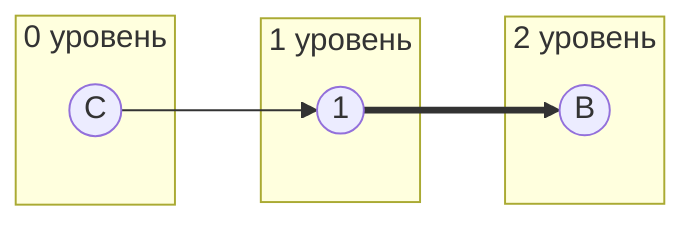
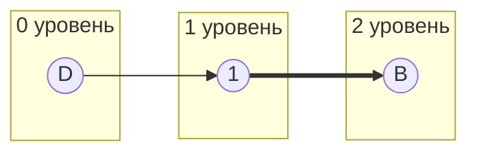
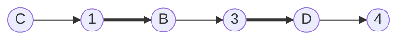
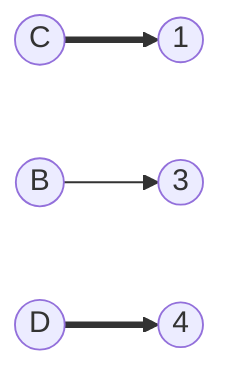
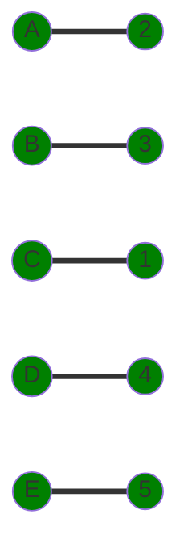

# Задание №8

## Вариант 6 — Задача о назначении. Венгерский алгоритм

---

## Постановка задачи

Дан полный двудольный граф:

- первая доля — задачи **A, B, C, D, E**
- вторая доля — исполнители **1, 2, 3, 4, 5**

Матрица затрат:

|       | **1** | **2** | **3** | **4** | **5** |
| ----- | :---: | :---: | :---: | :---: | :---: |
| **A** |  11   |   7   |  11   |  15   |   9   |
| **B** |   6   |  12   |  14   |  13   |  12   |
| **C** |   6   |  14   |  13   |  13   |  12   |
| **D** |   8   |  11   |  10   |  15   |  13   |
| **E** |  12   |  13   |   9   |  11   |  11   |

Требуется найти совершенное паросочетание минимальной стоимости  
(задачу о назначении) методом Венгерского алгоритма.

## Шаг 1. Редукция матрицы затрат

### 1.1. Вычитание минимального элемента из каждой строки

Минимумы строк:

| A   | B   | C   | D   | E   |
| --- | --- | --- | --- | --- |
| 7   | 6   | 6   | 8   | 9   |

После вычитания:

|       | **1** | **2** | **3** | **4** | **5** |
| ----- | :---: | :---: | :---: | :---: | :---: |
| **A** |   4   |   0   |   4   |   8   |   2   |
| **B** |   0   |   6   |   8   |   7   |   6   |
| **C** |   0   |   8   |   7   |   7   |   6   |
| **D** |   0   |   3   |   2   |   7   |   5   |
| **E** |   3   |   4   |   0   |   2   |   2   |

### 1.2. Вычитание минимального элемента из каждого столбца

Минимумы столбцов:

| столбец | 1   | 2   | 3   | 4   | 5   |
| ------- | --- | --- | --- | --- | --- |
| минимум | 0   | 0   | 0   | 2   | 2   |

После вычитания:

|       | **1** | **2** | **3** | **4** | **5** |
| ----- | :---: | :---: | :---: | :---: | :---: |
| **A** |   4   |   0   |   4   |   6   |   0   |
| **B** |   0   |   6   |   8   |   5   |   4   |
| **C** |   0   |   8   |   7   |   5   |   4   |
| **D** |   0   |   3   |   2   |   5   |   3   |
| **E** |   3   |   4   |   0   |   0   |   0   |

Получена редуцированная матрица.

## Шаг 2. Построение двудольного графа по нулевым элементам

Нули в матрице:

- A2, A5
- B1
- C1
- D1
- E3, E4, E5

Строим граф нулевых рёбер:



## Шаг 3. Поиск максимального паросочетания в графе нулей

Выберем начальное паросочетание:

B–1

A–2

E–3



Непокрытые вершины левой доли: C, D
Строим чередующееся дерево от вершины C.

Построение чередующегося дерева



Из B нет новых нулевых рёбер к непокрытым вершинам.
Попытка от вершины D:



Новых путей нет.
⇒ Совершенное паросочетание пока не найдено.

## Шаг 4. Повторная редукция матрицы

Множества вершин, покрытых деревом:

X = {C, D, B}

Y = {1}

Ищем минимальный элемент среди:
строк X и столбцов не из Y → столбцы {2,3,4,5}

Минимальный элемент = 2
(например D–3 = 2)

Вычитаем 2 из строк X
и прибавляем 2 к столбцу Y.

Новая матрица:

|       | **1** | **2** | **3** | **4** | **5** |
| ----- | :---: | :---: | :---: | :---: | :---: |
| **A** |   4   |   0   |   4   |   6   |   0   |
| **B** |   2   |   4   |   6   |   3   |   2   |
| **C** |   2   |   6   |   5   |   3   |   2   |
| **D** |   2   |   1   |   0   |   3   |   1   |
| **E** |   3   |   4   |   0   |   0   |   0   |

Добавился новый ноль: D3

Добавляем ребро D–3.

## Шаг 5. Новое построение чередующегося дерева

Стартуем от непокрытой вершины C.



Получена чередующаяся цепь:

```mathematica
C–1–B–3–D–4
```

Начало и конец — непокрытые вершины ⇒ усиливающая цепь найдена.

Перекрашиваем цепь



Полученное совершенное паросочетание



Итоговые назначения
Смотрим в исходную матрицу затрат:

Назначение | Стоимость

- A → 2 | 7
- B → 3 | 14
- C → 1 | 6
- D → 4 | 15
- E → 5 | 11

Общая минимальная стоимость:
7 + 14 + 6 + 15 + 11 = 53
