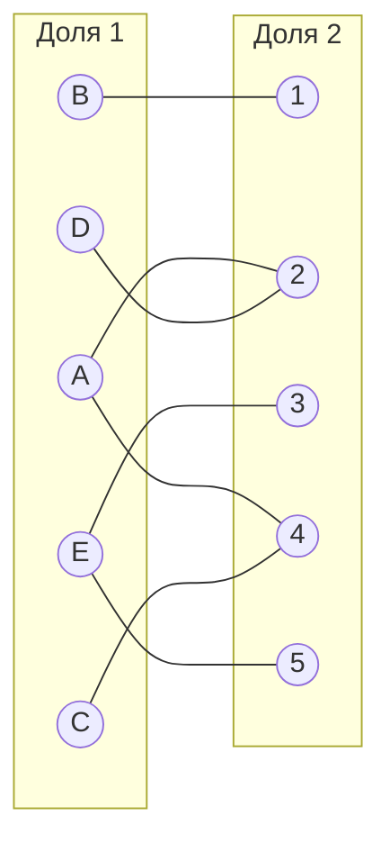
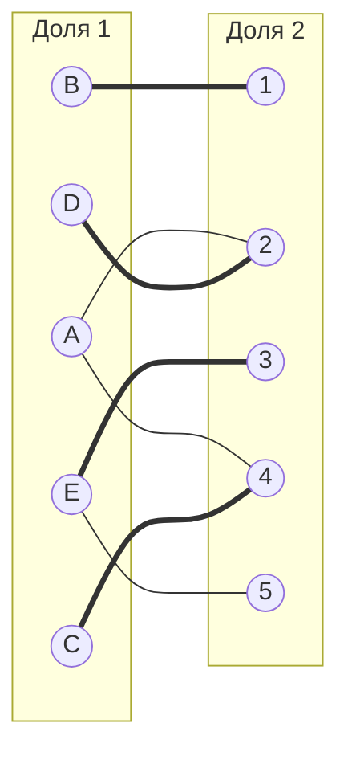
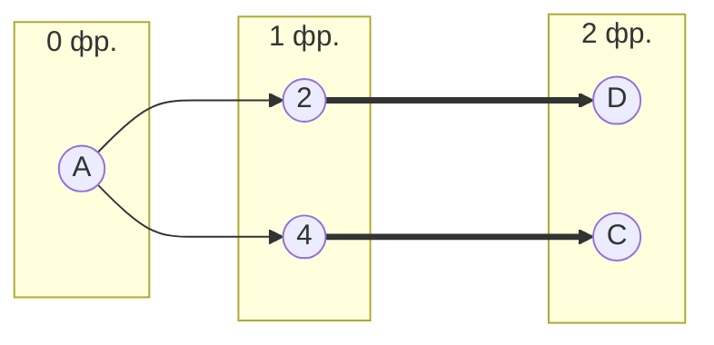
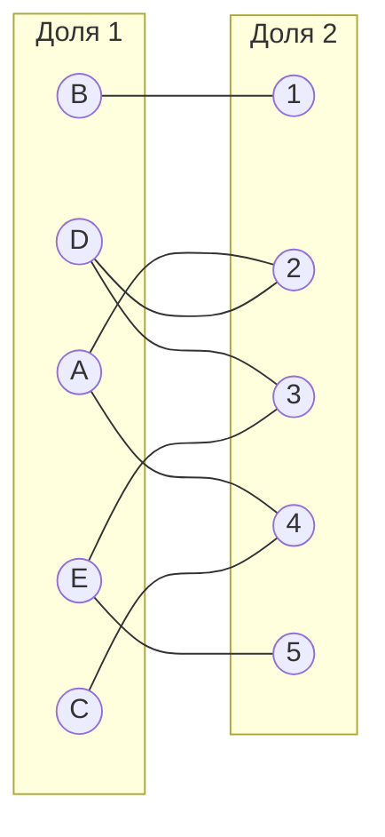
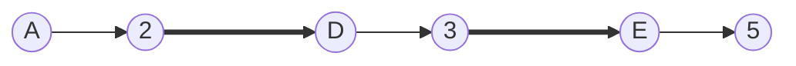
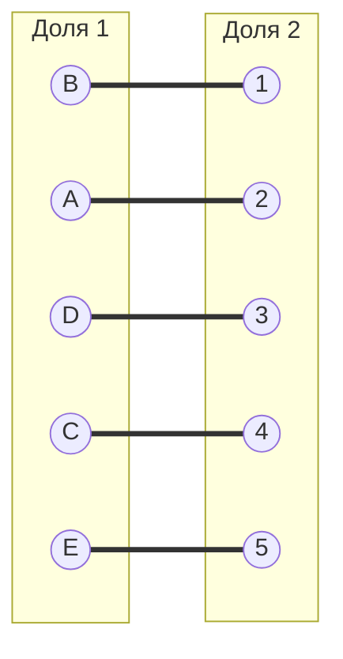

# Задание №8 Вариант 3

## Условие задачи

Дана матрица затрат для задач A, B, C, D, E и исполнителей 1–5:

|       | **1** | **2** | **3** | **4** | **5** |
| ----- | :---: | :---: | :---: | :---: | :---: |
| **A** |   10  |   7   |   15  |   7   |   12  |
| **B** |   4   |   9   |   6   |   5   |   15  |
| **C** |   14  |   15  |   9   |   6   |   10  |
| **D** |   11  |   7   |   9   |   12  |   11  |
| **E** |   12  |   13  |   6   |   12  |   6   |

## 1. Редукция матрицы затрат

Из каждой строки вычтем минимальный элемент этой строки.

|       | **1** | **2** | **3** | **4** | **5** | **Min** |
| ----- | :---: | :---: | :---: | :---: | :---: | :-----: |
| **A** |   3   |   0   |   8   |   0   |   5   |    -7   |
| **B** |   0   |   5   |   2   |   1   |   11  |    -4   |
| **C** |   8   |   9   |   3   |   0   |   4   |    -6   |
| **D** |   4   |   0   |   2   |   5   |   4   |    -7   |
| **E** |   6   |   7   |   0   |   6   |   0   |    -6   |

Теперь из каждого столбца вычтем минимальный элемент этого столбца.

Минимальные элементы по столбцам:

* столбец 1 — 0,
* столбец 2 — 0,
* столбец 3 — 0,
* столбец 4 — 0,
* столбец 5 — 0.

Редукция столбцов не изменяет матрицу.

### Редуцированная матрица затрат

|       | **1** | **2** | **3** | **4** | **5** |
| ----- | :---: | :---: | :---: | :---: | :---: |
| **A** |   3   |   0   |   8   |   0   |   5   |
| **B** |   0   |   5   |   2   |   1   |   11  |
| **C** |   8   |   9   |   3   |   0   |   4   |
| **D** |   4   |   0   |   2   |   5   |   4   |
| **E** |   6   |   7   |   0   |   6   |   0   |

## 2. Построение двудольного графа нулей

Построим двудольный граф, оставив только рёбра, соответствующие нулевым элементам редуцированной матрицы.

Выберем произвольное паросочетание и попытаемся построить совершенное паросочетание с помощью чередующихся деревьев.

Допустимое начальное паросочетание:

* B–1
* D–2
* C–4
* E–3

Вершины A и 5 остаются непокрытыми.

## 3. Построение чередующегося дерева

Начинаем построение чередующегося дерева из непокрытой вершины **A**.

A соединена с вершинами 2 и 4 (по нулевым ребрам). Обе вершины уже покрыты, поэтому продолжаем по паросочетанию.

В результате получаем дерево, в котором нет цепи, начинающейся и заканчивающейся в непокрытых вершинах (нет увеличивающей цепи). Следовательно, совершенного паросочетания в текущем графе не существует.

## 4. Повторная редукция

Во множество **X** включим покрытые построенным деревом вершины первой доли:

X = {A, C, D}

Во множество **Y** включим покрытые построенным деревом вершины второй доли:

Y = {2, 4}

Рассмотрим элементы строк множества X и столбцов, не входящих во множество Y (1, 3, 5). Минимальный элемент равен **2**.

Из каждой строки множества **X** вычтем 2, а к каждому столбцу множества **Y** прибавим 2.

|       | **1** | **2** | **3** | **4** | **5** |     |
| ----- | :---: | :---: | :---: | :---: | :---: | :-: |
| **A** |   1   |   0   |   6   |   0   |   3   |  −2 |
| **B** |   0   |   5   |   2   |   1   |   11  |     |
| **C** |   6   |   9   |   1   |   0   |   2   |  −2 |
| **D** |   2   |   0   |   0   |   5   |   2   |  −2 |
| **E** |   6   |   7   |   0   |   6   |   0   |     |
|       |       |   +2  |       |   +2  |       |     |

### Матрица после повторной редукции

|       | **1** | **2** | **3** | **4** | **5** |
| ----- | :---: | :---: | :---: | :---: | :---: |
| **A** |   1   |   0   |   6   |   0   |   3   |
| **B** |   0   |   5   |   2   |   1   |   11  |
| **C** |   6   |   9   |   1   |   0   |   2   |
| **D** |   2   |   0   |   0   |   5   |   2   |
| **E** |   6   |   7   |   0   |   6   |   0   |

В результате повторной редукции в матрице появляются новые нулевые элементы: **D–3** и **E–5**, а также сохраняются предыдущие нули.

## 5. Поиск увеличивающей цепи

Повторяем построение чередующегося дерева из непокрытой вершины **A** в обновлённом графе.

В результате строится увеличивающая цепь:

A–2–D–3–E–5

Перекрашивая рёбра найденной цепи, получаем совершенное паросочетание.

## 6. Итоговые назначения и стоимость

По исходной матрице затрат получаем:

* A–2 = 7
* B–1 = 4
* C–4 = 6
* D–3 = 9
* E–5 = 6

Общая стоимость затрат:

7 + 4 + 6 + 9 + 6 = **32**

## 7. Ответ

Минимальная стоимость затрат — **32**, при следующих назначениях:

* задача A — исполнитель 2;
* задача B — исполнитель 1;
* задача C — исполнитель 4;
* задача D — исполнитель 3;
* задача E — исполнитель 5.